# Deep Frontier AI Analysis

Reference date: **2026-05-15**. Generated at: **2026-05-16T12:05:27+00:00**.

This report is deliberately data-heavy. It uses the local rich frontier-model dataset plus the public Anthropic Economic Index release files for occupation exposure, task penetration, O*NET task text and BLS wage/employment companion fields. The goal is not to claim precision about the future; it is to make the assumptions inspectable enough that the forecast can be argued with.

## How To Read This Report

The report is organized around three questions:

1. **Who has the strongest frontier-family signal right now?** The answer is a composite heuristic, so the report shows both rank and component composition instead of hiding the weighting.
2. **Where are the counterintuitive gaps?** Open-weight systems, low prices, context windows and benchmark ratings move on different axes. The plots keep those axes separate.
3. **What happens when model capability meets labor structure?** Occupation exposure is not the same thing as replacement. The labor section separates task pressure, augmentation, bottlenecks and whole-job feasibility.

Every chart should be read as an audit surface. If a conclusion depends on one metric, the report names that metric and shows the caveat near the visualization.

Evidence badges used throughout the HTML view: `observed`, `direct_match`, `family_proxy`, `scenario`, `speculative`. They are labels for evidence strength, not decoration.

## Executive Takeaways

1. **Near-term frontier-family leadership is concentrated, but not one-dimensional.** The highest heuristic index in this run is **Qwen** with a frontier momentum heuristic index of **79.2**. The strongest openness/cost/ecosystem signal is **Qwen**, which is not automatically the same thing as best closed frontier performance.
2. **The next-winner question is a simulation sensitivity exercise.** The table changes component weights thousands of times and injects evidence noise. Its shares are not calibrated probabilities.
3. **Open vs closed is category-specific.** Some LMArena categories show narrow gaps; others preserve a clear closed/API advantage. "Open source caught up" is too crude.
4. **The job story is not "all jobs disappear."** The highest-risk roles are task bundles where language, analysis, clerical transformation and directive delegation are already exposed. Jobs with physical work, trust, regulation or face-to-face accountability keep meaningful bottlenecks.
5. **The 10-year question is institutional, not only technical.** In the base scenario, AI materially touches a large share of occupational tasks by 2036, but the binding constraint becomes verification, liability, workflow redesign and who owns the interface to work.

## Data Freshness And Coverage

The report now exposes source coverage before leaning on rankings. This section records row counts, captured dates, latest source dates and missingness across release dates, prices, benchmark values, context windows and organization/vendor fields.

| table                         |   rows | latest_source_date   |   release_date_coverage |   price_coverage |   benchmark_value_coverage |   organization_vendor_coverage |
|:------------------------------|-------:|:---------------------|------------------------:|-----------------:|---------------------------:|-------------------------------:|
| epoch_models_normalized       |   3525 | 2026-04-24           |                  0.9935 |                0 |                          0 |                         1      |
| github_ai_repositories        |   1395 | 2026-05-15           |                  1      |                0 |                          0 |                         0      |
| github_ai_repository_topics   |  13746 |                      |                  0      |                0 |                          0 |                         0      |
| github_model_mentions         |    703 |                      |                  0      |                0 |                          0 |                         0      |
| huggingface_model_files       |   5256 |                      |                  0      |                0 |                          0 |                         0      |
| huggingface_model_rollups     |   2574 | 2026-05-15           |                  1      |                0 |                          0 |                         1      |
| huggingface_model_tags        |  36737 |                      |                  0      |                0 |                          0 |                         0      |
| huggingface_models            |   2574 | 2026-05-15           |                  1      |                0 |                          0 |                         1      |
| livebench_judgments           |  60372 |                      |                  0      |                0 |                          1 |                         0      |
| lmarena_full                  | 862027 | 2026-05-14           |                  1      |                0 |                          1 |                         0.9726 |
| openalex_ai_paper_authorships |  22643 |                      |                  0      |                0 |                          0 |                         0      |
| openalex_ai_paper_concepts    |  36079 |                      |                  0      |                0 |                          1 |                         0      |

Family coverage matrix:

| model_family   | vendor    |   coverage_score |   direct_benchmark_match_count |   family_proxy_benchmark_count |   source_gap_count |
|:---------------|:----------|-----------------:|-------------------------------:|-------------------------------:|-------------------:|
| Claude         | Anthropic |           100    |                             48 |                             30 |                  0 |
| Gemini         | Google    |           100    |                             24 |                             32 |                  0 |
| Phi            | Microsoft |           100    |                              6 |                              8 |                  0 |
| Grok           | xAI       |           100    |                              3 |                             24 |                  0 |
| Command        | Cohere    |           100    |                             12 |                              5 |                  0 |
| GPT            | OpenAI    |            99.5  |                            120 |                             61 |                  0 |
| Mistral        | Mistral   |            99.33 |                             56 |                             23 |                  0 |
| Qwen           | Alibaba   |            99.3  |                             83 |                             52 |                  0 |
| DeepSeek       | DeepSeek  |            98.89 |                             25 |                             20 |                  0 |
| Llama          | Meta      |            98.08 |                             81 |                             25 |                  0 |
| Gemma          | Google    |            96.3  |                             15 |                             14 |                  0 |
| Cohere         | Cohere    |             0    |                              0 |                              0 |                  6 |

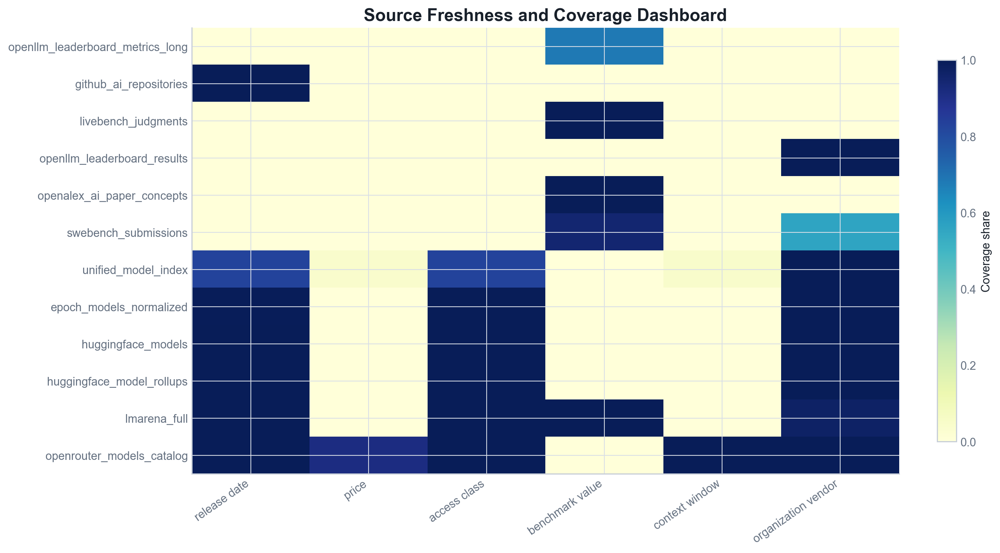

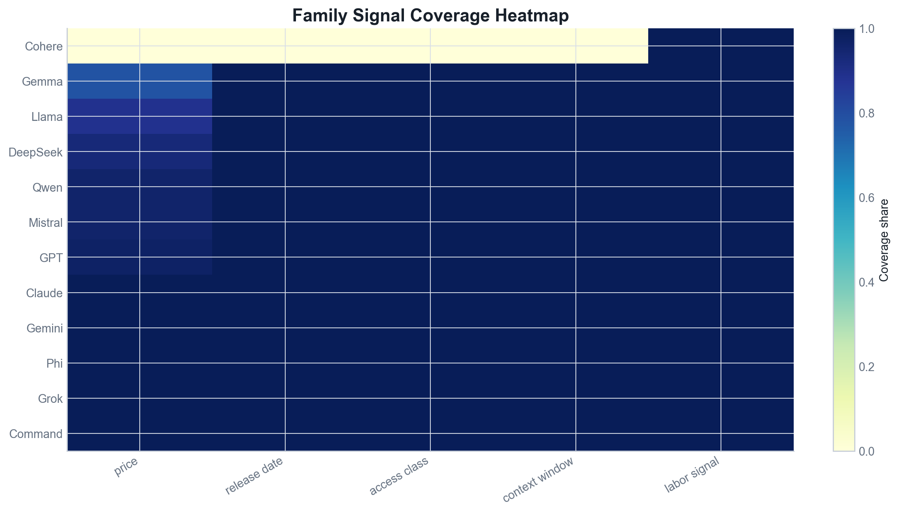

## Model Family Frontier Score

The index ranks model families and product lines, not legal companies. It blends benchmark performance, release velocity, API surface, price, research/ecosystem pull and openness. It is not a universal truth; sensitivity outputs show which rankings are weight-sensitive.

|   rank | model_family   |   frontier_momentum_heuristic_index | sensitivity_label   |   performance_component |   release_velocity_component |   ecosystem_component |   cost_efficiency_component |   openness_component |
|-------:|:---------------|------------------------------------:|:--------------------|------------------------:|-----------------------------:|----------------------:|----------------------------:|---------------------:|
|      1 | Qwen           |                               79.16 | stable_top_tier     |                 74.6117 |                     87.0417  |               80.9259 |                     94.6247 |             97.9167  |
|      2 | GPT            |                               78.54 | stable_top_tier     |                 69.2487 |                    100       |               87.1657 |                     91.7046 |             41.4415  |
|      3 | Mistral        |                               56.7  | weight_sensitive    |                 45.7925 |                     37.1667  |               70.6138 |                    100      |             95.1064  |
|      4 | Claude         |                               55.27 | weight_sensitive    |                 69.9818 |                     37.0417  |               57.7862 |                     36.1209 |             55       |
|      5 | Llama          |                               55.09 | weight_sensitive    |                 36.747  |                      4.64583 |               81.3439 |                    100      |             91.607   |
|      6 | DeepSeek       |                               55.01 | weight_sensitive    |                 33.7632 |                     34.3542  |               78.004  |                     85.8923 |             92.2704  |
|      7 | Gemini         |                               52.32 | weight_sensitive    |                 64.5602 |                     51.1042  |               35.3614 |                     80.9676 |              0       |
|      8 | Gemma          |                               47.4  | weight_sensitive    |                 38.4005 |                     10.1458  |               65.6807 |                     96.1247 |             91.9149  |
|      9 | Phi            |                               36.59 | weight_sensitive    |                 22.6984 |                      1.83333 |               48.871  |                     91.7046 |             83.1769  |
|     10 | Grok           |                               28.67 | weight_sensitive    |                 37.5893 |                     25.1875  |               27.389  |                      0      |              1.84211 |
|     11 | Command        |                               23.6  | weight_sensitive    |                 24.9707 |                      0       |                0      |                     90.9906 |             61.6667  |
|     12 | Cohere         |                                0    | weight_sensitive    |                  0      |                      0       |                0      |                      0      |              0       |

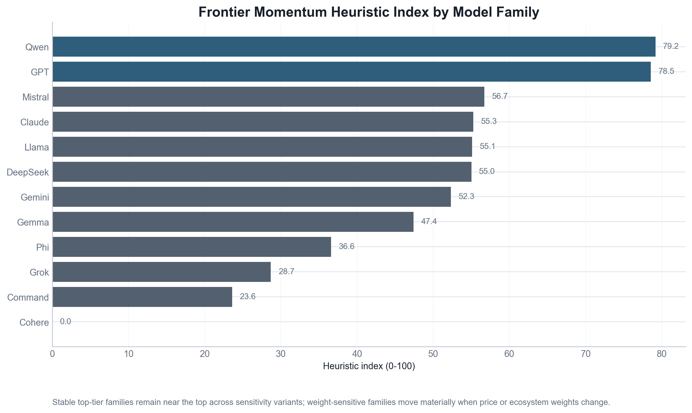

The headline rank is only the entry point. The stacked component chart below shows why a family ranks where it ranks. That matters because two families can have similar headline indexes for very different reasons: one may be performance-heavy, another may be ecosystem-heavy or cost-efficient.

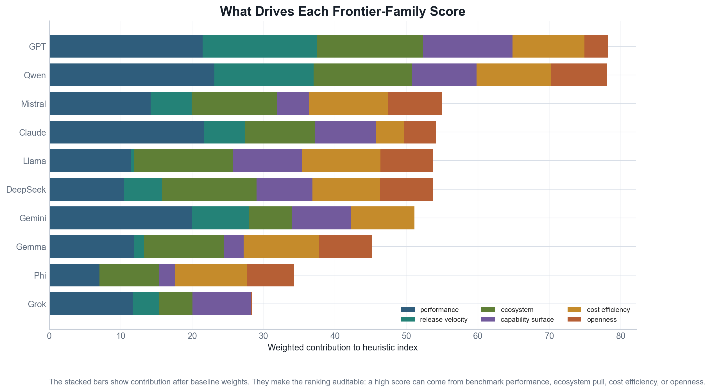

The evidence-depth scatter is the reviewer sanity check. A family with high score and high evidence count is more defensible than a family with a high score from sparse rows. Bubble size is tied to API catalog breadth, while color shows openness.

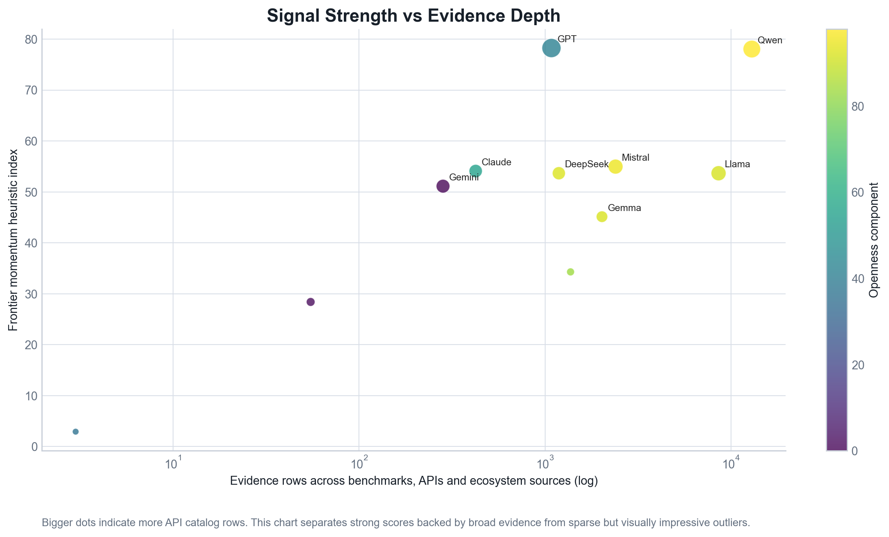

## Family Ranking vs Vendor Portfolio Ranking

Reviewers often reason in terms of companies, but model families remain the cleaner technical unit. The vendor view is therefore a companion view: it blends the flagship family with the evidence-weighted portfolio mean and keeps the flagship family visible.

|   rank | vendor    |   vendor_frontier_portfolio_score | flagship_family   |   family_count | portfolio_families   |   evidence_count |
|-------:|:----------|----------------------------------:|:------------------|---------------:|:---------------------|-----------------:|
|      1 | Alibaba   |                             79.16 | Qwen              |              1 | Qwen                 |            12932 |
|      2 | OpenAI    |                             78.54 | GPT               |              1 | GPT                  |             1083 |
|      3 | Mistral   |                             56.7  | Mistral           |              1 | Mistral              |             2394 |
|      4 | Anthropic |                             55.27 | Claude            |              1 | Claude               |              424 |
|      5 | Meta      |                             55.09 | Llama             |              1 | Llama                |             8569 |
|      6 | DeepSeek  |                             55.01 | DeepSeek          |              1 | DeepSeek             |             1187 |
|      7 | Google    |                             50.81 | Gemini            |              2 | Gemini,Gemma         |             2307 |
|      8 | Microsoft |                             36.59 | Phi               |              1 | Phi                  |             1372 |
|      9 | xAI       |                             28.67 | Grok              |              1 | Grok                 |               55 |
|     10 | Cohere    |                             23.57 | Command           |              2 | Command,Cohere       |              236 |

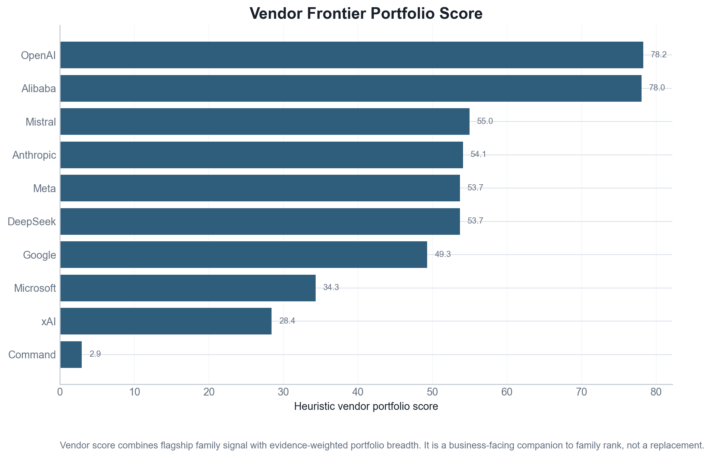

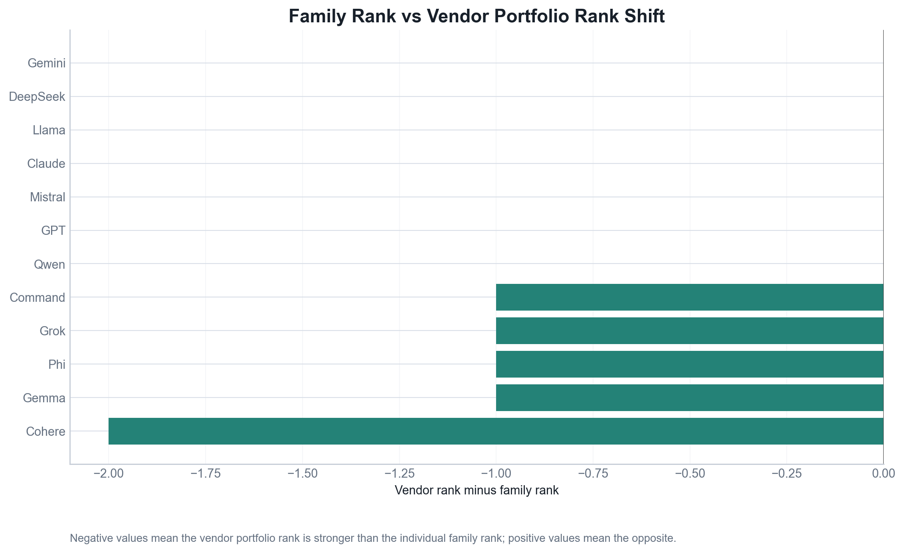

## Who Builds The Next Best Model?

This table is not a prediction market. It is a Monte Carlo stress test over the scoring components: benchmark performance, release velocity, ecosystem pull, capability surface, cost and openness. `simulation_win_share` is the share of simulation draws won by each family, not a calibrated real-world probability. The corrected version separates **frontier-quality leadership** from **open-ecosystem upside**. The former asks who is most likely to make the raw best model; the latter asks who benefits if distribution and low cost matter more.

2-year simulated leaders:

| model_family   | simulation_win_share   |   simulated_score_p10 |   simulated_score_p90 |
|:---------------|:-----------------------|----------------------:|----------------------:|
| GPT            | 70.8%                  |                 74.22 |                 82.02 |
| Qwen           | 29.2%                  |                 71.93 |                 79.77 |
| Mistral        | 0.0%                   |                 42.09 |                 49.96 |
| Claude         | 0.0%                   |                 54.11 |                 61.81 |
| Llama          | 0.0%                   |                 36.48 |                 45.61 |
| DeepSeek       | 0.0%                   |                 39.48 |                 47.68 |
| Gemini         | 0.0%                   |                 51.96 |                 59.7  |
| Gemma          | 0.0%                   |                 30.47 |                 38.9  |
| Phi            | 0.0%                   |                 19.32 |                 27.73 |
| Grok           | 0.0%                   |                 30.72 |                 38.27 |

10-year simulated leaders, frontier-quality scenario:

| model_family   | simulation_win_share   |   simulated_score_p10 |   simulated_score_p90 |
|:---------------|:-----------------------|----------------------:|----------------------:|
| GPT            | 52.7%                  |                 71.34 |                 82.92 |
| Qwen           | 47.3%                  |                 70.95 |                 82.43 |
| Mistral        | 0.0%                   |                 44.27 |                 56    |
| Claude         | 0.0%                   |                 51.46 |                 62.72 |
| Llama          | 0.0%                   |                 41.63 |                 54.4  |
| DeepSeek       | 0.0%                   |                 43.13 |                 55.03 |
| Gemini         | 0.0%                   |                 46.83 |                 58.53 |
| Gemma          | 0.0%                   |                 34.26 |                 46.07 |
| Phi            | 0.0%                   |                 23.25 |                 35.36 |
| Grok           | 0.0%                   |                 26.92 |                 38.35 |

10-year simulated leaders, open-ecosystem-upside scenario:

| model_family   | simulation_win_share   |   simulated_score_p10 |   simulated_score_p90 |
|:---------------|:-----------------------|----------------------:|----------------------:|
| Qwen           | 74.1%                  |                 75.47 |                 86.6  |
| GPT            | 25.9%                  |                 71.13 |                 82.78 |
| Mistral        | 0.0%                   |                 55.1  |                 67.17 |
| Llama          | 0.0%                   |                 53.87 |                 66.73 |
| Claude         | 0.0%                   |                 49.36 |                 60.81 |
| DeepSeek       | 0.0%                   |                 54.04 |                 66.26 |
| Gemini         | 0.0%                   |                 41.12 |                 53.13 |
| Gemma          | 0.0%                   |                 46.31 |                 58.95 |
| Phi            | 0.0%                   |                 35.32 |                 48.06 |
| Grok           | 0.0%                   |                 20.36 |                 32.09 |

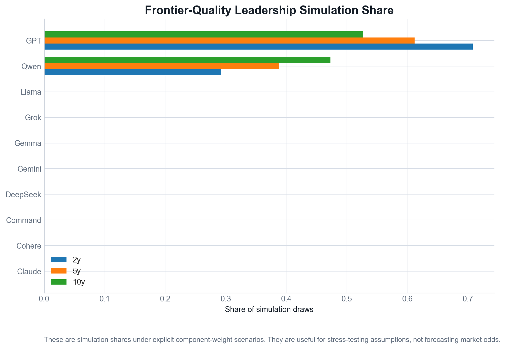

The scenario matrix compresses the same simulation into a reviewer-friendly view: each cell names the leading family under a scenario/horizon pair and reports its share of simulation draws. This makes it obvious when the answer changes because the question changed.

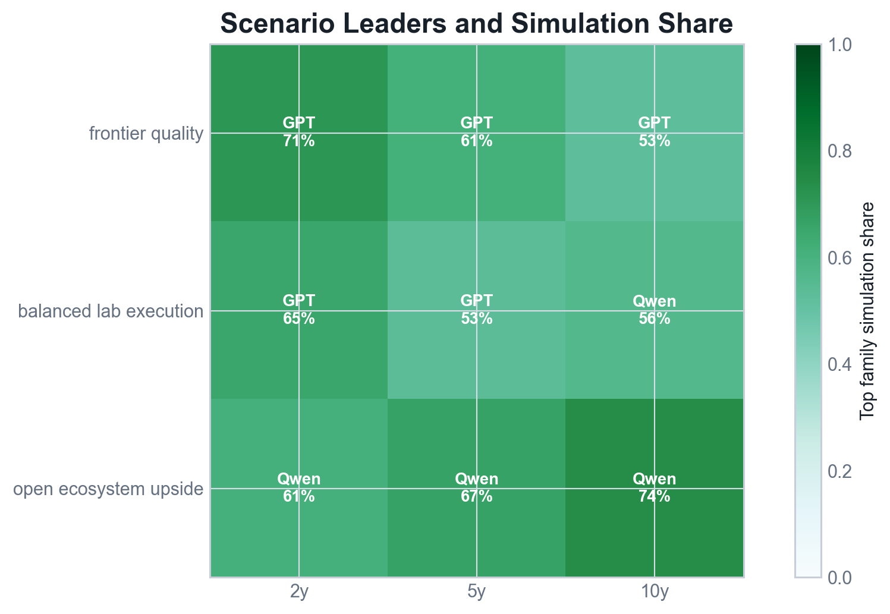

## Open vs Closed: Where Is The Gap?

| category      |   closed_or_api | open_weight        | open_closed_best_gap   |   open_closed_gap_pct_of_closed | comparison_note                                                           |
|:--------------|----------------:|:-------------------|:-----------------------|--------------------------------:|:--------------------------------------------------------------------------|
| text_to_image |         1574.24 | 1212.6857458083412 | 361.56                 |                          0.2297 | Comparable open-weight and closed/API rows observed in selected snapshot. |
| image_edit    |         1513.01 | 1272.2820948867309 | 240.73                 |                          0.1591 | Comparable open-weight and closed/API rows observed in selected snapshot. |
| vision        |         1451.69 | 1341.839120952578  | 109.85                 |                          0.0757 | Comparable open-weight and closed/API rows observed in selected snapshot. |
| webdev        |         1586.93 | 1491.3053126020395 | 95.62                  |                          0.0603 | Comparable open-weight and closed/API rows observed in selected snapshot. |
| document      |         1527.83 | 1433.687985154499  | 94.14                  |                          0.0616 | Comparable open-weight and closed/API rows observed in selected snapshot. |
| text          |         1619.78 | 1549.227871094854  | 70.55                  |                          0.0436 | Comparable open-weight and closed/API rows observed in selected snapshot. |
| search        |         1255.86 | n/a                | n/a                    |                          0      | No comparable open-weight or closed/API row in selected snapshot.         |

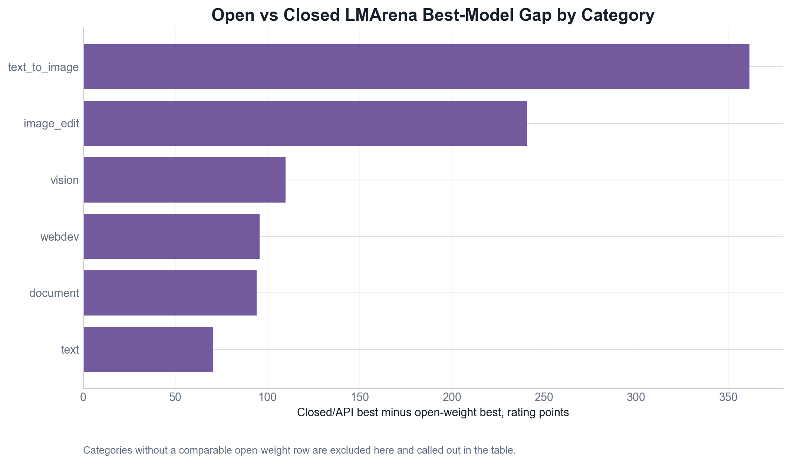

The gap chart shows differences, but differences alone can hide whether both sides are high-quality. The paired rating chart below shows the actual open and closed best observed ratings by category where both sides exist.

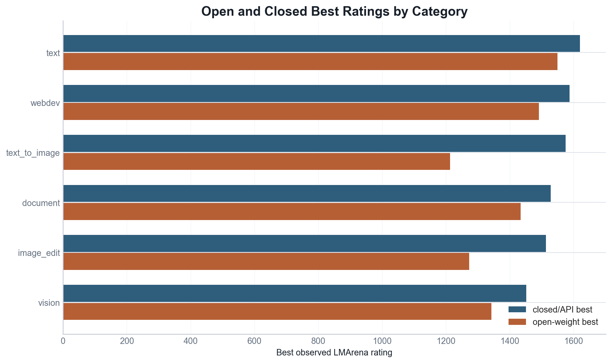

## Price-Performance Frontier

Raw best model and economically deployable model are not the same decision. This frontier is explicitly a family-level proxy: OpenRouter model prices are joined to the best observed LMArena rating for the model family, not to a direct benchmark for every listed model. It should be read as a deployability screen, not model-level proof.

| canonical_model             | model_family   | access_class   |   blended_price_usd_per_1m |   family_best_lmarena | quality_proxy_level   |   price_performance_index |
|:----------------------------|:---------------|:---------------|---------------------------:|----------------------:|:----------------------|--------------------------:|
| OpenAI: gpt-oss-20b         | GPT            | open_weight    |                     0.1015 |               1619.78 | family_level_proxy    |                     91.48 |
| inclusionAI: Ling-2.6-flash | Other          | unknown        |                     0.023  |               1574.24 | family_level_proxy    |                     82.18 |

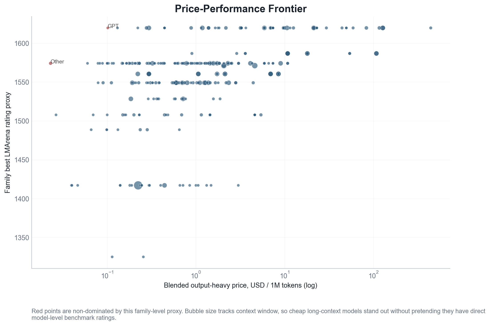

The context-price map keeps three product dimensions visible at once: context window, blended token price and family-level rating proxy. It prevents a common mistake in AI market analysis: treating cheap, long-context and high-quality as one metric.

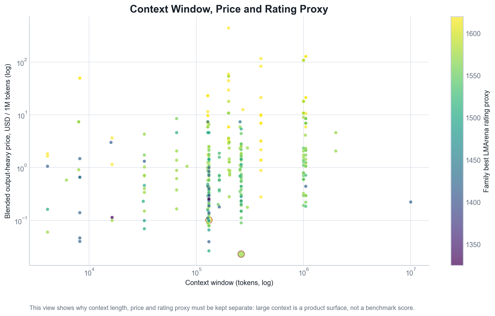

## Direct Model Evidence vs Family Proxy

The audit table matches OpenRouter model IDs/names to LMArena, SWE-bench, LiveBench and Open LLM Leaderboard rows. Direct model matches are separated from `family_only` evidence so the deployability screen does not quietly inherit model-level certainty it does not have.

Match confidence audit:

| match_confidence   |   rows |
|:-------------------|-------:|
| family_only        |    813 |
| normalized_exact   |    516 |
| unmatched          |     95 |

Direct evidence price-performance rows:

| canonical_model                | model_family   |   blended_price_usd_per_1m | direct_evidence_sources    |   direct_lmarena_rating | direct_lmarena_match_confidence   |   direct_price_performance_index | quality_proxy_level   |
|:-------------------------------|:---------------|---------------------------:|:---------------------------|------------------------:|:----------------------------------|---------------------------------:|:----------------------|
| OpenAI: GPT-4.1 Nano           | GPT            |                     0.295  | lmarena                    |                 1560.56 | normalized_exact                  |                            92.21 | direct_model_lmarena  |
| OpenAI: GPT-4.1 Mini           | GPT            |                     1.18   | lmarena                    |                 1560.56 | normalized_exact                  |                            91.18 | direct_model_lmarena  |
| OpenAI: o3 Mini High           | GPT            |                     3.245  | livebench,lmarena,swebench |                 1590.01 | normalized_exact                  |                            91.17 | direct_model_lmarena  |
| OpenAI: o3 Mini                | GPT            |                     3.245  | livebench,lmarena,swebench |                 1590.01 | normalized_exact                  |                            91.17 | direct_model_lmarena  |
| OpenAI: o3                     | GPT            |                     5.9    | livebench,lmarena,swebench |                 1590.01 | normalized_exact                  |                            90.21 | direct_model_lmarena  |
| OpenAI: GPT-4.1                | GPT            |                     5.9    | lmarena                    |                 1560.56 | normalized_exact                  |                            88.9  | direct_model_lmarena  |
| OpenAI: GPT-5.5                | GPT            |                    21.25   | lmarena                    |                 1567.64 | normalized_exact                  |                            87.52 | direct_model_lmarena  |
| OpenAI: o3 Deep Research       | GPT            |                    29.5    | livebench,lmarena,swebench |                 1590.01 | normalized_exact                  |                            87.28 | direct_model_lmarena  |
| Google: Gemini 3 Flash Preview | Gemini         |                     2.125  | lmarena                    |                 1535.16 | normalized_exact                  |                            87.13 | direct_model_lmarena  |
| OpenAI: GPT-5.4 Nano           | GPT            |                     0.8825 | lmarena                    |                 1538.27 | normalized_exact                  |                            87.06 | direct_model_lmarena  |
| Z.ai: GLM 5                    | Other          |                     1.458  | lmarena                    |                 1548.75 | normalized_exact                  |                            86.86 | direct_model_lmarena  |
| MoonshotAI: Kimi K2.6          | Other          |                     2.524  | lmarena                    |                 1545.48 | normalized_exact                  |                            86.12 | direct_model_lmarena  |

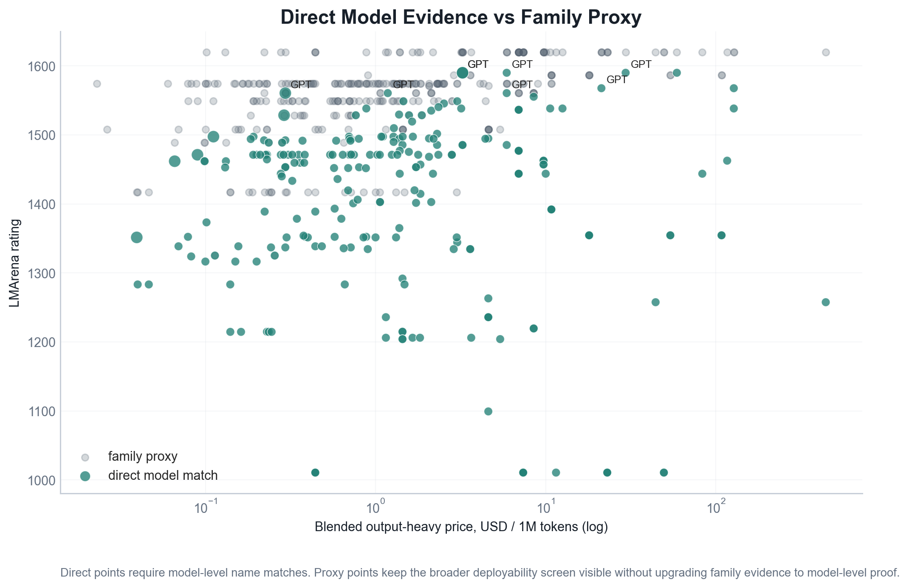

## Job Exposure And Labor Pressure

The labor table joins Anthropic observed occupation exposure to wage/job companion data, task-level penetration, automation/augmentation mode shares, and keyword-derived task bottlenecks from O*NET text. The output is an occupation-level pressure index, not a prediction that a whole occupation vanishes.

| title                                                                                        |   near_term_disruption_index |   substitution_pressure_index |   augmentation_index |   full_job_automation_feasibility_index | dominant_outcome      | risk_label   |
|:---------------------------------------------------------------------------------------------|-----------------------------:|------------------------------:|---------------------:|----------------------------------------:|:----------------------|:-------------|
| Data Entry Keyers                                                                            |                        60.16 |                         68.88 |                51.54 |                                   37.72 | replacement_candidate | very_high    |
| Market Research Analysts and Marketing Specialists                                           |                        59.55 |                         56.36 |                67.43 |                                   38.97 | replacement_candidate | high         |
| Medical Transcriptionists                                                                    |                        58.94 |                         60.44 |                60.15 |                                   28.27 | mixed_redesign        | high         |
| Technical Writers                                                                            |                        58.6  |                         55.78 |                59.26 |                                   36.26 | replacement_candidate | high         |
| Sales Representatives, Wholesale and Manufacturing, Except Technical and Scientific Products |                        54.97 |                         55.94 |                56.77 |                                   34.77 | mixed_redesign        | high         |
| Financial and Investment Analysts                                                            |                        53.75 |                         40.35 |                66.37 |                                   27.24 | augmentation_first    | high         |
| Statistical Assistants                                                                       |                        53.55 |                         47.71 |                59.62 |                                   31.6  | augmentation_first    | high         |
| Human Resources Assistants, Except Payroll and Timekeeping                                   |                        51.76 |                         50.06 |                52.03 |                                   30.44 | mixed_redesign        | high         |
| Mathematical Science Teachers, Postsecondary                                                 |                        50.86 |                         43.32 |                53.09 |                                   26.39 | augmentation_first    | high         |
| Social Science Research Assistants                                                           |                        50.61 |                         44.68 |                55.18 |                                   27.3  | augmentation_first    | high         |
| Engineering Teachers, Postsecondary                                                          |                        50.23 |                         40.29 |                50.32 |                                   24.37 | augmentation_first    | high         |
| Receptionists and Information Clerks                                                         |                        49.89 |                         53.46 |                49.79 |                                   30.45 | mixed_redesign        | high         |

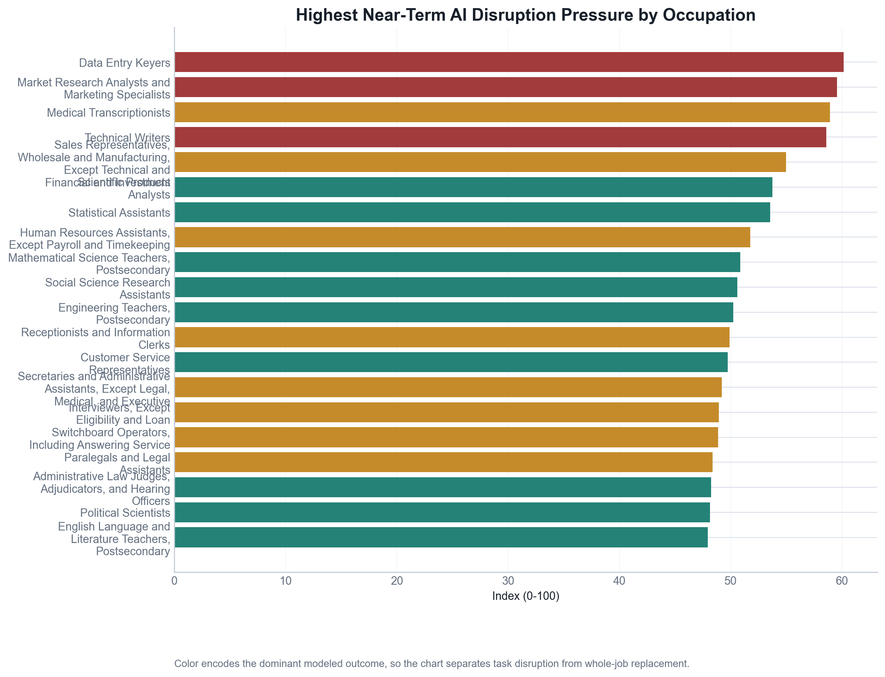

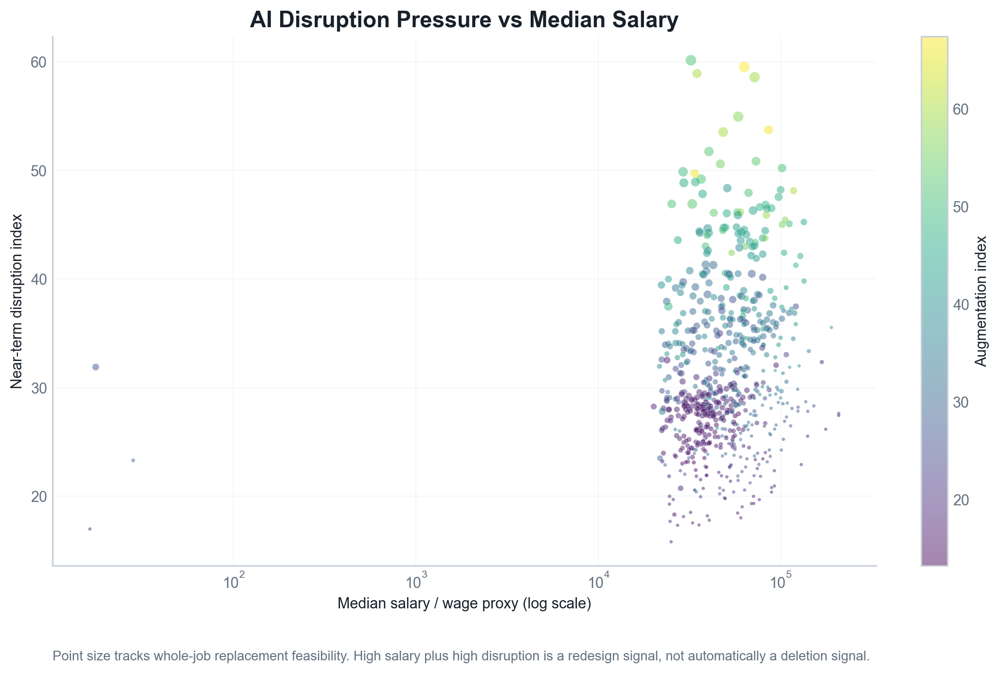

## Whole-Job Replacement Feasibility

The replacement feasibility index gates substitution pressure through physical, trust, regulatory and task-coverage bottlenecks. This is the section that answers the "will AI take all jobs" question more honestly: many occupations are touched; fewer are clean full-job replacement candidates.

| title                                                                                        | job_family                                     |   full_job_automation_feasibility_index |   substitution_pressure_index |   human_bottleneck_index | dominant_outcome      |
|:---------------------------------------------------------------------------------------------|:-----------------------------------------------|----------------------------------------:|------------------------------:|-------------------------:|:----------------------|
| Market Research Analysts and Marketing Specialists                                           | Business and Financial Operations              |                                   38.97 |                         56.36 |                     0    | replacement_candidate |
| Data Entry Keyers                                                                            | Office and Administrative Support              |                                   37.72 |                         68.88 |                     0    | replacement_candidate |
| Technical Writers                                                                            | Arts, Design, Entertainment, Sports, and Media |                                   36.26 |                         55.78 |                     0    | replacement_candidate |
| Sales Representatives, Wholesale and Manufacturing, Except Technical and Scientific Products | Sales and Related                              |                                   34.77 |                         55.94 |                     2.4  | mixed_redesign        |
| Office Clerks, General                                                                       | Office and Administrative Support              |                                   32.08 |                         51.56 |                     1.22 | mixed_redesign        |
| Statistical Assistants                                                                       | Office and Administrative Support              |                                   31.6  |                         47.71 |                     0.78 | augmentation_first    |
| Receptionists and Information Clerks                                                         | Office and Administrative Support              |                                   30.45 |                         53.46 |                     1.26 | mixed_redesign        |
| Human Resources Assistants, Except Payroll and Timekeeping                                   | Office and Administrative Support              |                                   30.44 |                         50.06 |                     0    | mixed_redesign        |
| Secretaries and Administrative Assistants, Except Legal, Medical, and Executive              | Office and Administrative Support              |                                   30.34 |                         52.33 |                     1.95 | mixed_redesign        |
| Medical Transcriptionists                                                                    | Healthcare Support                             |                                   28.27 |                         60.44 |                     9.95 | mixed_redesign        |
| Switchboard Operators, Including Answering Service                                           | Office and Administrative Support              |                                   27.58 |                         49.12 |                     0.68 | mixed_redesign        |
| Social Science Research Assistants                                                           | Life, Physical, and Social Science             |                                   27.3  |                         44.68 |                     0.68 | augmentation_first    |

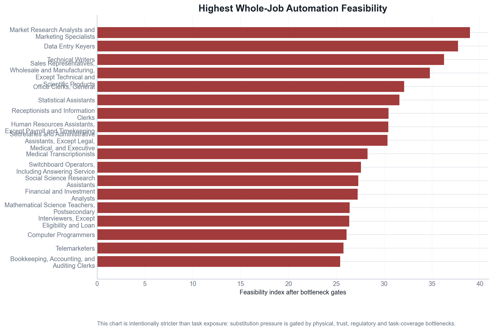

## Labor Clusters

|   labor_cluster_id | cluster_label                               |   occupation_count |   full_job_automation_feasibility_index |   augmentation_index |   human_bottleneck_index | example_occupations                                                                                                                                                                                                                                  |
|-------------------:|:--------------------------------------------|-------------------:|----------------------------------------:|---------------------:|-------------------------:|:-----------------------------------------------------------------------------------------------------------------------------------------------------------------------------------------------------------------------------------------------------|
|                  2 | replacement-prone clerical/transaction work |                 98 |                                20.7162  |              46.4024 |                  1.55796 | Data Entry Keyers; Market Research Analysts and Marketing Specialists; Medical Transcriptionists; Technical Writers; Sales Representatives, Wholesale and Manufacturing, Except Technical and Scientific Products                                    |
|                  0 | mixed redesign work                         |                138 |                                14.3645  |              32.4154 |                  2.20072 | Dispatchers, Except Police, Fire, and Ambulance; Counter and Rental Clerks; Tax Preparers; Nursing Instructors and Teachers, Postsecondary; Procurement Clerks                                                                                       |
|                  4 | augmentation-heavy expert work              |                 27 |                                10.737   |              32.2737 |                  1.55037 | Desktop Publishers; Special Effects Artists and Animators; Photographic Process Workers and Processing Machine Operators; Graphic Designers; Art Directors                                                                                           |
|                  6 | mixed redesign work                         |                215 |                                 9.09526 |              19.2143 |                  1.94414 | Multiple Machine Tool Setters, Operators, and Tenders, Metal and Plastic; Transportation Security Screeners; Ophthalmic Laboratory Technicians; Molders, Shapers, and Casters, Except Metal and Plastic; Ushers, Lobby Attendants, and Ticket Takers |
|                  5 | mixed redesign work                         |                103 |                                 7.69932 |              19.8668 |                  7.65272 | Insurance Appraisers, Auto Damage; Computer, Automated Teller, and Office Machine Repairers; Rail Yard Engineers, Dinkey Operators, and Hostlers; Amusement and Recreation Attendants; Bus and Truck Mechanics and Diesel Engine Specialists         |
|                  3 | augmentation-heavy expert work              |                124 |                                 4.73355 |              29.6729 |                  2.4329  | Lawyers; Atmospheric and Space Scientists; Chief Executives; Construction and Building Inspectors; Geoscientists, Except Hydrologists and Geographers                                                                                                |
|                  1 | augmentation-heavy expert work              |                 51 |                                 3.61902 |              26.5986 |                  9.81039 | Nurse Practitioners; Nurse Midwives; Genetic Counselors; Nurse Anesthetists; Pharmacists                                                                                                                                                             |

Labor-weighted dominant outcome summary:

| group                 |   occupation_count |   labor_weight_sum |   weighted_disruption_index |   weighted_replacement_feasibility |   weighted_augmentation_index |
|:----------------------|-------------------:|-------------------:|----------------------------:|-----------------------------------:|------------------------------:|
| replacement_candidate |                  3 |   796776           |                       59.76 |                              38.16 |                         59.36 |
| mixed_redesign        |                364 |        6.74605e+07 |                       32.91 |                              14.31 |                         25.51 |
| augmentation_first    |                389 |        7.54147e+07 |                       31.08 |                               8.58 |                         33.5  |

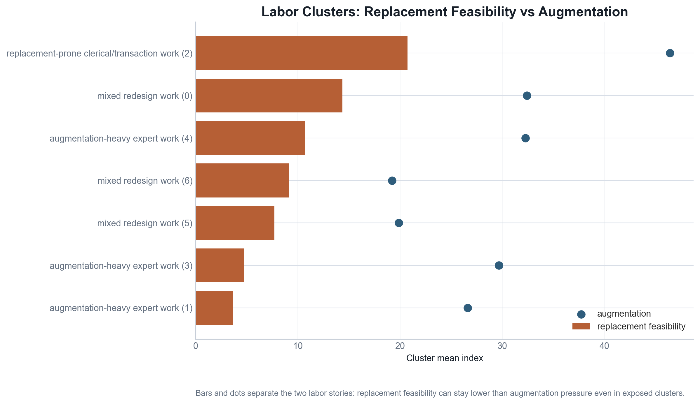

The labor-weighted outcome mix below is the report's guardrail against overclaiming. It weights modeled outcomes by the best available public labor proxy so a handful of highly automatable occupations do not dominate the narrative.

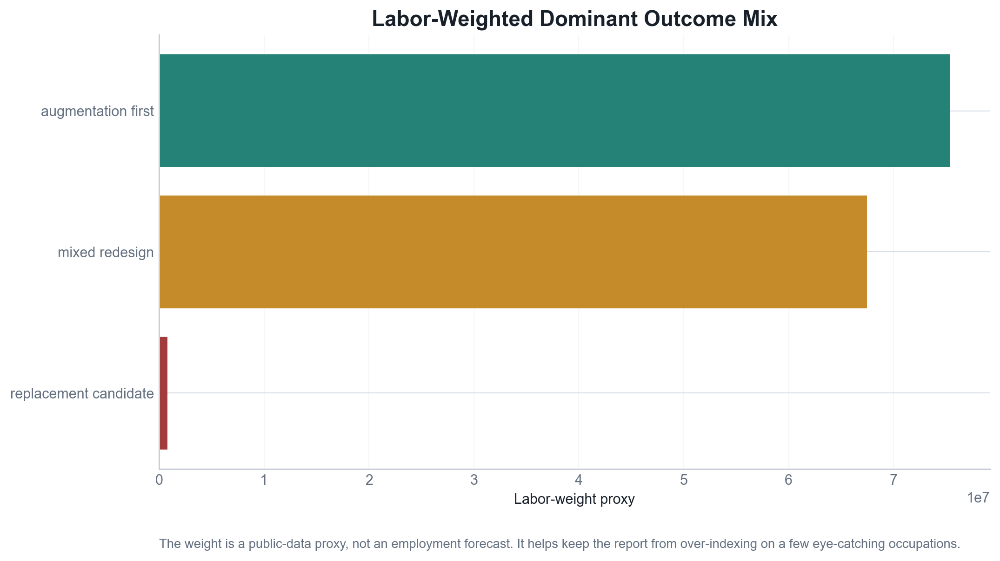

## Business Domain Implications

The domain layer translates occupation-level pressure into business language. It does not replace occupation evidence; each domain keeps example occupations and explicit human gates so a portfolio reviewer can see where the abstraction could fail.

| business_domain           | pressure_label   |   disruption_index |   augmentation_index |   replacement_feasibility_index |   human_bottleneck_index | example_occupations                                                                                                                                                                                                      |
|:--------------------------|:-----------------|-------------------:|---------------------:|--------------------------------:|-------------------------:|:-------------------------------------------------------------------------------------------------------------------------------------------------------------------------------------------------------------------------|
| finance_analysis          | moderate         |              38.91 |                39.74 |                           15.46 |                     1.58 | Market Research Analysts and Marketing Specialists; Financial and Investment Analysts; Accountants and Auditors; Loan Officers                                                                                           |
| marketing_content         | moderate         |              34.82 |                33.3  |                           12.93 |                     1.27 | Technical Writers; Public Relations Specialists; Real Estate Brokers; Real Estate Sales Agents                                                                                                                           |
| software_engineering      | moderate         |              33.81 |                32.14 |                           12.44 |                     3.93 | Social Science Research Assistants; Secretaries and Administrative Assistants, Except Legal, Medical, and Executive; Interviewers, Except Eligibility and Loan; Office Clerks, General                                   |
| customer_support          | moderate         |              32.76 |                29.95 |                           12.79 |                     2.79 | Sales Representatives, Wholesale and Manufacturing, Except Technical and Scientific Products; Receptionists and Information Clerks; Customer Service Representatives; Switchboard Operators, Including Answering Service |
| legal_compliance          | moderate         |              31.26 |                28.01 |                            9.55 |                     3.1  | Paralegals and Legal Assistants; Administrative Law Judges, Adjudicators, and Hearing Officers; Judges, Magistrate Judges, and Magistrates; Property, Real Estate, and Community Association Managers                    |
| operations_back_office    | moderate         |              30.2  |                24.04 |                           11.11 |                     3.28 | Data Entry Keyers; Statistical Assistants; Human Resources Assistants, Except Payroll and Timekeeping; Political Scientists                                                                                              |
| education                 | moderate         |              28.91 |                23.28 |                            8.97 |                     3.74 | Mathematical Science Teachers, Postsecondary; Engineering Teachers, Postsecondary; English Language and Literature Teachers, Postsecondary; Health Specialties Teachers, Postsecondary                                   |
| healthcare_administration | moderate         |              27.73 |                28.43 |                            4.35 |                     7.52 | Medical Transcriptionists; Nurse Practitioners; Medical Records Specialists; Magnetic Resonance Imaging Technologists                                                                                                    |

Workflow examples:

| business_domain           | workflow_example                                                         | likely_ai_role                               | human_gate                                            |
|:--------------------------|:-------------------------------------------------------------------------|:---------------------------------------------|:------------------------------------------------------|
| software_engineering      | Issue triage, code review, test generation and migration planning        | draft patches and review checklists          | senior engineer approval and production ownership     |
| customer_support          | Ticket summarization, answer drafting and escalation routing             | suggest responses and detect repeated issues | human review for refunds, safety and account actions  |
| legal_compliance          | Contract review, policy comparison and evidence packet preparation       | extract clauses and compare requirements     | licensed professional signoff                         |
| marketing_content         | Campaign briefs, SEO drafts, localization and asset variants             | generate drafts and performance hypotheses   | brand, legal and factual review                       |
| finance_analysis          | Variance explanations, spreadsheet checks and memo drafting              | surface anomalies and draft analysis         | accountability for assumptions and controls           |
| healthcare_administration | Claims coding, prior authorization packets and patient-message drafts    | prepare structured documentation             | clinical and compliance review                        |
| education                 | Lesson planning, tutoring support and feedback drafting                  | adapt materials and summarize progress       | teacher judgment and student relationship             |
| operations_back_office    | Data entry cleanup, scheduling, reconciliation and process documentation | automate routine transformations             | exception handling and vendor/customer accountability |

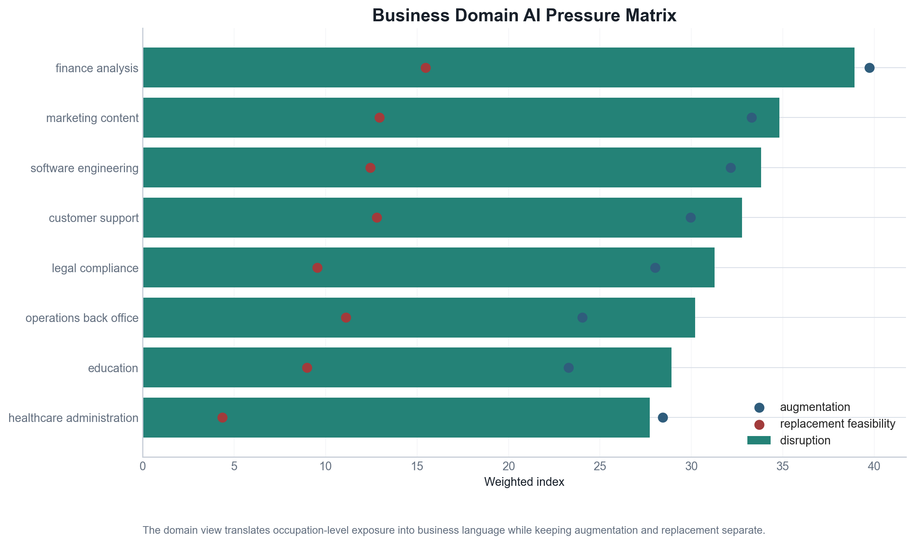

## 2, 5 And 10 Year Forecasts

Base scenario subset:

|   target_year | metric                                          |   value | unit                                                   | method                                                                               |
|--------------:|:------------------------------------------------|--------:|:-------------------------------------------------------|:-------------------------------------------------------------------------------------|
|          2028 | frontier_context_window_multiplier              |   6.23  | x current API catalog trend                            | capped scenario from OpenRouter upper-tail slope; raw=6.23x capped=False             |
|          2028 | frontier_output_price_factor                    |   1     | fraction of current low-price frontier API output cost | OpenRouter lower-quintile output price slope; observed=0.039, scenario_assumed=0.000 |
|          2028 | open_weight_lmarena_gap_remaining               |  53.6   | arena rating points                                    | current open vs closed LMArena gap with scenario-specific closure speed              |
|          2028 | share_of_us_occupation_tasks_materially_touched |   0.104 | share of task-weighted occupation activity             | Anthropic observed exposure plus O*NET task bottleneck pressure, scaled by horizon   |
|          2031 | frontier_context_window_multiplier              |  64     | x current API catalog trend                            | capped scenario from OpenRouter upper-tail slope; raw=96.70x capped=True             |
|          2031 | frontier_output_price_factor                    |   1     | fraction of current low-price frontier API output cost | OpenRouter lower-quintile output price slope; observed=0.039, scenario_assumed=0.000 |
|          2031 | open_weight_lmarena_gap_remaining               |  28.2   | arena rating points                                    | current open vs closed LMArena gap with scenario-specific closure speed              |
|          2031 | share_of_us_occupation_tasks_materially_touched |   0.183 | share of task-weighted occupation activity             | Anthropic observed exposure plus O*NET task bottleneck pressure, scaled by horizon   |
|          2036 | frontier_context_window_multiplier              |  64     | x current API catalog trend                            | capped scenario from OpenRouter upper-tail slope; raw=9351.33x capped=True           |
|          2036 | frontier_output_price_factor                    |   1     | fraction of current low-price frontier API output cost | OpenRouter lower-quintile output price slope; observed=0.039, scenario_assumed=0.000 |
|          2036 | open_weight_lmarena_gap_remaining               |   5.6   | arena rating points                                    | current open vs closed LMArena gap with scenario-specific closure speed              |
|          2036 | share_of_us_occupation_tasks_materially_touched |   0.281 | share of task-weighted occupation activity             | Anthropic observed exposure plus O*NET task bottleneck pressure, scaled by horizon   |

The dashboard puts four scenario families on one page: context scale, output price, open-weight benchmark gap and task-share contact. The useful reading is not the exact number in 2036; it is which assumptions move together and which do not.

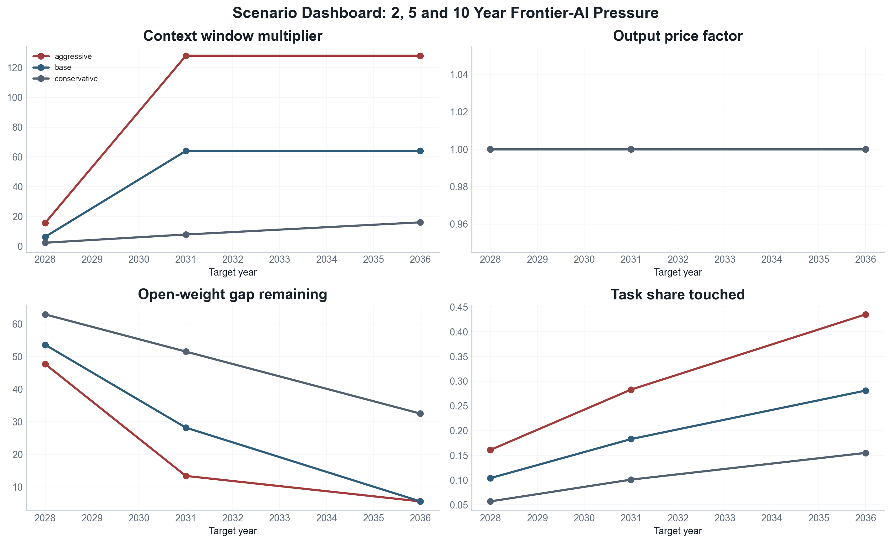

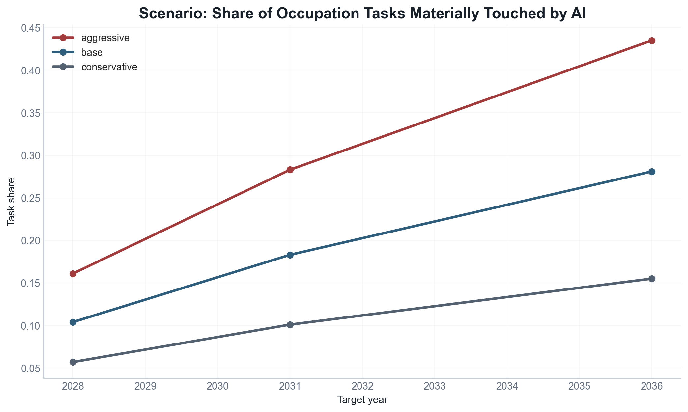

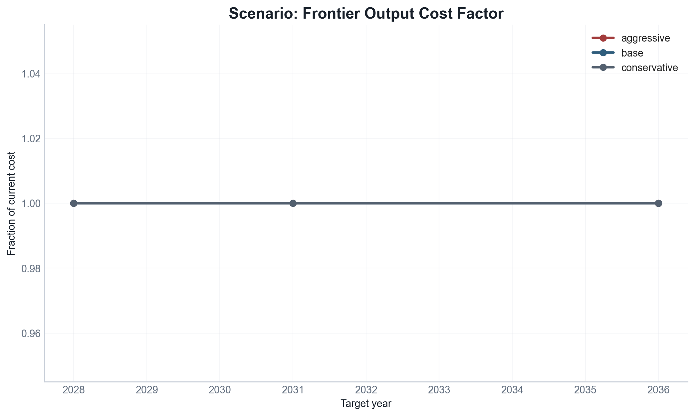

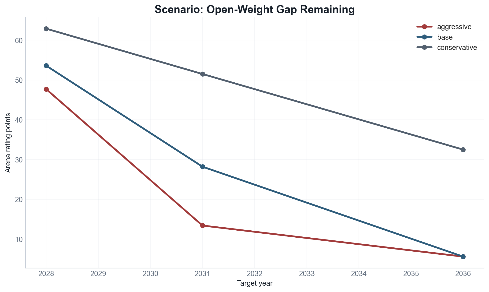

## Uncertainty And Rank Stability

The uncertainty view stress-tests component weights and evidence depth. These intervals are not calibrated confidence intervals; they are a visibility layer for how much the rank can move when public-source signals are perturbed.

| model_family   |   current_rank |   score_p10 |   score_p50 |   score_p90 |   best_rank |   median_rank |   worst_rank | rank_stability_label   |
|:---------------|---------------:|------------:|------------:|------------:|------------:|--------------:|-------------:|:-----------------------|
| Qwen           |              1 |       77.1  |       79.09 |       81.06 |           1 |             1 |            2 | stable                 |
| GPT            |              2 |       75.67 |       78.31 |       80.93 |           1 |             2 |            2 | stable                 |
| Mistral        |              3 |       53.43 |       56.47 |       59.51 |           3 |             4 |            7 | moderate               |
| DeepSeek       |              6 |       51.61 |       54.95 |       58.01 |           3 |             5 |            8 | moderate               |
| Llama          |              5 |       50.89 |       55    |       58.58 |           3 |             5 |            8 | moderate               |
| Claude         |              4 |       52.5  |       55.3  |       58.09 |           3 |             5 |            8 | moderate               |
| Gemini         |              7 |       48.92 |       52.47 |       55.94 |           3 |             7 |            8 | moderate               |
| Gemma          |              8 |       43.68 |       47.2  |       50.79 |           6 |             8 |            9 | stable                 |
| Phi            |              9 |       32.82 |       36.51 |       40.17 |           9 |             9 |           11 | stable                 |
| Grok           |             10 |       25.31 |       29.05 |       33.9  |           9 |            10 |           12 | stable                 |
| Command        |             11 |       20.25 |       23.98 |       28.4  |          10 |            11 |           12 | stable                 |
| Cohere         |             12 |        3.05 |       14.09 |       29.71 |           3 |            12 |           12 | stable                 |

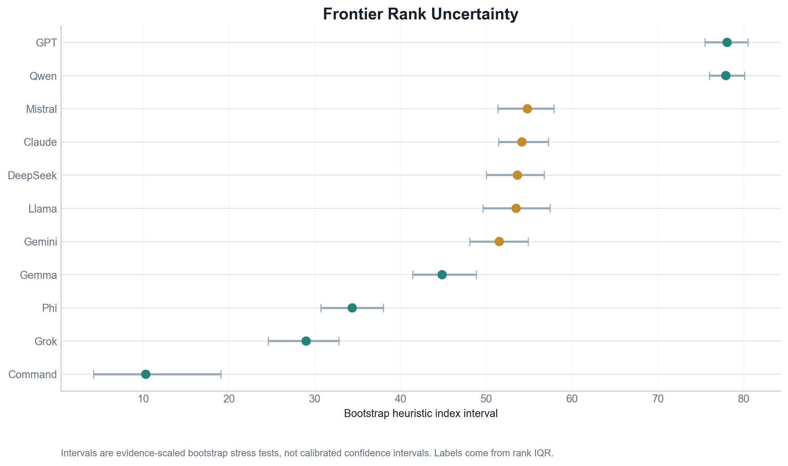

The forecast band chart is a scenario envelope across conservative, base and aggressive cases. It should not be read as a statistical confidence band.

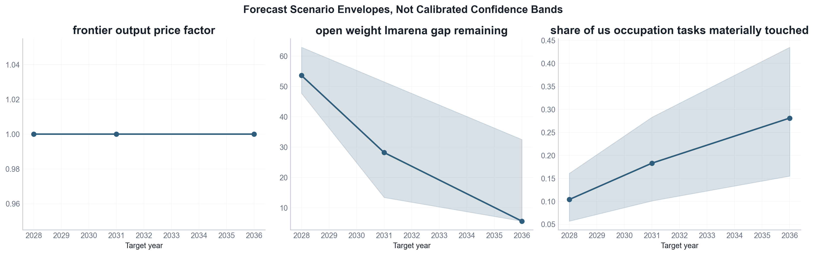

## Release Velocity And Product Cadence

Release cadence separates visible public execution speed from benchmark quality. The cadence tables combine OpenRouter API catalog entries and Epoch metadata, deduplicated by family, vendor, product line and date.

Family cadence:

| model_family   | vendor    |   total_releases |   recent_releases_365d |   median_days_between_releases |   days_since_latest_release | cadence_label   |
|:---------------|:----------|-----------------:|-----------------------:|-------------------------------:|----------------------------:|:----------------|
| GPT            | OpenAI    |              162 |                     66 |                           16   |                          10 | fast            |
| Qwen           | Alibaba   |              131 |                     64 |                            8   |                          18 | fast            |
| Gemini         | Google    |               69 |                     31 |                           14   |                           8 | fast            |
| Mistral        | Mistral   |               67 |                     30 |                           17   |                          15 | fast            |
| Claude         | Anthropic |               37 |                     24 |                           37.5 |                           3 | fast            |
| DeepSeek       | DeepSeek  |               52 |                     19 |                           26.5 |                          21 | fast            |
| Grok           | xAI       |               22 |                     13 |                           40   |                          15 | fast            |
| Gemma          | Google    |               31 |                      9 |                           18   |                          42 | fast            |
| Llama          | Meta      |               92 |                      3 |                           13   |                         212 | fast            |
| Command        | Cohere    |               11 |                      2 |                          104   |                         267 | steady          |
| Phi            | Microsoft |               17 |                      1 |                           71   |                         210 | fast            |

Vendor cadence:

| vendor    | portfolio_families   |   total_releases |   recent_releases_365d |   median_days_between_releases | cadence_label   |
|:----------|:---------------------|-----------------:|-----------------------:|-------------------------------:|:----------------|
| OpenAI    | GPT                  |              162 |                     66 |                           16   | fast            |
| Alibaba   | Qwen                 |              131 |                     64 |                            8   | fast            |
| Google    | Gemini,Gemma         |              100 |                     40 |                           12   | fast            |
| Mistral   | Mistral              |               67 |                     30 |                           17   | fast            |
| Anthropic | Claude               |               37 |                     24 |                           37.5 | fast            |
| DeepSeek  | DeepSeek             |               52 |                     19 |                           26.5 | fast            |
| xAI       | Grok                 |               22 |                     13 |                           40   | fast            |
| Meta      | Llama                |               92 |                      3 |                           13   | fast            |
| Cohere    | Command              |               11 |                      2 |                          104   | steady          |
| Microsoft | Phi                  |               17 |                      1 |                           71   | fast            |

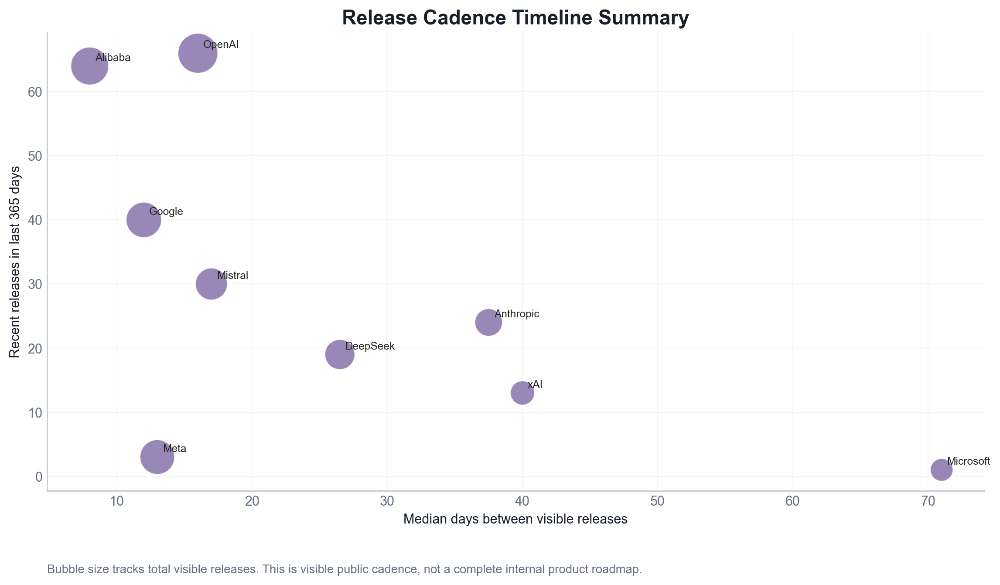

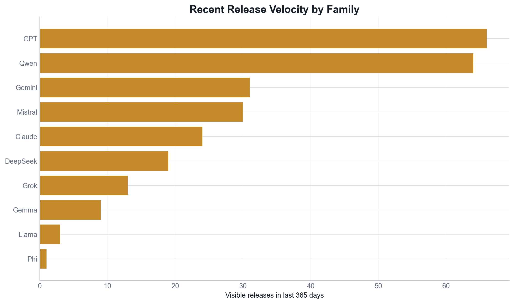

## Historical Analogy

AI looks less like a single prior wave and more like an uncomfortable hybrid: spreadsheet-style task rebundling, internet-style diffusion, cloud-style API economics, and electricity-style long-run production redesign.

| wave                | period    |   ai_similarity_score | interpretation                                                                                       |
|:--------------------|:----------|----------------------:|:-----------------------------------------------------------------------------------------------------|
| cloud_saas          | 2006-2022 |                 99.17 | Best analogy for enterprise adoption lags and API-first business-model shift.                        |
| internet            | 1993-2010 |                 98.86 | Best analogy for general-purpose diffusion, platform creation and strange second-order labor demand. |
| smartphones         | 2007-2020 |                 97.44 | Best analogy for consumer pull, app ecosystems and fast behavioral rewiring.                         |
| containerization    | 1956-1990 |                 97.23 | Best analogy for cost shock in a hidden infrastructure layer.                                        |
| search_ads          | 1998-2015 |                 96.53 | Best analogy for advertising-funded discovery and winner-take-most information layers.               |
| electricity         | 1882-1930 |                 96.22 | Best analogy for long-run production reorganization, not near-term speed.                            |
| spreadsheets        | 1979-1995 |                 95.85 | Best analogy for occupational task rebundling and sudden knowledge-worker productivity jumps.        |
| industrial_robotics | 1961-2020 |                 89.11 | Useful negative analogy: physical deployment is slower and more capital-locked than software AI.     |

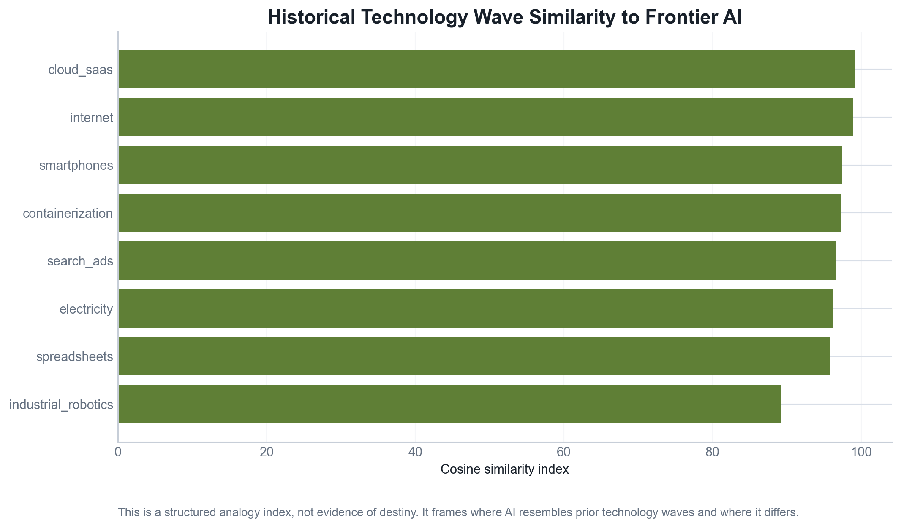

## Forecast Claims

| claim_id                                | claim                                                                                                                                                                       | evidence                                                                                                                  | confidence   | analysis_captured_at      |
|:----------------------------------------|:----------------------------------------------------------------------------------------------------------------------------------------------------------------------------|:--------------------------------------------------------------------------------------------------------------------------|:-------------|:--------------------------|
| company-next-best-model                 | Qwen has the strongest composite signal for near-term frontier leadership, but the top open-weight ecosystem score is not necessarily the same family.                      | Composite of LMArena, SWE-bench, OpenRouter, Epoch, Hugging Face, GitHub and OpenAlex indicators.                         | medium       | 2026-05-16T12:05:27+00:00 |
| jobs-augmentation-not-total-replacement | The labor signal is broad task contact, not full-job deletion: high-exposure occupations still retain bottlenecks from trust, regulation, physical work and accountability. | Anthropic Economic Index occupation exposure joined to O*NET task text, task collaboration modes and wage/job metadata.   | medium-high  | 2026-05-16T12:05:27+00:00 |
| open-source-catchup                     | Open-weight systems look structurally advantaged on ecosystem and cost but still need repeated frontier jumps to erase closed/API benchmark gaps.                           | OpenRouter price fields, Hugging Face downloads/files, LMArena access-class split and Epoch open-weight release metadata. | medium       | 2026-05-16T12:05:27+00:00 |
| ten-year-forecast                       | The 10-year question is less whether AI touches most cognitive workflows and more whether institutions redesign jobs around verification, liability and human preference.   | Scenario table combines capability trend, price decline, observed task exposure and bottleneck scoring.                   | speculative  | 2026-05-16T12:05:27+00:00 |

## Counterintuitive Findings

| finding                                                                               | evidence                                                                                                                                                        | why_it_is_interesting                                                                                                                    | artifact                                | analysis_captured_at      |
|:--------------------------------------------------------------------------------------|:----------------------------------------------------------------------------------------------------------------------------------------------------------------|:-----------------------------------------------------------------------------------------------------------------------------------------|:----------------------------------------|:--------------------------|
| Raw frontier leadership and open-distribution upside are different questions.         | In the 10-year frontier-quality scenario, GPT leads (52.7% of simulation draws); in the open-ecosystem-upside scenario, Qwen leads (74.1% of simulation draws). | The previous single 10-year number was misleading because it mixed best-model simulation share with adoption economics.                  | company_next_frontier_probabilities.csv | 2026-05-16T12:05:27+00:00 |
| The open-vs-closed gap is not one gap.                                                | The largest measured LMArena category gap is text_to_image at 361.6 rating points.                                                                              | Open-source catchup can be true in one domain and false in another; a single headline benchmark hides where closed labs still have moat. | open_closed_gap_by_category.csv         | 2026-05-16T12:05:27+00:00 |
| Cheap models can sit on the efficient frontier without being the raw best model.      | Efficient frontier examples include OpenAI: gpt-oss-20b; inclusionAI: Ling-2.6-flash.                                                                           | Enterprise adoption often follows sufficient capability per dollar, not absolute leaderboard rank.                                       | price_performance_frontier.csv          | 2026-05-16T12:05:27+00:00 |
| The top whole-job automation candidates are narrower than the top task-exposure jobs. | The highest replacement-feasibility occupation is Market Research Analysts and Marketing Specialists with feasibility index 39.0.                               | A job can be heavily touched by AI but still mostly redesigned around human review rather than deleted.                                  | job_replacement_feasibility.csv         | 2026-05-16T12:05:27+00:00 |
| Augmentation can be a larger labor-weighted mode than replacement.                    | Available labor-weight proxy: augmentation-first=75,414,668, replacement-candidate=796,776.                                                                     | This pushes the labor forecast toward workflow redesign, wage compression and productivity dispersion before mass full automation.       | labor_market_exposure_summary.csv       | 2026-05-16T12:05:27+00:00 |

## Where This Analysis Is Weak

The skeptical section names assumptions that could break the analysis. It is meant to make the work easier to challenge, not to protect it with broad caveats.

| claim_id                 | assumption                                                                              | failure_mode                                                                                                  | mitigation                                                                                | severity   |
|:-------------------------|:----------------------------------------------------------------------------------------|:--------------------------------------------------------------------------------------------------------------|:------------------------------------------------------------------------------------------|:-----------|
| family-frontier-ranking  | Benchmark, release, ecosystem, cost and openness signals are directionally informative. | A private model or undisclosed benchmark result changes the frontier without appearing in public data.        | Keep heuristic label, show sensitivity, and refresh source snapshots before external use. | high       |
| direct-model-evidence    | Normalized names and curated aliases correctly identify equivalent model rows.          | Vendor naming drift or hidden routing makes same-looking model IDs non-equivalent.                            | Expose match confidence and keep unmatched/family-only rows in the audit table.           | high       |
| vendor-portfolio-ranking | Flagship plus evidence-weighted portfolio mean is a reasonable vendor aggregation.      | A vendor has one dominant model family and several weak rows that should not affect portfolio interpretation. | Report flagship family, family count and components beside the vendor score.              | medium     |
| labor-domain-pressure    | Keyword domain mapping is sufficient for a portfolio-level translation layer.           | Occupation titles hide domain-specific workflows or regulated subdomains.                                     | Keep occupation examples and human gates visible for each domain.                         | medium     |
| forecast-envelope        | Conservative/base/aggressive scenarios bound the intended stress test.                  | A structural market break makes historical slopes irrelevant.                                                 | Label forecast bands as non-calibrated scenario envelopes.                                | high       |

Under-observed family audit:

| model_family   | vendor    |   direct_benchmark_match_count |   coverage_score | underobserved   | underobserved_reasons                                                    |
|:---------------|:----------|-------------------------------:|-----------------:|:----------------|:-------------------------------------------------------------------------|
| Cohere         | Cohere    |                              0 |             0    | True            | few_direct_model_matches,low_source_coverage,below_median_evidence_depth |
| GPT            | OpenAI    |                            120 |            99.5  | True            | below_median_evidence_depth                                              |
| Claude         | Anthropic |                             48 |           100    | True            | below_median_evidence_depth                                              |
| Gemini         | Google    |                             24 |           100    | True            | below_median_evidence_depth                                              |
| Grok           | xAI       |                              3 |           100    | True            | below_median_evidence_depth                                              |
| Command        | Cohere    |                             12 |           100    | True            | below_median_evidence_depth                                              |
| Gemma          | Google    |                             15 |            96.3  | False           | none                                                                     |
| Llama          | Meta      |                             81 |            98.08 | False           | none                                                                     |
| DeepSeek       | DeepSeek  |                             25 |            98.89 | False           | none                                                                     |
| Qwen           | Alibaba   |                             83 |            99.3  | False           | none                                                                     |
| Mistral        | Mistral   |                             56 |            99.33 | False           | none                                                                     |
| Phi            | Microsoft |                              6 |           100    | False           | none                                                                     |

## Method Notes

- Model-family scoring uses `data/dataset/`: LMArena full leaderboard rows, SWE-bench submissions, Open LLM Leaderboard metrics, OpenRouter prices/context, Epoch model metadata, Hugging Face rollups, GitHub model mentions and OpenAlex paper mentions.
- Direct model evidence uses conservative name matching across exact, normalized exact, alias, family-only and unmatched classes. Family-only rows are audit evidence, not direct model proof.
- Vendor scoring maps model families to legal vendors and combines flagship-family signal with evidence-weighted portfolio breadth.
- Rank stability and forecast bands are stress tests and scenario envelopes. They are not calibrated confidence intervals.
- Labor scoring uses Anthropic Economic Index files from Hugging Face, including occupation exposure, task penetration, task automation/augmentation labels, O*NET task mappings/statements, and BLS wage/employment companion data.
- Scenario forecasts are not forecasts from a proprietary model. They are transparent transforms of observed slopes and pressure scores. Every scenario row includes a method field and the input diagnostics include caps/fallback policy.
- Leadership simulation shares are stochastic sensitivity analyses over explicit score components, not calibrated market probabilities.
- Labor-weighted summaries use the best available public companion weights; where only major-group BLS employment is available, the analysis allocates it across detailed occupations inside that group to avoid treating each detailed occupation as the whole major group.
- BLS web xlsx endpoints returned anti-bot 403 responses in this environment. The analysis therefore uses public BLS-derived companion files already included in Anthropic's release rather than scraping around that restriction.

## Generated Artifacts

- `data/analysis/company_frontier_scores.csv`
- `data/analysis/company_score_methodology.csv`
- `data/analysis/company_score_sensitivity.csv`
- `data/analysis/model_benchmark_match_audit.csv`
- `data/analysis/direct_model_price_performance.csv`
- `data/analysis/vendor_frontier_scores.csv`
- `data/analysis/vendor_score_components.csv`
- `data/analysis/source_coverage_diagnostics.csv`
- `data/analysis/family_coverage_matrix.csv`
- `data/analysis/frontier_score_bootstrap.csv`
- `data/analysis/rank_stability_intervals.csv`
- `data/analysis/claim_failure_modes.csv`
- `data/analysis/underobserved_family_audit.csv`
- `data/analysis/business_domain_ai_pressure.csv`
- `data/analysis/domain_workflow_examples.csv`
- `data/analysis/release_cadence_by_family.csv`
- `data/analysis/release_cadence_by_vendor.csv`
- `data/analysis/job_exposure_scores.csv`
- `data/analysis/capability_forecasts.csv`
- `data/analysis/forecast_input_diagnostics.csv`
- `data/analysis/company_next_frontier_probabilities.csv`
- `data/analysis/open_closed_gap_by_category.csv`
- `data/analysis/lmarena_category_leaders.csv`
- `data/analysis/price_performance_frontier.csv`
- `data/analysis/labor_cluster_profiles.csv`
- `data/analysis/labor_market_exposure_summary.csv`
- `data/analysis/job_replacement_feasibility.csv`
- `data/analysis/counterintuitive_findings.csv`
- `data/analysis/historical_analogy_index.csv`
- `data/analysis/forecast_claims.csv`
- `figures/deep_analysis/company_score_component_stack.png`
- `figures/deep_analysis/company_score_evidence_scatter.png`
- `figures/deep_analysis/leadership_scenario_matrix.png`
- `figures/deep_analysis/open_closed_category_levels.png`
- `figures/deep_analysis/price_context_rating_map.png`
- `figures/deep_analysis/labor_outcome_mix.png`
- `figures/deep_analysis/forecast_scenario_dashboard.png`
- `figures/deep_analysis/direct_vs_proxy_price_performance.png`
- `figures/deep_analysis/vendor_frontier_scores.png`
- `figures/deep_analysis/family_vs_vendor_rank_shift.png`
- `figures/deep_analysis/source_coverage_dashboard.png`
- `figures/deep_analysis/family_signal_coverage_heatmap.png`
- `figures/deep_analysis/frontier_rank_uncertainty.png`
- `figures/deep_analysis/forecast_uncertainty_bands.png`
- `figures/deep_analysis/business_domain_pressure_matrix.png`
- `figures/deep_analysis/release_cadence_timeline.png`
- `figures/deep_analysis/recent_release_velocity.png`
- `figures/deep_analysis/*.png`
