# Deep Frontier AI Analysis

Reference date: **2026-05-15**. Generated at: **2026-07-12T19:42:51+00:00**.

This report is deliberately data-heavy. It uses the local rich frontier-model dataset, the public Anthropic Economic Index release files for occupation exposure, and a new domain benchmark layer covering coding, medicine, terminal agents, finance, legal reasoning, math, science/reasoning, language, vision and search/document work. The goal is not to claim precision about the future; it is to make the assumptions inspectable enough that the forecast can be argued with.

## Dashboard Snapshot

This opening map is the fast path through the analysis. It turns the long report into a set of inspectable questions, each tied to a primary artifact and an evidence-strength label.

| section         | question                                                         | headline                                           | metric                        | evidence_level   | primary_artifact                        |
|:----------------|:-----------------------------------------------------------------|:---------------------------------------------------|:------------------------------|:-----------------|:----------------------------------------|
| Models          | Who leads the current frontier-family signal?                    | GPT                                                | 78.2 heuristic index          | observed         | company_frontier_scores.csv             |
| Domains         | Which capability field is improving fastest in the public panel? | Agentic terminal work                              | 12.0 points/year used         | scenario         | domain_improvement_velocity.csv         |
| Coverage        | How many capability domains have broad benchmark coverage?       | 1 broad domains                                    | 115,938 normalized rows       | observed         | domain_benchmark_catalog.csv            |
| Evidence        | Where is model-level evidence strongest?                         | GPT                                                | 120 direct benchmark matches  | direct_match     | family_coverage_matrix.csv              |
| Forecast        | Who wins the 10-year frontier-quality stress test?               | GPT                                                | 58.6% simulation share        | scenario         | company_next_frontier_probabilities.csv |
| Open Ecosystem  | Who benefits if distribution, openness and cost matter more?     | Qwen                                               | 70.2% simulation share        | scenario         | company_next_frontier_probabilities.csv |
| Domain Forecast | Which field has the highest 2036 base-case frontier score?       | Software engineering                               | 97.4/100 forecast score       | scenario         | domain_capability_forecasts.csv         |
| Open vs Closed  | Where is the open-vs-closed gap largest?                         | text to image                                      | 361.6 arena rating points     | observed         | open_closed_gap_by_category.csv         |
| Economics       | Which directly matched model sits highest on price-performance?  | OpenAI: GPT-4.1 Nano                               | 92.2 direct index             | direct_match     | direct_model_price_performance.csv      |
| Economics       | Is average message/task cost rising in the modeled workload mix? | 0.152 USD                                          | 577.1 index vs 2023           | scenario         | llm_message_cost_trends.csv             |
| Fixed Task Cost | What happens to a thesis-quality fixed writing task?             | GPT                                                | 0.0002 USD in 2036            | scenario         | fixed_task_cost_curves.csv              |
| Labor           | Which occupation has the highest near-term pressure index?       | Data Entry Keyers                                  | 60.2 disruption index         | observed         | job_exposure_scores.csv                 |
| Labor           | Where is whole-job replacement most feasible after gates?        | Market Research Analysts and Marketing Specialists | 39.0 feasibility index        | observed         | job_replacement_feasibility.csv         |
| Workflows       | Which business domain should a reader inspect first?             | finance analysis                                   | 38.1 disruption index         | family_proxy     | business_domain_ai_pressure.csv         |
| Execution       | Which family shows the most visible recent release velocity?     | GPT                                                | 66 releases in 365 days       | observed         | release_cadence_by_family.csv           |
| Coverage        | How fresh is the visible source layer?                           | 2026-05-15                                         | 1,327,480 source rows tracked | observed         | source_coverage_diagnostics.csv         |
| Uncertainty     | How many family ranks are stable under evidence-scaled stress?   | 5 stable rank bands                                | 11 families stress-tested     | scenario         | rank_stability_intervals.csv            |
| Risk            | What should a reviewer challenge first?                          | 3 high-severity assumptions                        | Named failure modes           | speculative      | claim_failure_modes.csv                 |

## How To Read This Report

The report is organized around three questions:

1. **Who has the strongest frontier-family signal right now?** The answer is a composite heuristic, so the report shows both rank and component composition instead of hiding the weighting.
2. **Where are the counterintuitive gaps?** Open-weight systems, low prices, context windows and benchmark ratings move on different axes. The plots keep those axes separate.
3. **Which domains are improving fastest?** The domain panel keeps fields separate: coding and agentic terminal work should not be averaged blindly with medicine, legal reasoning or finance.
4. **What happens when model capability meets labor structure?** Occupation exposure is not the same thing as replacement. The labor section separates task pressure, augmentation, bottlenecks and whole-job feasibility.
5. **Are costs rising or falling?** The economics section separates workload-mix cost per message/task from fixed-task cost curves, because those can move in opposite directions.

Every chart should be read as an audit surface. If a conclusion depends on one metric, the report names that metric and shows the caveat near the visualization. Domain rows with `forecast_enabled=false` are deliberately held flat: no comparable history means no extrapolation. The full remediation log is in `docs/statistical_audit.md`.

Evidence badges used throughout the HTML view: `observed`, `direct_match`, `family_proxy`, `scenario`, `speculative`. They are labels for evidence strength, not decoration.

## Executive Takeaways

1. **Near-term frontier-family leadership is concentrated, but not one-dimensional.** The highest heuristic index in this run is **GPT** with a frontier momentum heuristic index of **78.2**. The strongest openness/cost/ecosystem signal is **Qwen**, which is not automatically the same thing as best closed frontier performance.
2. **The next-winner question is a simulation sensitivity exercise.** The table changes component weights thousands of times and injects evidence noise. Its shares are not calibrated probabilities.
3. **Open vs closed is category-specific.** Some LMArena categories show narrow gaps; others preserve a clear closed/API advantage. "Open source caught up" is too crude.
4. **Field-level progress is uneven.** Coding, terminal-agent and language/document signals have denser coverage than legal and finance. The report extrapolates only domains with repeated observations of the same benchmark; other domains are marked `insufficient_history` and held flat.
5. **The job story is not "all jobs disappear."** The highest-risk roles are task bundles where language, analysis, clerical transformation and directive delegation are already exposed. Jobs with physical work, trust, regulation or face-to-face accountability keep meaningful bottlenecks.
6. **The 10-year labor path is a scenario, not an estimate.** The task-contact paths encode explicit adoption assumptions; they are useful for stress testing verification, liability and workflow redesign, not for predicting employment levels.
7. **The cost view is synthetic.** Message/task paths combine assumed workload mixes with current catalog cohorts, while fixed-task paths use explicit quality and price scenarios. Neither is observed invoice history.

## Data Freshness And Coverage

The report now exposes source coverage before leaning on rankings. This section records row counts, captured dates, latest source dates and missingness across release dates, prices, benchmark values, context windows and organization/vendor fields.

| table                         |   rows | latest_source_date   |   release_date_coverage |   price_coverage |   benchmark_value_coverage |   organization_vendor_coverage |
|:------------------------------|-------:|:---------------------|------------------------:|-----------------:|---------------------------:|-------------------------------:|
| epoch_models_normalized       |   3525 | 2026-04-24           |                  0.9935 |                0 |                          0 |                         1      |
| github_ai_repositories        |   1395 | 2026-05-15           |                  1      |                0 |                          0 |                         0      |
| github_ai_repository_topics   |  13746 |                      |                  0      |                0 |                          0 |                         0      |
| github_model_mentions         |    703 |                      |                  0      |                0 |                          0 |                         0      |
| huggingface_model_files       |   5256 |                      |                  0      |                0 |                          0 |                         0      |
| huggingface_model_rollups     |   2574 | 2026-05-15           |                  1      |                0 |                          0 |                         1      |
| huggingface_model_tags        |  36737 |                      |                  0      |                0 |                          0 |                         0      |
| huggingface_models            |   2574 | 2026-05-15           |                  1      |                0 |                          0 |                         1      |
| livebench_judgments           |  60372 |                      |                  0      |                0 |                          1 |                         0      |
| lmarena_full                  | 862027 | 2026-05-14           |                  1      |                0 |                          1 |                         0.9726 |
| openalex_ai_paper_authorships |  22643 |                      |                  0      |                0 |                          0 |                         0      |
| openalex_ai_paper_concepts    |  36079 |                      |                  0      |                0 |                          1 |                         0      |

Family coverage matrix:

| model_family   | vendor    |   coverage_score |   direct_benchmark_match_count |   family_proxy_benchmark_count |   source_gap_count |
|:---------------|:----------|-----------------:|-------------------------------:|-------------------------------:|-------------------:|
| Gemini         | Google    |           100    |                             24 |                             32 |                  0 |
| Claude         | Anthropic |           100    |                             48 |                             30 |                  0 |
| Phi            | Microsoft |           100    |                              6 |                              8 |                  0 |
| Grok           | xAI       |           100    |                              3 |                             24 |                  0 |
| GPT            | OpenAI    |            99.5  |                            120 |                             61 |                  0 |
| Mistral        | Mistral   |            99.33 |                             56 |                             23 |                  0 |
| Qwen           | Alibaba   |            99.3  |                             83 |                             52 |                  0 |
| DeepSeek       | DeepSeek  |            98.89 |                             25 |                             20 |                  0 |
| Llama          | Meta      |            98.08 |                             81 |                             25 |                  0 |
| Gemma          | Google    |            96.3  |                             15 |                             14 |                  0 |
| Command        | Command   |             0    |                              0 |                              0 |                  6 |

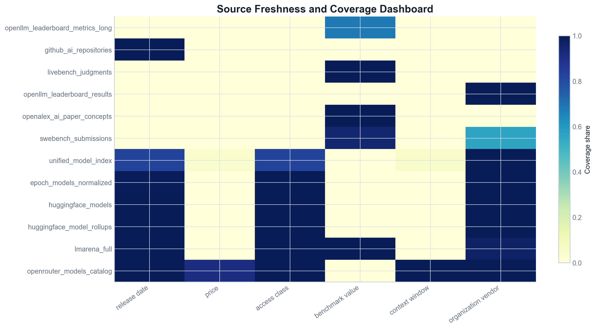

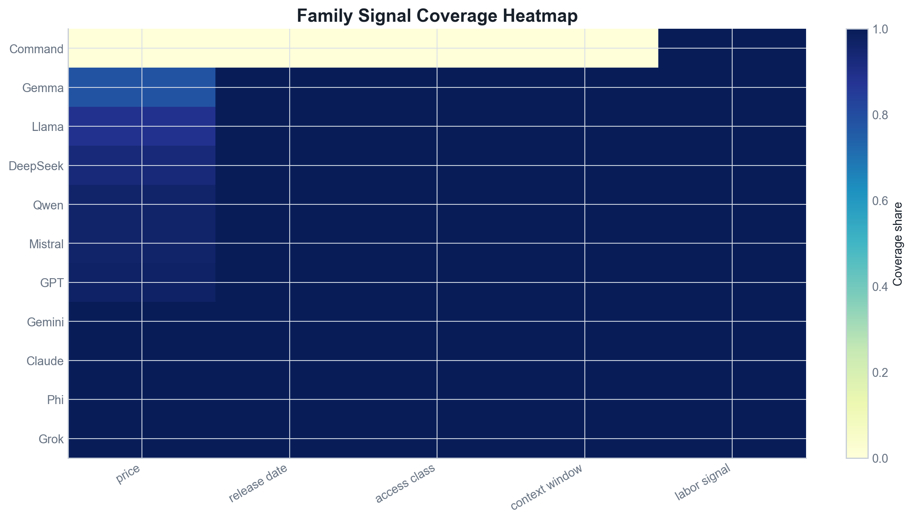

## Capability Domains

This is the new domain benchmark layer. It pulls together local benchmark sources and additional public sources downloaded during generation: LiveCodeBench, Open Medical-LLM Leaderboard result files, Terminal-Bench, FinanceBench, QFBench and Lexometrica LegalBench RU. Scores are normalized to a 0-100 frontier scale so fields can be compared without pretending that a medical QA percent, a legal composite, an arena rating and an agentic terminal score are the same measurement.

Domain catalog:

| domain_label                      |   normalized_result_rows |   source_count |   benchmark_count |   model_count | coverage_label   | latest_eval_date   | interpretation                                                                                    |
|:----------------------------------|-------------------------:|---------------:|------------------:|--------------:|:-----------------|:-------------------|:--------------------------------------------------------------------------------------------------|
| Software engineering              |                     3020 |              4 |                 4 |           391 | broad            | 2026-05-14         | Code generation, repository repair, web development and terminal software workflows.              |
| Science and reasoning             |                    46146 |              2 |                36 |          1368 | moderate         | 2026-05-12         | Graduate-level science, GPQA-like reasoning, ARC/BBH/MuSR and broad reasoning suites.             |
| Language and writing              |                    40009 |              2 |                 2 |           480 | moderate         | 2026-05-14         | General text quality, paraphrase, editing, summarization and subjective chat preference.          |
| Instruction following             |                     1529 |              2 |                 2 |          1457 | moderate         | 2025-04-07         | Constraint following, output format obedience and prompt-level generalization.                    |
| Finance and quantitative analysis |                       22 |              2 |                 3 |            13 | moderate         | 2026-05-07         | Financial QA, quantitative coding, risk, pricing, forecasting and professional finance tasks.     |
| Mathematics                       |                    12060 |              1 |                 9 |          1339 | moderate         |                    | Competition math, quantitative reasoning and formal problem solving.                              |
| Medicine and biomedical QA        |                     1873 |              1 |                10 |           184 | moderate         | 2025-01-29         | Medical question answering, biomedical literature reasoning and clinical knowledge subsets.       |
| Vision and multimodal             |                    10947 |              1 |                 3 |           202 | thin             | 2026-05-12         | Image understanding, image editing, text-to-image and multimodal preference leaderboards.         |
| Search and document work          |                      166 |              1 |                 1 |            24 | thin             | 2026-05-12         | Search, long-document handling, retrieval-facing work and document synthesis.                     |
| Agentic terminal work             |                      146 |              1 |                 1 |            51 | thin             | 2026-05-15         | Long-horizon command-line tasks requiring planning, execution, debugging and environment control. |
| Legal reasoning                   |                       20 |              1 |                 2 |            10 | thin             | 2026-03-01         | Legal issue spotting, rule application, citations and jurisdiction-specific legal reasoning.      |

Representative high-scoring source rows:

| source_name                    | domain_label          | benchmark          | task          | model_name      |   score_normalized_0_100 | eval_date   | limitations                                                                                       |
|:-------------------------------|:----------------------|:-------------------|:--------------|:----------------|-------------------------:|:------------|:--------------------------------------------------------------------------------------------------|
| Terminal-Bench 2.0 leaderboard | Agentic terminal work | Terminal-Bench 2.0 | vix           | Claude Opus 4.7 |                     90.2 | 2026-05-15  | Agent, scaffold and model are entangled; do not attribute the whole score to model weights alone. |
| Terminal-Bench 2.0 leaderboard | Agentic terminal work | Terminal-Bench 2.0 | JJAgent       | Multiple        |                     87.1 | 2026-05-15  | Agent, scaffold and model are entangled; do not attribute the whole score to model weights alone. |
| Terminal-Bench 2.0 leaderboard | Agentic terminal work | Terminal-Bench 2.0 | NexAU-AHE     | GPT-5.5         |                     84.7 | 2026-05-14  | Agent, scaffold and model are entangled; do not attribute the whole score to model weights alone. |
| Terminal-Bench 2.0 leaderboard | Agentic terminal work | Terminal-Bench 2.0 | LemonHarness  | Multiple        |                     84.5 | 2026-05-14  | Agent, scaffold and model are entangled; do not attribute the whole score to model weights alone. |
| Terminal-Bench 2.0 leaderboard | Agentic terminal work | Terminal-Bench 2.0 | Capy          | GPT-5.5         |                     83.1 | 2026-05-14  | Agent, scaffold and model are entangled; do not attribute the whole score to model weights alone. |
| Terminal-Bench 2.0 leaderboard | Agentic terminal work | Terminal-Bench 2.0 | Polaris       | Multiple        |                     82.2 | 2026-05-14  | Agent, scaffold and model are entangled; do not attribute the whole score to model weights alone. |
| Terminal-Bench 2.0 leaderboard | Agentic terminal work | Terminal-Bench 2.0 | Codex CLI     | GPT-5.5         |                     82   | 2026-04-23  | Agent, scaffold and model are entangled; do not attribute the whole score to model weights alone. |
| Terminal-Bench 2.0 leaderboard | Agentic terminal work | Terminal-Bench 2.0 | ForgeCode     | GPT-5.4         |                     81.8 | 2026-03-12  | Agent, scaffold and model are entangled; do not attribute the whole score to model weights alone. |
| Terminal-Bench 2.0 leaderboard | Agentic terminal work | Terminal-Bench 2.0 | WOZCODE       | Claude Opus 4.7 |                     80.2 | 2026-05-14  | Agent, scaffold and model are entangled; do not attribute the whole score to model weights alone. |
| Terminal-Bench 2.0 leaderboard | Agentic terminal work | Terminal-Bench 2.0 | TongAgents    | Gemini 3.1 Pro  |                     80.2 | 2026-03-13  | Agent, scaffold and model are entangled; do not attribute the whole score to model weights alone. |
| Terminal-Bench 2.0 leaderboard | Agentic terminal work | Terminal-Bench 2.0 | LemonHarness  | Multiple        |                     79.9 | 2026-05-14  | Agent, scaffold and model are entangled; do not attribute the whole score to model weights alone. |
| Terminal-Bench 2.0 leaderboard | Agentic terminal work | Terminal-Bench 2.0 | ForgeCode     | Claude Opus 4.6 |                     79.8 | 2026-03-12  | Agent, scaffold and model are entangled; do not attribute the whole score to model weights alone. |
| Terminal-Bench 2.0 leaderboard | Agentic terminal work | Terminal-Bench 2.0 | SageAgent     | GPT-5.3-Codex   |                     78.4 | 2026-03-13  | Agent, scaffold and model are entangled; do not attribute the whole score to model weights alone. |
| Terminal-Bench 2.0 leaderboard | Agentic terminal work | Terminal-Bench 2.0 | ForgeCode     | Gemini 3.1 Pro  |                     78.4 | 2026-03-02  | Agent, scaffold and model are entangled; do not attribute the whole score to model weights alone. |
| Terminal-Bench 2.0 leaderboard | Agentic terminal work | Terminal-Bench 2.0 | Droid         | GPT-5.3-Codex   |                     77.3 | 2026-02-24  | Agent, scaffold and model are entangled; do not attribute the whole score to model weights alone. |
| Terminal-Bench 2.0 leaderboard | Agentic terminal work | Terminal-Bench 2.0 | Meta-Harness  | Claude Opus 4.6 |                     76.4 | 2026-05-14  | Agent, scaffold and model are entangled; do not attribute the whole score to model weights alone. |
| Terminal-Bench 2.0 leaderboard | Agentic terminal work | Terminal-Bench 2.0 | CodeBrain-1.5 | GPT-5.3-Codex   |                     75.8 | 2026-02-10  | Agent, scaffold and model are entangled; do not attribute the whole score to model weights alone. |
| Terminal-Bench 2.0 leaderboard | Agentic terminal work | Terminal-Bench 2.0 | Codelia       | GPT-5.3-Codex   |                     75.7 | 2026-05-14  | Agent, scaffold and model are entangled; do not attribute the whole score to model weights alone. |

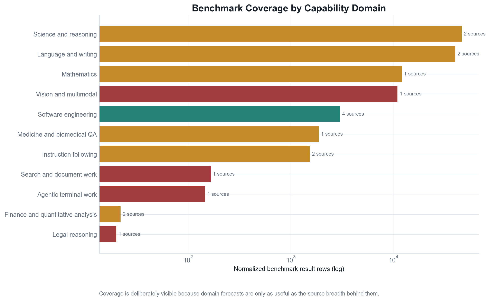

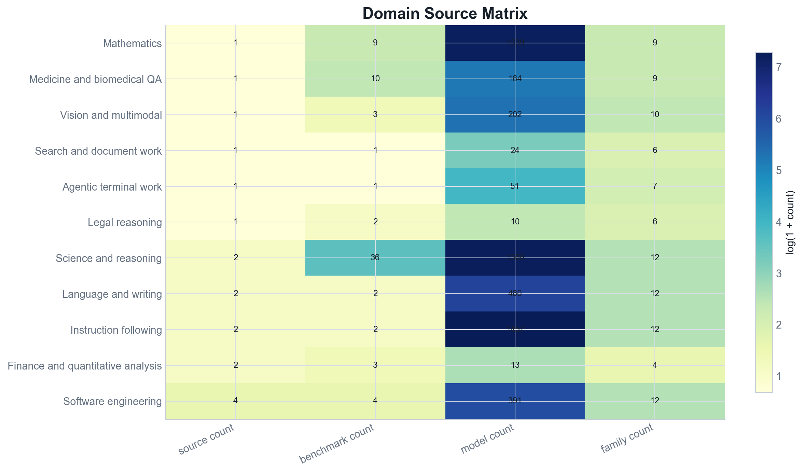

## Domain Improvement Velocity

The velocity table estimates how quickly each field is improving in the public benchmark panel. When a domain has enough dated observations, the report uses its observed frontier slope. When the time series is too thin, it falls back to the cross-domain median and labels the slope source explicitly.

| domain_label                      |   current_frontier_score |   annual_frontier_point_gain_used | slope_source                    |   years_observed | coverage_label   | forecast_confidence   |
|:----------------------------------|-------------------------:|----------------------------------:|:--------------------------------|-----------------:|:-----------------|:----------------------|
| Vision and multimodal             |                    97.31 |                             1.542 | median_within_benchmark_slope   |                3 | thin             | low                   |
| Search and document work          |                    95.21 |                             0     | insufficient_comparable_history |                1 | thin             | insufficient_history  |
| Science and reasoning             |                    95.17 |                             0     | median_within_benchmark_slope   |                2 | moderate         | insufficient_history  |
| Legal reasoning                   |                    93.88 |                             0     | insufficient_comparable_history |                1 | thin             | insufficient_history  |
| Language and writing              |                    87.71 |                             9.573 | median_within_benchmark_slope   |                4 | moderate         | low                   |
| Instruction following             |                    85.71 |                             0     | median_within_benchmark_slope   |                2 | moderate         | insufficient_history  |
| Agentic terminal work             |                    84.36 |                            12     | median_within_benchmark_slope   |                2 | thin             | low                   |
| Software engineering              |                    79.87 |                             4.094 | median_within_benchmark_slope   |                4 | broad            | medium                |
| Medicine and biomedical QA        |                    72.39 |                             0     | insufficient_comparable_history |                1 | moderate         | insufficient_history  |
| Finance and quantitative analysis |                    64.89 |                             0     | insufficient_comparable_history |                1 | moderate         | insufficient_history  |
| Mathematics                       |                    39.38 |                             0     | insufficient_comparable_history |                0 | moderate         | insufficient_history  |

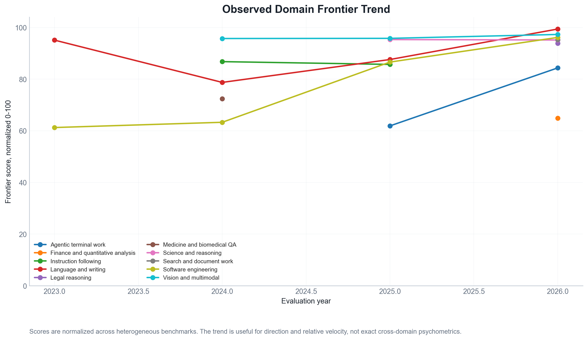

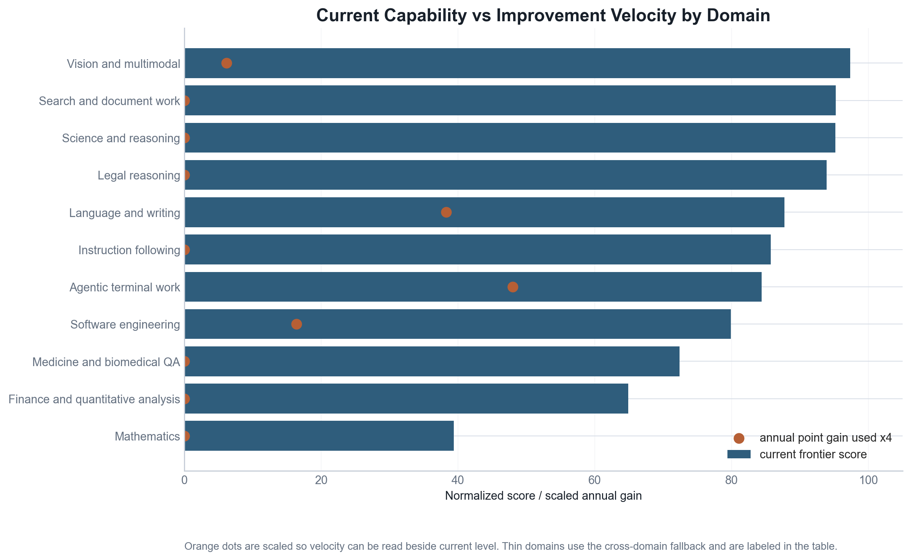

## Domain Capability Forecasts

The domain forecast uses a bounded gap-closure model: a domain starts at its current normalized frontier score, closes a fraction of the remaining gap each year, and is capped below 100. This makes the forecast interpretable: the question is how quickly each field closes the remaining gap, not whether scores can grow without limit.

Base scenario by domain and horizon:

| domain_label                      |   target_year |   forecast_frontier_score |   current_frontier_score | confidence           | caveat                                                                                                                 |
|:----------------------------------|--------------:|--------------------------:|-------------------------:|:---------------------|:-----------------------------------------------------------------------------------------------------------------------|
| Vision and multimodal             |          2028 |                     98.17 |                    97.31 | low                  | The data mixes perception and generation; downstream reliability depends heavily on task framing.                      |
| Vision and multimodal             |          2031 |                     98.97 |                    97.31 | low                  | The data mixes perception and generation; downstream reliability depends heavily on task framing.                      |
| Vision and multimodal             |          2036 |                     99.5  |                    97.31 | low                  | The data mixes perception and generation; downstream reliability depends heavily on task framing.                      |
| Search and document work          |          2028 |                     95.21 |                    95.21 | insufficient_history | Retrieval quality, source grounding and tool access can dominate model-only scores.                                    |
| Search and document work          |          2031 |                     95.21 |                    95.21 | insufficient_history | Retrieval quality, source grounding and tool access can dominate model-only scores.                                    |
| Search and document work          |          2036 |                     95.21 |                    95.21 | insufficient_history | Retrieval quality, source grounding and tool access can dominate model-only scores.                                    |
| Science and reasoning             |          2028 |                     95.17 |                    95.17 | insufficient_history | This is a mixed domain; gains may come from either knowledge, search, reasoning-time or benchmark-specific training.   |
| Science and reasoning             |          2031 |                     95.17 |                    95.17 | insufficient_history | This is a mixed domain; gains may come from either knowledge, search, reasoning-time or benchmark-specific training.   |
| Science and reasoning             |          2036 |                     95.17 |                    95.17 | insufficient_history | This is a mixed domain; gains may come from either knowledge, search, reasoning-time or benchmark-specific training.   |
| Legal reasoning                   |          2028 |                     93.88 |                    93.88 | insufficient_history | Legal performance is highly jurisdictional; benchmark score is not professional legal authority.                       |
| Legal reasoning                   |          2031 |                     93.88 |                    93.88 | insufficient_history | Legal performance is highly jurisdictional; benchmark score is not professional legal authority.                       |
| Legal reasoning                   |          2036 |                     93.88 |                    93.88 | insufficient_history | Legal performance is highly jurisdictional; benchmark score is not professional legal authority.                       |
| Language and writing              |          2028 |                     97.09 |                    87.71 | low                  | Human preference and style vary; benchmark gains do not map one-to-one to brand-safe writing quality.                  |
| Language and writing              |          2031 |                     99.5  |                    87.71 | low                  | Human preference and style vary; benchmark gains do not map one-to-one to brand-safe writing quality.                  |
| Language and writing              |          2036 |                     99.5  |                    87.71 | low                  | Human preference and style vary; benchmark gains do not map one-to-one to brand-safe writing quality.                  |
| Instruction following             |          2028 |                     85.71 |                    85.71 | insufficient_history | High scores can hide brittle behavior on a user's own constraints, so local evals remain important.                    |
| Instruction following             |          2031 |                     85.71 |                    85.71 | insufficient_history | High scores can hide brittle behavior on a user's own constraints, so local evals remain important.                    |
| Instruction following             |          2036 |                     85.71 |                    85.71 | insufficient_history | High scores can hide brittle behavior on a user's own constraints, so local evals remain important.                    |
| Agentic terminal work             |          2028 |                     96.29 |                    84.36 | low                  | Agent scaffolding can dominate raw model quality, so model and agent should be separated when possible.                |
| Agentic terminal work             |          2031 |                     99.5  |                    84.36 | low                  | Agent scaffolding can dominate raw model quality, so model and agent should be separated when possible.                |
| Agentic terminal work             |          2036 |                     99.5  |                    84.36 | low                  | Agent scaffolding can dominate raw model quality, so model and agent should be separated when possible.                |
| Software engineering              |          2028 |                     86.6  |                    79.87 | medium               | Coding benchmarks move quickly and are contamination-sensitive; use fresh task windows when possible.                  |
| Software engineering              |          2031 |                     92.72 |                    79.87 | medium               | Coding benchmarks move quickly and are contamination-sensitive; use fresh task windows when possible.                  |
| Software engineering              |          2036 |                     97.37 |                    79.87 | medium               | Coding benchmarks move quickly and are contamination-sensitive; use fresh task windows when possible.                  |
| Medicine and biomedical QA        |          2028 |                     72.39 |                    72.39 | insufficient_history | Multiple-choice medical QA is not clinical deployment safety; human review and liability remain binding.               |
| Medicine and biomedical QA        |          2031 |                     72.39 |                    72.39 | insufficient_history | Multiple-choice medical QA is not clinical deployment safety; human review and liability remain binding.               |
| Medicine and biomedical QA        |          2036 |                     72.39 |                    72.39 | insufficient_history | Multiple-choice medical QA is not clinical deployment safety; human review and liability remain binding.               |
| Finance and quantitative analysis |          2028 |                     64.89 |                    64.89 | insufficient_history | Benchmarks are sparse and often workflow-specific; treat forecasts as directional until more longitudinal data exists. |
| Finance and quantitative analysis |          2031 |                     64.89 |                    64.89 | insufficient_history | Benchmarks are sparse and often workflow-specific; treat forecasts as directional until more longitudinal data exists. |
| Finance and quantitative analysis |          2036 |                     64.89 |                    64.89 | insufficient_history | Benchmarks are sparse and often workflow-specific; treat forecasts as directional until more longitudinal data exists. |

Threshold timing:

| domain_label                      |   threshold_score | base_years_to_threshold   | estimated_threshold_year   | confidence           |
|:----------------------------------|------------------:|:--------------------------|:---------------------------|:---------------------|
| Vision and multimodal             |                90 | 0.0                       | 2026.0                     | low                  |
| Vision and multimodal             |                95 | 0.0                       | 2026.0                     | low                  |
| Search and document work          |                90 | 0.0                       | 2026.0                     | insufficient_history |
| Search and document work          |                95 | 0.0                       | 2026.0                     | insufficient_history |
| Science and reasoning             |                90 | 0.0                       | 2026.0                     | insufficient_history |
| Science and reasoning             |                95 | 0.0                       | 2026.0                     | insufficient_history |
| Legal reasoning                   |                90 | 0.0                       | 2026.0                     | insufficient_history |
| Legal reasoning                   |                95 | n/a                       | n/a                        | insufficient_history |
| Language and writing              |                90 | 0.29                      | 2027.0                     | low                  |
| Language and writing              |                95 | 1.25                      | 2028.0                     | low                  |
| Instruction following             |                90 | n/a                       | n/a                        | insufficient_history |
| Instruction following             |                95 | n/a                       | n/a                        | insufficient_history |
| Agentic terminal work             |                90 | 0.62                      | 2027.0                     | low                  |
| Agentic terminal work             |                95 | 1.58                      | 2028.0                     | low                  |
| Software engineering              |                90 | 3.44                      | 2030.0                     | medium               |
| Software engineering              |                95 | 6.85                      | 2033.0                     | medium               |
| Medicine and biomedical QA        |                90 | n/a                       | n/a                        | insufficient_history |
| Medicine and biomedical QA        |                95 | n/a                       | n/a                        | insufficient_history |
| Finance and quantitative analysis |                90 | n/a                       | n/a                        | insufficient_history |
| Finance and quantitative analysis |                95 | n/a                       | n/a                        | insufficient_history |
| Mathematics                       |                90 | n/a                       | n/a                        | insufficient_history |
| Mathematics                       |                95 | n/a                       | n/a                        | insufficient_history |

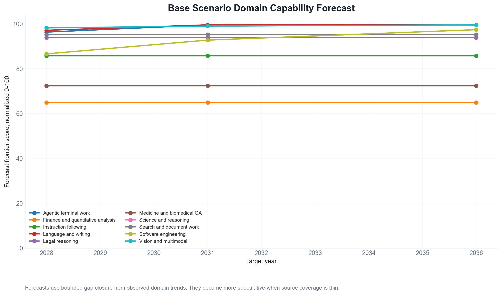

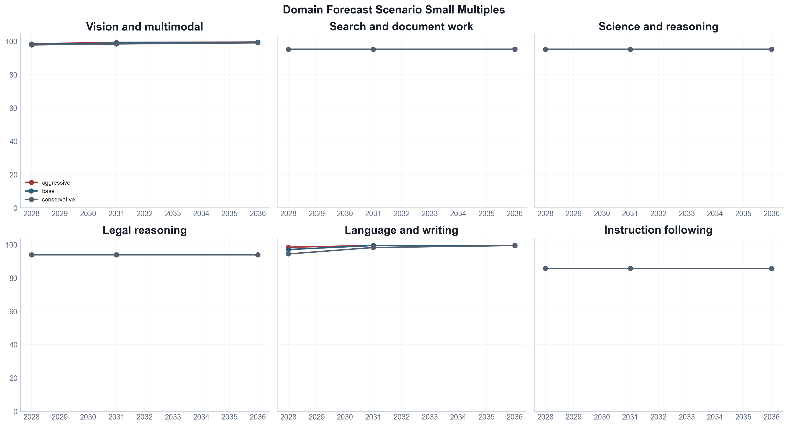

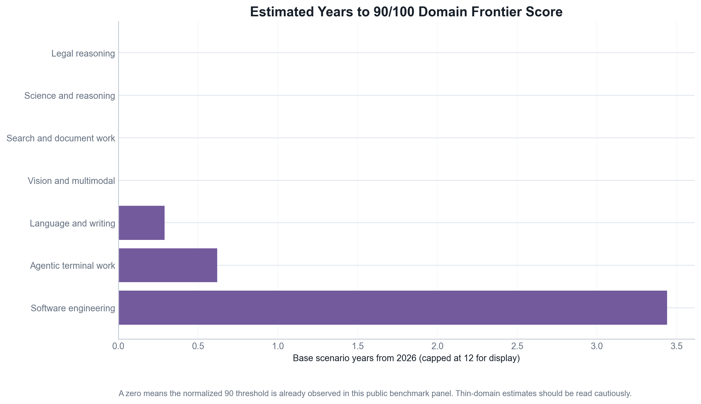

## Model Family Frontier Score

The index ranks model families and product lines, not legal companies. It blends benchmark performance, release velocity, API surface, price, research/ecosystem pull and openness. It is not a universal truth; sensitivity outputs show which rankings are weight-sensitive.

|   rank | model_family   |   frontier_momentum_heuristic_index | sensitivity_label   |   performance_component |   release_velocity_component |   ecosystem_component |   cost_efficiency_component |   openness_component |
|-------:|:---------------|------------------------------------:|:--------------------|------------------------:|-----------------------------:|----------------------:|----------------------------:|---------------------:|
|      1 | GPT            |                               78.25 | stable_top_tier     |                 69.2487 |                    100       |               87.1657 |                     91.7046 |             41.4415  |
|      2 | Qwen           |                               78.05 | stable_top_tier     |                 74.6117 |                     86.7888  |               80.9259 |                     94.6247 |             97.9167  |
|      3 | Mistral        |                               59.62 | weight_sensitive    |                 60.7925 |                     35.7759  |               70.6138 |                    100      |             95.1064  |
|      4 | Gemini         |                               59.26 | weight_sensitive    |                 77.0602 |                     49.903   |               60.3614 |                     80.9676 |              0       |
|      5 | DeepSeek       |                               58.32 | weight_sensitive    |                 48.7632 |                     32.9634  |               78.004  |                     85.8923 |             92.2704  |
|      6 | Claude         |                               57.97 | weight_sensitive    |                 82.4818 |                     35.8405  |               57.7862 |                     36.1209 |             55       |
|      7 | Llama          |                               53.67 | weight_sensitive    |                 36.747  |                      2.8125  |               81.3439 |                    100      |             91.607   |
|      8 | Gemma          |                               49.79 | weight_sensitive    |                 53.4005 |                      8.50216 |               65.6807 |                     96.1247 |             91.9149  |
|      9 | Command        |                               45.08 | weight_sensitive    |                 50      |                     50       |               25      |                     50      |             41.6667  |
|     10 | Phi            |                               38.95 | weight_sensitive    |                 37.6984 |                      0       |               48.871  |                     91.7046 |             83.1769  |
|     11 | Grok           |                               38.62 | weight_sensitive    |                 65.0893 |                     23.4806  |               27.389  |                      0      |              1.84211 |

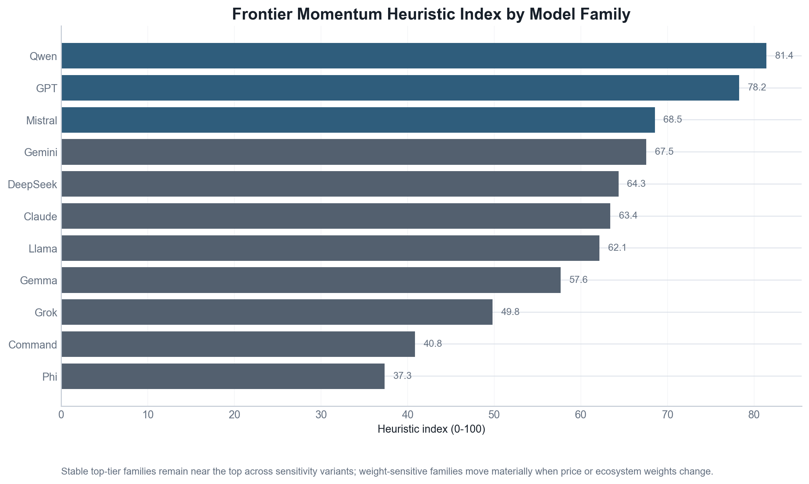

The headline rank is only the entry point. The stacked component chart below shows why a family ranks where it ranks. That matters because two families can have similar headline indexes for very different reasons: one may be performance-heavy, another may be ecosystem-heavy or cost-efficient.

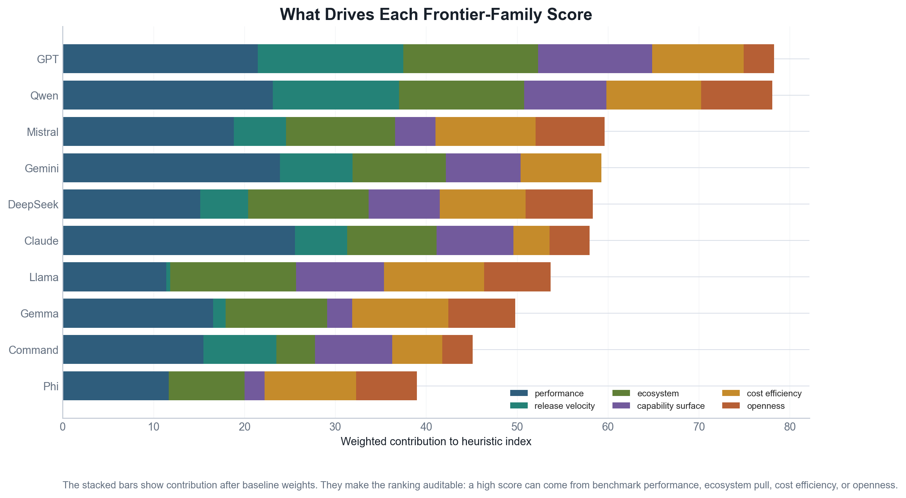

The evidence-depth scatter is the reviewer sanity check. A family with high score and high evidence count is more defensible than a family with a high score from sparse rows. Bubble size is tied to API catalog breadth, while color shows openness.

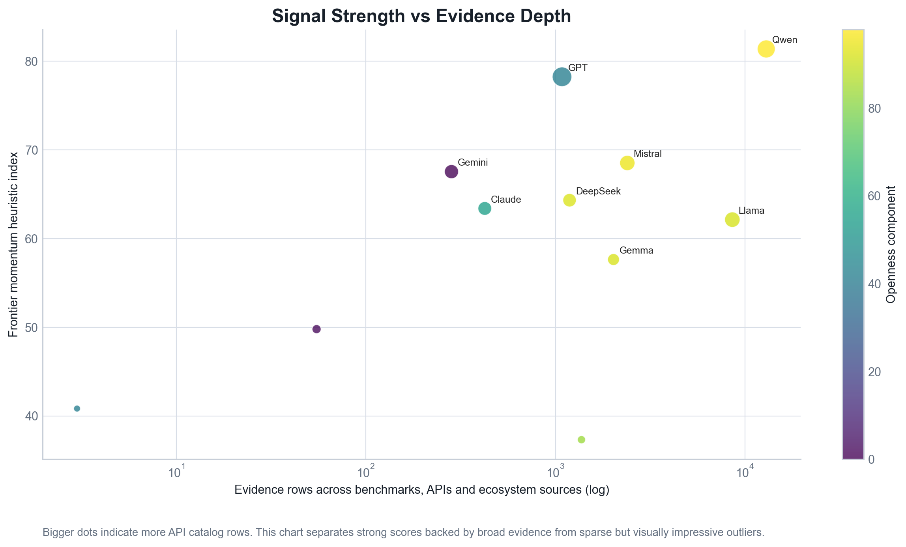

## Family Ranking vs Vendor Portfolio Ranking

Reviewers often reason in terms of companies, but model families remain the cleaner technical unit. The vendor view is therefore a companion view: it blends the flagship family with the evidence-weighted portfolio mean and keeps the flagship family visible.

|   rank | vendor    |   vendor_frontier_portfolio_score | flagship_family   |   family_count | portfolio_families   |   evidence_count |
|-------:|:----------|----------------------------------:|:------------------|---------------:|:---------------------|-----------------:|
|      1 | OpenAI    |                             78.25 | GPT               |              1 | GPT                  |             1083 |
|      2 | Alibaba   |                             78.05 | Qwen              |              1 | Qwen                 |            12932 |
|      3 | Mistral   |                             59.62 | Mistral           |              1 | Mistral              |             2394 |
|      4 | DeepSeek  |                             58.32 | DeepSeek          |              1 | DeepSeek             |             1187 |
|      5 | Anthropic |                             57.97 | Claude            |              1 | Claude               |              424 |
|      6 | Google    |                             56.35 | Gemini            |              2 | Gemini,Gemma         |             2307 |
|      7 | Meta      |                             53.68 | Llama             |              1 | Llama                |             8569 |
|      8 | Command   |                             45.08 | Command           |              1 | Command              |                3 |
|      9 | Microsoft |                             38.95 | Phi               |              1 | Phi                  |             1372 |
|     10 | xAI       |                             38.63 | Grok              |              1 | Grok                 |               55 |

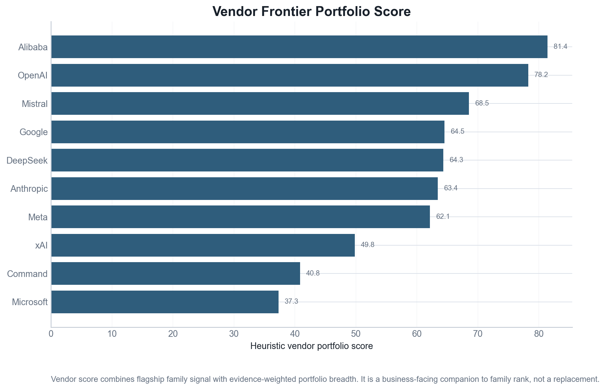

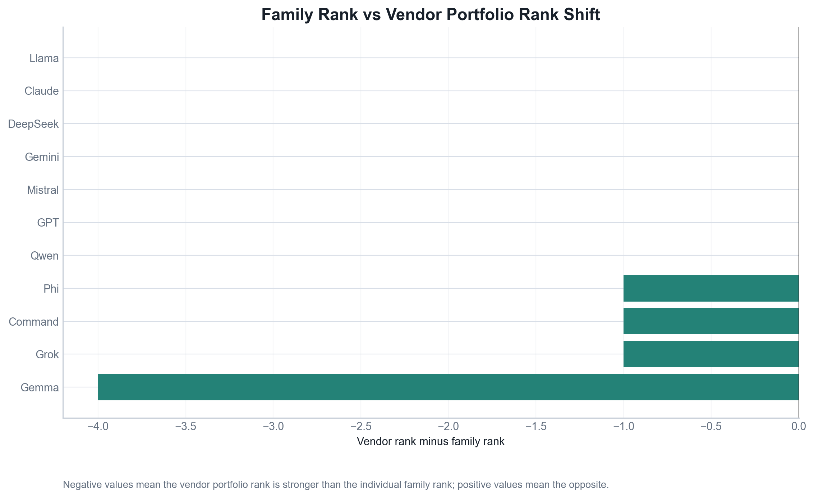

## Who Builds The Next Best Model?

This table is not a prediction market. It is a Monte Carlo stress test over the scoring components: benchmark performance, release velocity, ecosystem pull, capability surface, cost and openness. `simulation_win_share` is the share of simulation draws won by each family, not a calibrated real-world probability. The corrected version separates **frontier-quality leadership** from **open-ecosystem upside**. The former asks who is most likely to make the raw best model; the latter asks who benefits if distribution and low cost matter more.

2-year simulated leaders:

| model_family   | simulation_win_share   |   simulated_score_p10 |   simulated_score_p90 |
|:---------------|:-----------------------|----------------------:|----------------------:|
| GPT            | 77.6%                  |                 73.85 |                 81.7  |
| Qwen           | 22.4%                  |                 70.51 |                 78.46 |
| Mistral        | 0.0%                   |                 46.59 |                 55    |
| Gemini         | 0.0%                   |                 57.91 |                 66.11 |
| DeepSeek       | 0.0%                   |                 44.88 |                 52.81 |
| Claude         | 0.0%                   |                 57.86 |                 66.27 |
| Llama          | 0.0%                   |                 34.67 |                 43.91 |
| Gemma          | 0.0%                   |                 34.28 |                 43.5  |
| Command        | 0.0%                   |                 44.26 |                 51.65 |
| Phi            | 0.0%                   |                 23.28 |                 31.95 |

10-year simulated leaders, frontier-quality scenario:

| model_family   | simulation_win_share   |   simulated_score_p10 |   simulated_score_p90 |
|:---------------|:-----------------------|----------------------:|----------------------:|
| GPT            | 58.6%                  |                 70.99 |                 82.47 |
| Qwen           | 41.2%                  |                 69.61 |                 80.94 |
| Claude         | 0.1%                   |                 54.44 |                 66.16 |
| Gemini         | 0.1%                   |                 52.83 |                 64.78 |
| Mistral        | 0.0%                   |                 47.67 |                 59.78 |
| DeepSeek       | 0.0%                   |                 47.2  |                 58.95 |
| Llama          | 0.0%                   |                 40.13 |                 52.59 |
| Gemma          | 0.0%                   |                 36.67 |                 49.24 |
| Command        | 0.0%                   |                 41.1  |                 52.46 |
| Phi            | 0.0%                   |                 25.99 |                 38.3  |

10-year simulated leaders, open-ecosystem-upside scenario:

| model_family   | simulation_win_share   |   simulated_score_p10 |   simulated_score_p90 |
|:---------------|:-----------------------|----------------------:|----------------------:|
| Qwen           | 70.2%                  |                 74.56 |                 85.67 |
| GPT            | 29.7%                  |                 70.94 |                 82.55 |
| DeepSeek       | 0.1%                   |                 56.83 |                 68.62 |
| Mistral        | 0.1%                   |                 57.29 |                 69.44 |
| Llama          | 0.0%                   |                 52.72 |                 65.69 |
| Gemini         | 0.0%                   |                 48.71 |                 61.04 |
| Claude         | 0.0%                   |                 51.53 |                 62.88 |
| Gemma          | 0.0%                   |                 48.19 |                 60.54 |
| Command        | 0.0%                   |                 37.52 |                 48.51 |
| Phi            | 0.0%                   |                 36.84 |                 49.38 |

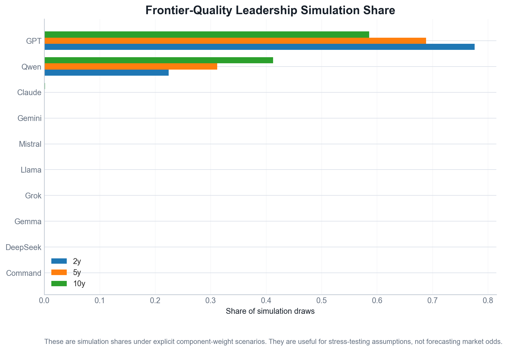

The scenario matrix compresses the same simulation into a reviewer-friendly view: each cell names the leading family under a scenario/horizon pair and reports its share of simulation draws. This makes it obvious when the answer changes because the question changed.

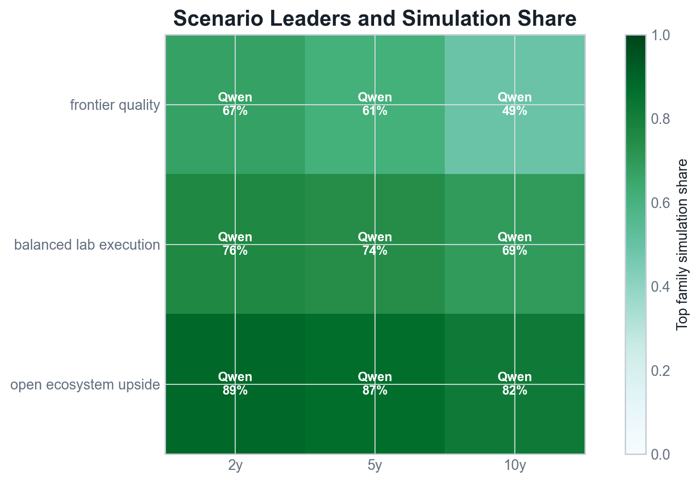

## Open vs Closed: Where Is The Gap?

| category      |   closed_or_api | open_weight        | open_closed_best_gap   |   open_closed_gap_pct_of_closed | comparison_note                                                           |
|:--------------|----------------:|:-------------------|:-----------------------|--------------------------------:|:--------------------------------------------------------------------------|
| text_to_image |         1574.24 | 1212.6857458083412 | 361.56                 |                          0.2297 | Comparable open-weight and closed/API rows observed in selected snapshot. |
| image_edit    |         1513.01 | 1272.2820948867309 | 240.73                 |                          0.1591 | Comparable open-weight and closed/API rows observed in selected snapshot. |
| vision        |         1451.69 | 1341.839120952578  | 109.85                 |                          0.0757 | Comparable open-weight and closed/API rows observed in selected snapshot. |
| webdev        |         1586.93 | 1491.3053126020395 | 95.62                  |                          0.0603 | Comparable open-weight and closed/API rows observed in selected snapshot. |
| document      |         1527.83 | 1433.687985154499  | 94.14                  |                          0.0616 | Comparable open-weight and closed/API rows observed in selected snapshot. |
| text          |         1619.78 | 1549.227871094854  | 70.55                  |                          0.0436 | Comparable open-weight and closed/API rows observed in selected snapshot. |
| search        |         1255.86 | n/a                | n/a                    |                          0      | No comparable open-weight or closed/API row in selected snapshot.         |

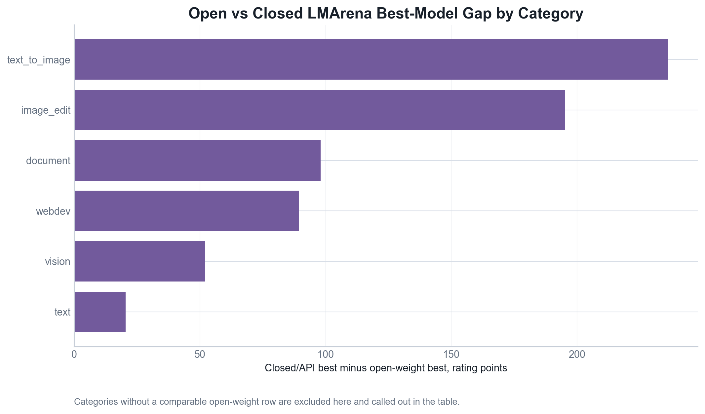

The gap chart shows differences, but differences alone can hide whether both sides are high-quality. The paired rating chart below shows the actual open and closed best observed ratings by category where both sides exist.

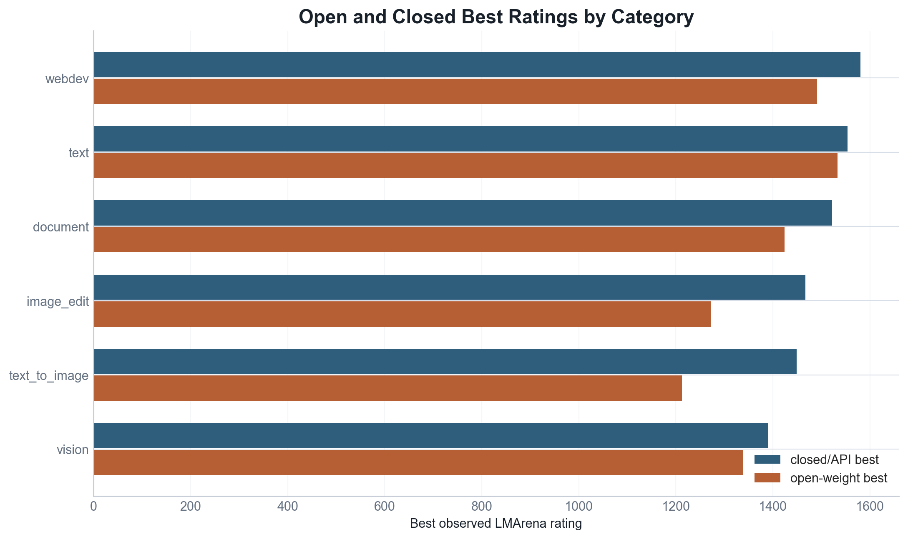

## Price-Performance Frontier

Raw best model and economically deployable model are not the same decision. This frontier is explicitly a family-level proxy: OpenRouter model prices are joined to the best observed LMArena rating for the model family, not to a direct benchmark for every listed model. It should be read as a deployability screen, not model-level proof.

| canonical_model             | model_family   | access_class   |   blended_price_usd_per_1m |   family_best_lmarena | quality_proxy_level   |   price_performance_index |
|:----------------------------|:---------------|:---------------|---------------------------:|----------------------:|:----------------------|--------------------------:|
| OpenAI: gpt-oss-20b         | GPT            | open_weight    |                     0.1015 |               1619.78 | family_level_proxy    |                     91.48 |
| inclusionAI: Ling-2.6-flash | Other          | unknown        |                     0.023  |               1574.24 | family_level_proxy    |                     82.18 |

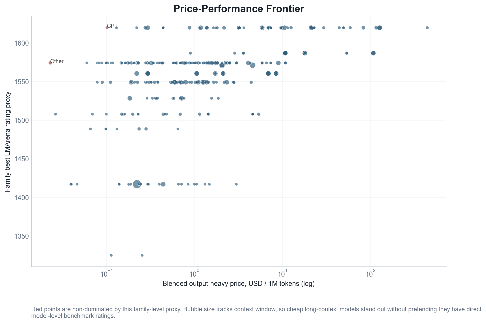

The context-price map keeps three product dimensions visible at once: context window, blended token price and family-level rating proxy. It prevents a common mistake in AI market analysis: treating cheap, long-context and high-quality as one metric.

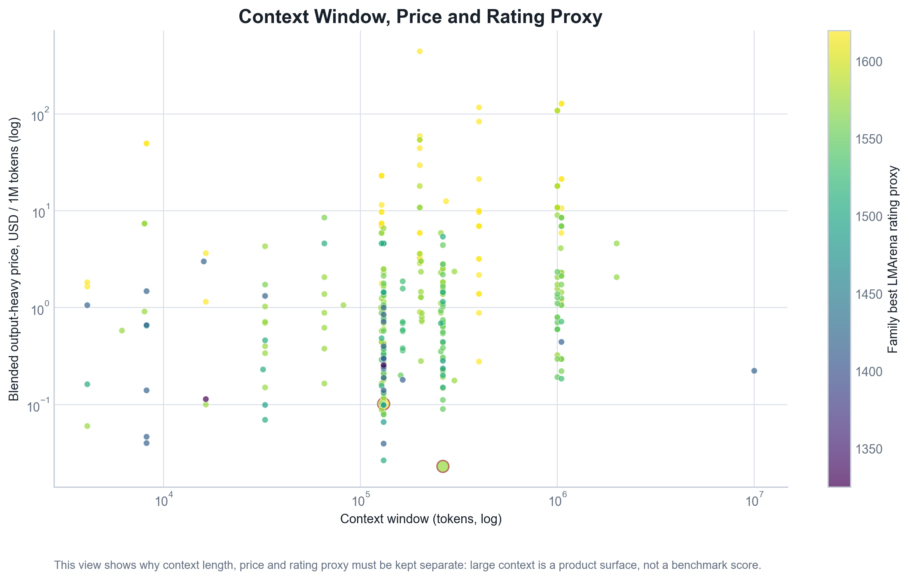

## Direct Model Evidence vs Family Proxy

The audit table matches OpenRouter model IDs/names to LMArena, SWE-bench, LiveBench and Open LLM Leaderboard rows. Direct model matches are separated from `family_only` evidence so the deployability screen does not quietly inherit model-level certainty it does not have.

Match confidence audit:

| match_confidence   |   rows |
|:-------------------|-------:|
| family_only        |    813 |
| normalized_exact   |    504 |
| unmatched          |     91 |

Direct evidence price-performance rows:

| canonical_model                | model_family   |   blended_price_usd_per_1m | direct_evidence_sources    |   direct_lmarena_rating | direct_lmarena_match_confidence   |   direct_price_performance_index | quality_proxy_level   |
|:-------------------------------|:---------------|---------------------------:|:---------------------------|------------------------:|:----------------------------------|---------------------------------:|:----------------------|
| OpenAI: GPT-4.1 Nano           | GPT            |                     0.295  | lmarena                    |                 1560.56 | normalized_exact                  |                            92.21 | direct_model_lmarena  |
| OpenAI: GPT-4.1 Mini           | GPT            |                     1.18   | lmarena                    |                 1560.56 | normalized_exact                  |                            91.18 | direct_model_lmarena  |
| OpenAI: o3 Mini High           | GPT            |                     3.245  | livebench,lmarena,swebench |                 1590.01 | normalized_exact                  |                            91.17 | direct_model_lmarena  |
| OpenAI: o3 Mini                | GPT            |                     3.245  | livebench,lmarena,swebench |                 1590.01 | normalized_exact                  |                            91.17 | direct_model_lmarena  |
| OpenAI: o3                     | GPT            |                     5.9    | livebench,lmarena,swebench |                 1590.01 | normalized_exact                  |                            90.21 | direct_model_lmarena  |
| OpenAI: GPT-4.1                | GPT            |                     5.9    | lmarena                    |                 1560.56 | normalized_exact                  |                            88.9  | direct_model_lmarena  |
| OpenAI: GPT-5.5                | GPT            |                    21.25   | lmarena                    |                 1567.64 | normalized_exact                  |                            87.52 | direct_model_lmarena  |
| OpenAI: o3 Deep Research       | GPT            |                    29.5    | livebench,lmarena,swebench |                 1590.01 | normalized_exact                  |                            87.28 | direct_model_lmarena  |
| Google: Gemini 3 Flash Preview | Gemini         |                     2.125  | lmarena                    |                 1535.16 | normalized_exact                  |                            87.13 | direct_model_lmarena  |
| OpenAI: GPT-5.4 Nano           | GPT            |                     0.8825 | lmarena                    |                 1538.27 | normalized_exact                  |                            87.06 | direct_model_lmarena  |
| Z.ai: GLM 5                    | Other          |                     1.458  | lmarena                    |                 1548.75 | normalized_exact                  |                            86.86 | direct_model_lmarena  |
| MoonshotAI: Kimi K2.6          | Other          |                     2.524  | lmarena                    |                 1545.48 | normalized_exact                  |                            86.12 | direct_model_lmarena  |

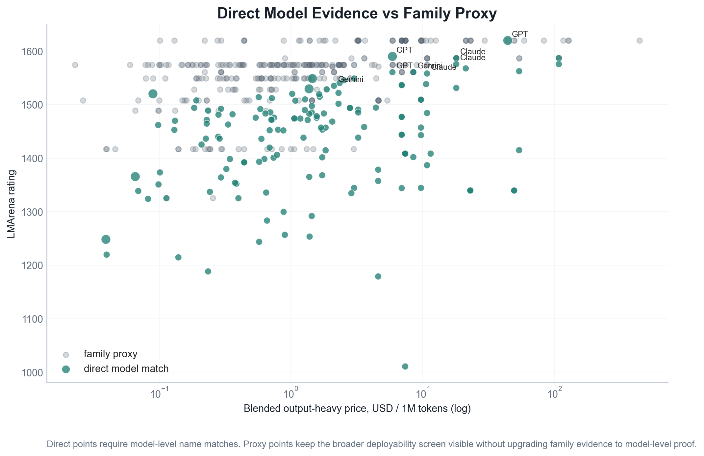

## LLM Cost Per Message vs Fixed Task Cost

This section separates two claims that are often blended together. A **modeled average message/task** can become more expensive when users route more work to long-context, tool-heavy or agentic frontier runs. A **fixed task**, such as thesis-quality long-form writing under a stable token budget and quality threshold, can become cheaper when cheaper families become good enough. The tables below do not claim to observe private invoices or usage logs; they expose the assumptions behind the workload mix and the fixed-task thresholds.

Modeled message/task cost by release cohort:

|   year |   released_model_count |   low_cost_blended_price_usd_per_1m |   median_blended_price_usd_per_1m |   frontier_blended_price_usd_per_1m |   average_effective_tokens |   modeled_average_message_cost_usd |   message_cost_index_2023_100 |
|-------:|-----------------------:|------------------------------------:|----------------------------------:|------------------------------------:|---------------------------:|-----------------------------------:|------------------------------:|
|   2023 |                     10 |                            0.4788   |                            1.4125 |                             46.5    |                       4655 |                           0.026383 |                         100   |
|   2024 |                     57 |                            0.209924 |                            0.847  |                             14.7    |                      14708 |                           0.078275 |                         296.7 |
|   2025 |                    232 |                            0.21     |                            0.8252 |                              7.4125 |                      28153 |                           0.080733 |                         306   |
|   2026 |                    321 |                            0.247    |                            1.02   |                              9.6    |                      43046 |                           0.152251 |                         577.1 |

2026 workload profile components:

| display_name           |   mix_share |   input_tokens |   output_tokens |   price_quantile |   profile_cost_usd |   weighted_cost_contribution_usd |
|:-----------------------|------------:|---------------:|----------------:|-----------------:|-------------------:|---------------------------------:|
| Simple chat or Q&A     |        0.32 |            900 |             500 |             0.2  |           0.000275 |                         8.8e-05  |
| Knowledge-work message |        0.34 |           3500 |            1200 |             0.5  |           0.0032   |                         0.001088 |
| Long-context analysis  |        0.22 |          45000 |            5000 |             0.75 |           0.08125  |                         0.017875 |
| Agentic workflow run   |        0.12 |         220000 |           30000 |             0.9  |           1.11     |                         0.1332   |

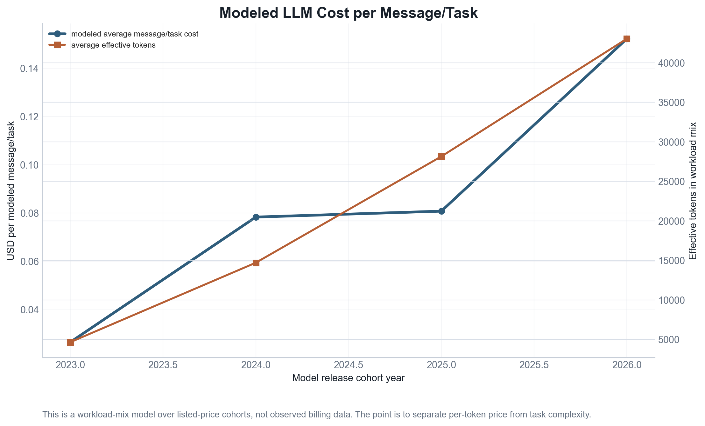

Current cheapest adequate fixed-task candidates:

| display_name                     | domain_label                      | selected_model                 | selected_family   |   required_domain_score |   selected_domain_score |   forecast_task_cost_usd | adequacy_status                | human_gate                           |
|:---------------------------------|:----------------------------------|:-------------------------------|:------------------|------------------------:|------------------------:|-------------------------:|:-------------------------------|:-------------------------------------|
| Thesis-quality long-form writing | Language and writing              | OpenAI: gpt-oss-20b            | GPT               |                      88 |                  85.432 |                  0.0067  | best_available_below_threshold | advisor, fact and citation review    |
| Repository issue resolution      | Software engineering              | Anthropic Claude Sonnet Latest | Claude            |                      82 |                  78.966 |                  1.635   | best_available_below_threshold | senior engineer review and tests     |
| Financial analysis memo          | Finance and quantitative analysis | Anthropic: Claude 3 Haiku      | Claude            |                      65 |                  62.962 |                  0.02125 | best_available_below_threshold | assumption and control owner signoff |
| Legal due-diligence memo         | Legal reasoning                   | Anthropic: Claude 3 Haiku      | Claude            |                      90 |                  90.5   |                  0.02875 | adequate                       | licensed legal review                |
| Long-document synthesis          | Search and document work          | Anthropic: Claude 3 Haiku      | Claude            |                      84 |                 100     |                  0.04125 | adequate                       | source-grounding and factual review  |
| Customer-support resolution      | Instruction following             | Meta: Llama 3.1 8B Instruct    | Llama             |                      78 |                  81.208 |                  0.00015 | adequate                       | policy, refund and safety review     |

Base scenario fixed-task curves:

| display_name                     |   target_year | selected_family   |   selected_domain_score |   forecast_task_cost_usd |   cost_factor_vs_current | adequacy_status                |
|:---------------------------------|--------------:|:------------------|------------------------:|-------------------------:|-------------------------:|:-------------------------------|
| Thesis-quality long-form writing |          2028 | GPT               |                  96.11  |                 0.001544 |                 0.2304   | adequate                       |
| Thesis-quality long-form writing |          2031 | GPT               |                  98.854 |                 0.000171 |                 0.02548  | adequate                       |
| Thesis-quality long-form writing |          2036 | GPT               |                  98.854 |                 0.000168 |                 0.025    | adequate                       |
| Repository issue resolution      |          2028 | GPT               |                  82.627 |                 0.007834 |                 0.004791 | adequate                       |
| Repository issue resolution      |          2031 | GPT               |                  89.585 |                 0.000866 |                 0.00053  | adequate                       |
| Repository issue resolution      |          2036 | GPT               |                  94.872 |                 0.00085  |                 0.00052  | adequate                       |
| Financial analysis memo          |          2028 | Claude            |                  62.962 |                 0.004896 |                 0.2304   | best_available_below_threshold |
| Financial analysis memo          |          2031 | Claude            |                  62.962 |                 0.000541 |                 0.02548  | best_available_below_threshold |
| Financial analysis memo          |          2036 | Claude            |                  62.962 |                 0.000531 |                 0.025    | best_available_below_threshold |
| Legal due-diligence memo         |          2028 | Claude            |                  90.5   |                 0.006624 |                 0.2304   | adequate                       |
| Legal due-diligence memo         |          2031 | Claude            |                  90.5   |                 0.000733 |                 0.02548  | adequate                       |
| Legal due-diligence memo         |          2036 | Claude            |                  90.5   |                 0.000719 |                 0.025    | adequate                       |
| Long-document synthesis          |          2028 | Claude            |                  99.5   |                 0.009504 |                 0.2304   | adequate                       |
| Long-document synthesis          |          2031 | Claude            |                  99.5   |                 0.001051 |                 0.02548  | adequate                       |
| Long-document synthesis          |          2036 | Claude            |                  99.5   |                 0.001031 |                 0.025    | adequate                       |
| Customer-support resolution      |          2028 | Llama             |                  81.208 |                 3.5e-05  |                 0.2304   | adequate                       |
| Customer-support resolution      |          2031 | Llama             |                  81.208 |                 4e-06    |                 0.02548  | adequate                       |
| Customer-support resolution      |          2036 | Llama             |                  81.208 |                 4e-06    |                 0.025    | adequate                       |

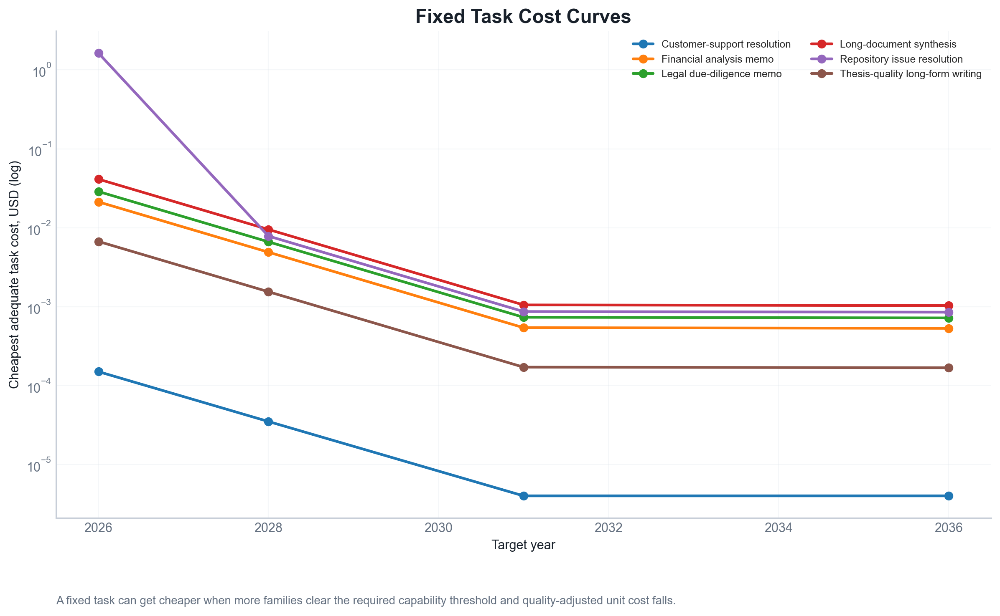

The divergence table is the explicit version of the user's hypothesis: frontier work-unit cost can rise because average tasks get harder, while fixed task cost can fall because capability diffuses into cheaper models.

| scenario     |   target_year |   modeled_average_message_cost_usd |   message_cost_factor_vs_2026 |   median_fixed_task_cost_usd |   fixed_task_cost_factor_vs_2026 |   frontier_workload_complexity_multiplier |
|:-------------|--------------:|-----------------------------------:|------------------------------:|-----------------------------:|---------------------------------:|------------------------------------------:|
| conservative |          2028 |                           0.291059 |                        1.9117 |                     0.012147 |                          0.48588 |                                    1.9905 |
| conservative |          2031 |                           0.383646 |                        2.5198 |                     0.003336 |                          0.13344 |                                    2.7877 |
| conservative |          2036 |                           0.43726  |                        2.872  |                     0.000719 |                          0.02876 |                                    3.5149 |
| base         |          2028 |                           0.414459 |                        2.7222 |                     0.006624 |                          0.26496 |                                    2.7222 |
| base         |          2031 |                           0.661146 |                        4.3425 |                     0.000733 |                          0.02932 |                                    4.3425 |
| base         |          2036 |                           0.780511 |                        5.1265 |                     0.000719 |                          0.02876 |                                    5.1265 |
| aggressive   |          2028 |                           0.607352 |                        3.9892 |                     0.003726 |                          0.14904 |                                    3.5503 |
| aggressive   |          2031 |                           1.1106   |                        7.2946 |                     0.000719 |                          0.02876 |                                    5.4509 |
| aggressive   |          2036 |                           1.81779  |                       11.9394 |                     0.000719 |                          0.02876 |                                    6.6669 |

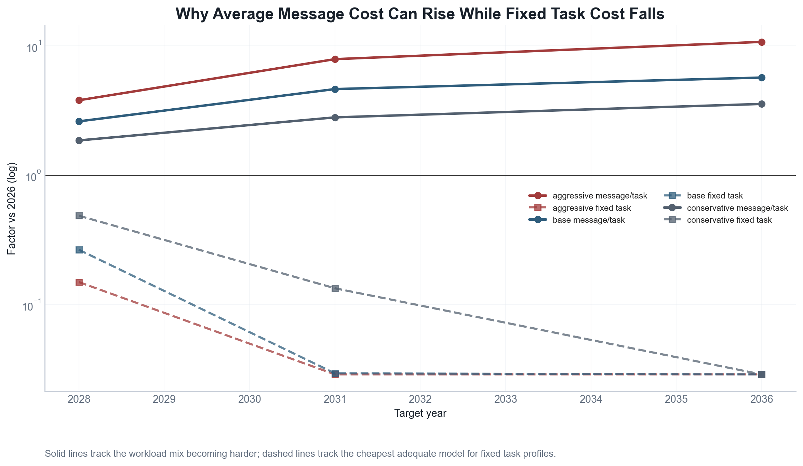

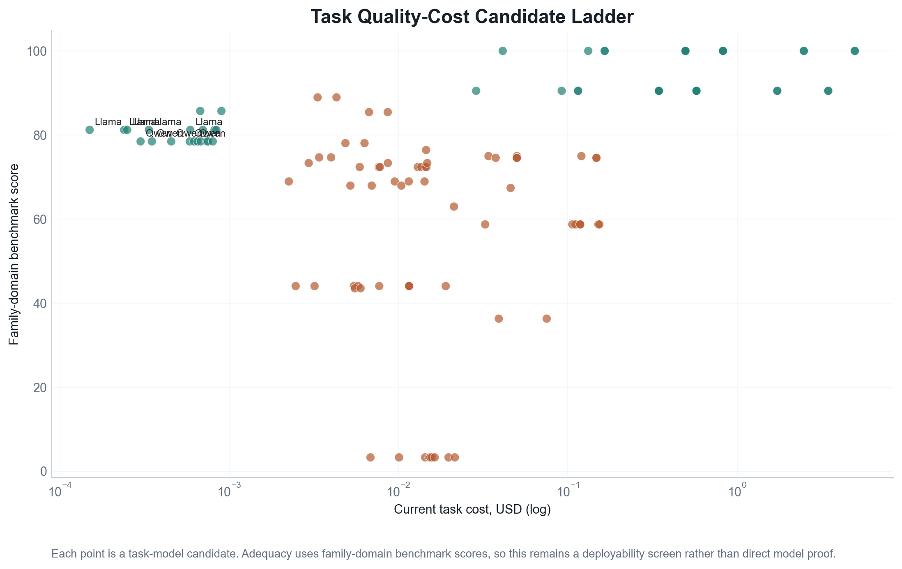

Cost evidence notes:

| source_id                                  | name                                                                               | used_for                                                                                                                | url                                                        |
|:-------------------------------------------|:-----------------------------------------------------------------------------------|:------------------------------------------------------------------------------------------------------------------------|:-----------------------------------------------------------|
| openrouter_models_api                      | OpenRouter Models API                                                              | Current model price, context-window and modality catalog fields.                                                        | https://openrouter.ai/docs/guides/overview/models          |
| epoch_llm_inference_price_trends           | Epoch AI LLM inference price trends                                                | External prior that quality-adjusted inference prices can fall faster than raw frontier price lists.                    | https://epoch.ai/data-insights/llm-inference-price-trends/ |
| price_of_progress_arxiv_2511_23455         | The Price of Progress: Algorithmic Efficiency and the Falling Cost of AI Inference | Quality-adjusted fixed-task cost-decline prior.                                                                         | https://arxiv.org/abs/2511.23455                           |
| agentic_token_consumption_arxiv_2604_22750 | How Do AI Agents Spend Your Money?                                                 | Token-amplification caveat for agentic coding and multi-step workflows.                                                 | https://arxiv.org/abs/2604.22750                           |
| price_reversal_arxiv_2603_23971            | The Price Reversal Phenomenon                                                      | Caveat that listed price can be a weak proxy for realized cost when thinking tokens and retry variance differ by model. | https://arxiv.org/abs/2603.23971                           |
| anthropic_economic_index_arxiv_2511_15080  | Anthropic Economic Index report: Uneven geographic and enterprise AI adoption      | External support for rising directive delegation and more autonomous AI task use.                                       | https://arxiv.org/abs/2511.15080                           |

## Job Exposure And Labor Pressure

The labor table joins Anthropic observed occupation exposure to wage/job companion data, task-level penetration, automation/augmentation mode shares, and keyword-derived task bottlenecks from O*NET text. The output is an occupation-level pressure index, not a prediction that a whole occupation vanishes.

| title                                                                                        |   near_term_disruption_index |   substitution_pressure_index |   augmentation_index |   full_job_automation_feasibility_index | dominant_outcome      | risk_label   |
|:---------------------------------------------------------------------------------------------|-----------------------------:|------------------------------:|---------------------:|----------------------------------------:|:----------------------|:-------------|
| Data Entry Keyers                                                                            |                        60.16 |                         68.88 |                51.54 |                                   37.72 | replacement_candidate | very_high    |
| Market Research Analysts and Marketing Specialists                                           |                        59.55 |                         56.36 |                67.43 |                                   38.97 | replacement_candidate | high         |
| Medical Transcriptionists                                                                    |                        58.94 |                         60.44 |                60.15 |                                   28.27 | mixed_redesign        | high         |
| Technical Writers                                                                            |                        58.6  |                         55.78 |                59.26 |                                   36.26 | replacement_candidate | high         |
| Sales Representatives, Wholesale and Manufacturing, Except Technical and Scientific Products |                        54.97 |                         55.94 |                56.77 |                                   34.77 | mixed_redesign        | high         |
| Financial and Investment Analysts                                                            |                        53.75 |                         40.35 |                66.37 |                                   27.24 | augmentation_first    | high         |
| Statistical Assistants                                                                       |                        53.55 |                         47.71 |                59.62 |                                   31.6  | augmentation_first    | high         |
| Computer Programmers                                                                         |                        52.61 |                         52.14 |                55.26 |                                   26.07 | mixed_redesign        | high         |
| Human Resources Assistants, Except Payroll and Timekeeping                                   |                        51.76 |                         50.06 |                52.03 |                                   30.44 | mixed_redesign        | high         |
| Mathematical Science Teachers, Postsecondary                                                 |                        50.86 |                         43.32 |                53.09 |                                   26.39 | augmentation_first    | high         |
| Social Science Research Assistants                                                           |                        50.61 |                         44.68 |                55.18 |                                   27.3  | augmentation_first    | high         |
| Engineering Teachers, Postsecondary                                                          |                        50.23 |                         40.29 |                50.32 |                                   24.37 | augmentation_first    | high         |

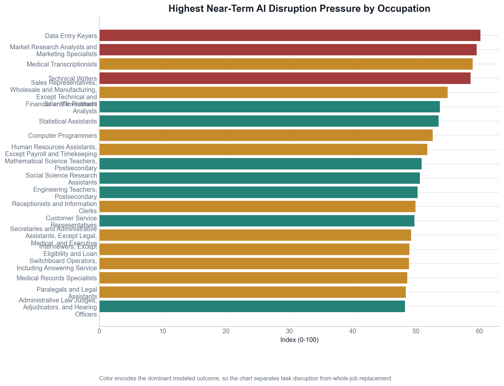

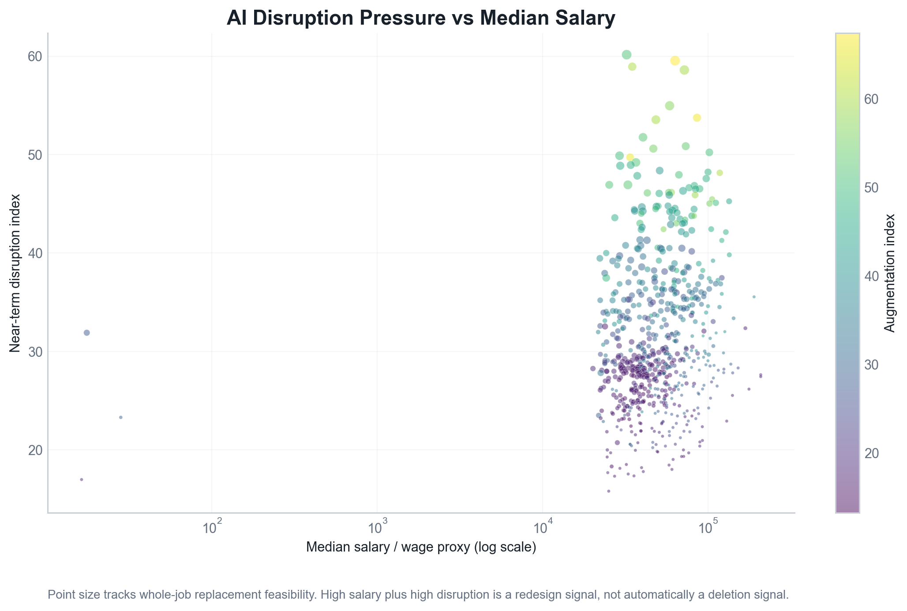

## Whole-Job Replacement Feasibility

The replacement feasibility index gates substitution pressure through physical, trust, regulatory and task-coverage bottlenecks. This is the section that answers the "will AI take all jobs" question more honestly: many occupations are touched; fewer are clean full-job replacement candidates.

| title                                                                                        | job_family                                     |   full_job_automation_feasibility_index |   substitution_pressure_index |   human_bottleneck_index | dominant_outcome      |
|:---------------------------------------------------------------------------------------------|:-----------------------------------------------|----------------------------------------:|------------------------------:|-------------------------:|:----------------------|
| Market Research Analysts and Marketing Specialists                                           | Business and Financial Operations              |                                   38.97 |                         56.36 |                     0    | replacement_candidate |
| Data Entry Keyers                                                                            | Office and Administrative Support              |                                   37.72 |                         68.88 |                     0    | replacement_candidate |
| Technical Writers                                                                            | Arts, Design, Entertainment, Sports, and Media |                                   36.26 |                         55.78 |                     0    | replacement_candidate |
| Sales Representatives, Wholesale and Manufacturing, Except Technical and Scientific Products | Sales and Related                              |                                   34.77 |                         55.94 |                     2.4  | mixed_redesign        |
| Office Clerks, General                                                                       | Office and Administrative Support              |                                   32.08 |                         51.56 |                     1.22 | mixed_redesign        |
| Statistical Assistants                                                                       | Office and Administrative Support              |                                   31.6  |                         47.71 |                     0.78 | augmentation_first    |
| Receptionists and Information Clerks                                                         | Office and Administrative Support              |                                   30.45 |                         53.46 |                     1.26 | mixed_redesign        |
| Human Resources Assistants, Except Payroll and Timekeeping                                   | Office and Administrative Support              |                                   30.44 |                         50.06 |                     0    | mixed_redesign        |
| Secretaries and Administrative Assistants, Except Legal, Medical, and Executive              | Office and Administrative Support              |                                   30.34 |                         52.33 |                     1.95 | mixed_redesign        |
| Medical Transcriptionists                                                                    | Healthcare Support                             |                                   28.27 |                         60.44 |                     9.95 | mixed_redesign        |
| Switchboard Operators, Including Answering Service                                           | Office and Administrative Support              |                                   27.58 |                         49.12 |                     0.68 | mixed_redesign        |
| Social Science Research Assistants                                                           | Life, Physical, and Social Science             |                                   27.3  |                         44.68 |                     0.68 | augmentation_first    |

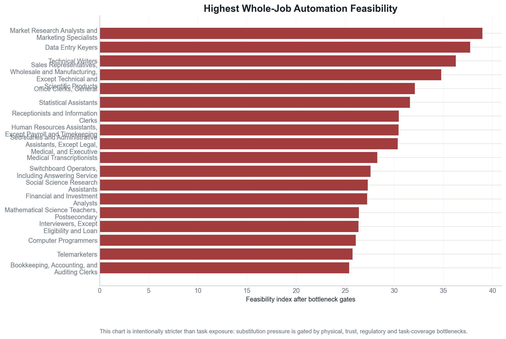

## Labor Clusters

|   labor_cluster_id | cluster_label                               |   occupation_count |   full_job_automation_feasibility_index |   augmentation_index |   human_bottleneck_index | example_occupations                                                                                                                                                                                                                          |
|-------------------:|:--------------------------------------------|-------------------:|----------------------------------------:|---------------------:|-------------------------:|:---------------------------------------------------------------------------------------------------------------------------------------------------------------------------------------------------------------------------------------------|
|                  2 | replacement-prone clerical/transaction work |                113 |                                20.4247  |              44.8353 |                  1.31115 | Data Entry Keyers; Market Research Analysts and Marketing Specialists; Technical Writers; Sales Representatives, Wholesale and Manufacturing, Except Technical and Scientific Products; Financial and Investment Analysts                    |
|                  0 | augmentation-heavy expert work              |                 28 |                                10.9904  |              32.3325 |                  1.56679 | Desktop Publishers; Special Effects Artists and Animators; Photographic Process Workers and Processing Machine Operators; Prepress Technicians and Workers; Graphic Designers                                                                |
|                  4 | mixed redesign work                         |                298 |                                10.799   |              22.9227 |                  2.07715 | Power Plant Operators; Baggage Porters and Bellhops; Hosts and Hostesses, Restaurant, Lounge, and Coffee Shop; Couriers and Messengers; Library Technicians                                                                                  |
|                  5 | mixed redesign work                         |                 16 |                                10.0306  |              32.4838 |                  7.43938 | Medical Transcriptionists; Medical Records Specialists; Medical Secretaries and Administrative Assistants; Judicial Law Clerks; Court Reporters and Simultaneous Captioners                                                                  |
|                  6 | mixed redesign work                         |                104 |                                 7.67019 |              19.8389 |                  7.65317 | Insurance Appraisers, Auto Damage; Computer, Automated Teller, and Office Machine Repairers; Rail Yard Engineers, Dinkey Operators, and Hostlers; Amusement and Recreation Attendants; Bus and Truck Mechanics and Diesel Engine Specialists |
|                  1 | augmentation-heavy expert work              |                152 |                                 5.75487 |              29.4653 |                  2.2102  | Title Examiners, Abstractors, and Searchers; Compensation and Benefits Managers; Magnetic Resonance Imaging Technologists; Production, Planning, and Expediting Clerks; Purchasing Managers                                                  |
|                  3 | augmentation-heavy expert work              |                 45 |                                 3.45956 |              27.58   |                  9.87867 | Nurse Practitioners; Nurse Midwives; Genetic Counselors; Special Education Teachers, Preschool; Nurse Anesthetists                                                                                                                           |

Labor-weighted dominant outcome summary:

| group                 |   occupation_count |   labor_weight_sum |   weighted_disruption_index |   weighted_replacement_feasibility |   weighted_augmentation_index |
|:----------------------|-------------------:|-------------------:|----------------------------:|-----------------------------------:|------------------------------:|
| replacement_candidate |                  3 |    22337.6         |                       59.66 |                              38.31 |                         61.4  |
| mixed_redesign        |                364 |        2.96894e+06 |                       33.73 |                              14.76 |                         27.53 |
| augmentation_first    |                389 |        4.21343e+06 |                       32.69 |                               9.76 |                         36.22 |

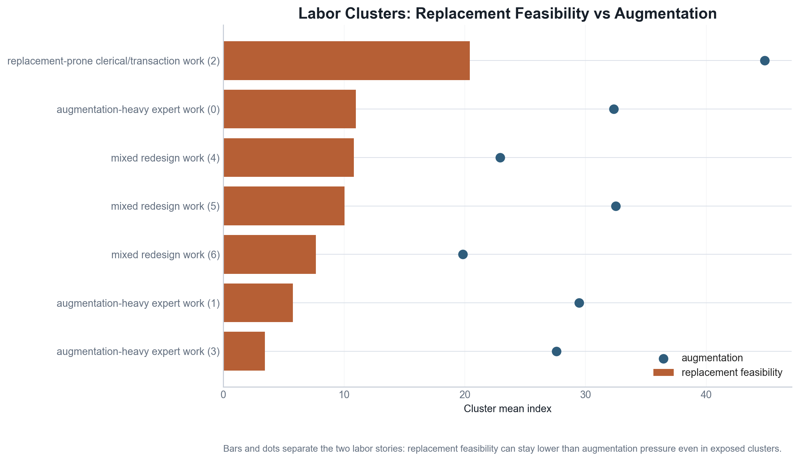

The labor-weighted outcome mix below is the report's guardrail against overclaiming. It weights modeled outcomes by the best available public labor proxy so a handful of highly automatable occupations do not dominate the narrative.

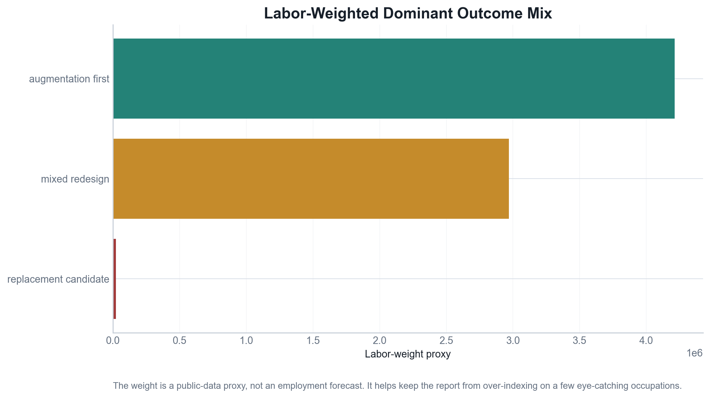

## Business Domain Implications

The domain layer translates occupation-level pressure into business language. It does not replace occupation evidence; each domain keeps example occupations and explicit human gates so a portfolio reviewer can see where the abstraction could fail.

| business_domain           | pressure_label   |   disruption_index |   augmentation_index |   replacement_feasibility_index |   human_bottleneck_index | example_occupations                                                                                                                                                                                                      |
|:--------------------------|:-----------------|-------------------:|---------------------:|--------------------------------:|-------------------------:|:-------------------------------------------------------------------------------------------------------------------------------------------------------------------------------------------------------------------------|
| finance_analysis          | moderate         |              38.13 |                39.65 |                           14.24 |                     1.42 | Market Research Analysts and Marketing Specialists; Financial and Investment Analysts; Accountants and Auditors; Loan Officers                                                                                           |
| marketing_content         | moderate         |              36.29 |                34.67 |                           14.34 |                     1.21 | Technical Writers; Public Relations Specialists; Real Estate Brokers; Real Estate Sales Agents                                                                                                                           |
| software_engineering      | moderate         |              34.98 |                35.76 |                           12.74 |                     3.13 | Computer Programmers; Social Science Research Assistants; Secretaries and Administrative Assistants, Except Legal, Medical, and Executive; Interviewers, Except Eligibility and Loan                                     |
| legal_compliance          | moderate         |              32.82 |                29.97 |                           10.41 |                     3.11 | Paralegals and Legal Assistants; Administrative Law Judges, Adjudicators, and Hearing Officers; Judges, Magistrate Judges, and Magistrates; Property, Real Estate, and Community Association Managers                    |
| customer_support          | moderate         |              31.55 |                29.36 |                           11.93 |                     3.11 | Sales Representatives, Wholesale and Manufacturing, Except Technical and Scientific Products; Receptionists and Information Clerks; Customer Service Representatives; Switchboard Operators, Including Answering Service |
| operations_back_office    | moderate         |              30.12 |                25.13 |                           10.86 |                     3.52 | Data Entry Keyers; Statistical Assistants; Human Resources Assistants, Except Payroll and Timekeeping; Political Scientists                                                                                              |
| education                 | moderate         |              29.77 |                25.61 |                            9.36 |                     3.42 | Mathematical Science Teachers, Postsecondary; Engineering Teachers, Postsecondary; English Language and Literature Teachers, Postsecondary; Health Specialties Teachers, Postsecondary                                   |
| healthcare_administration | moderate         |              29.09 |                30.08 |                            5.52 |                     7.75 | Medical Transcriptionists; Medical Records Specialists; Nurse Practitioners; Magnetic Resonance Imaging Technologists                                                                                                    |

Workflow examples:

| business_domain           | workflow_example                                                         | likely_ai_role                               | human_gate                                            |
|:--------------------------|:-------------------------------------------------------------------------|:---------------------------------------------|:------------------------------------------------------|
| software_engineering      | Issue triage, code review, test generation and migration planning        | draft patches and review checklists          | senior engineer approval and production ownership     |
| customer_support          | Ticket summarization, answer drafting and escalation routing             | suggest responses and detect repeated issues | human review for refunds, safety and account actions  |
| legal_compliance          | Contract review, policy comparison and evidence packet preparation       | extract clauses and compare requirements     | licensed professional signoff                         |
| marketing_content         | Campaign briefs, SEO drafts, localization and asset variants             | generate drafts and performance hypotheses   | brand, legal and factual review                       |
| finance_analysis          | Variance explanations, spreadsheet checks and memo drafting              | surface anomalies and draft analysis         | accountability for assumptions and controls           |
| healthcare_administration | Claims coding, prior authorization packets and patient-message drafts    | prepare structured documentation             | clinical and compliance review                        |
| education                 | Lesson planning, tutoring support and feedback drafting                  | adapt materials and summarize progress       | teacher judgment and student relationship             |
| operations_back_office    | Data entry cleanup, scheduling, reconciliation and process documentation | automate routine transformations             | exception handling and vendor/customer accountability |

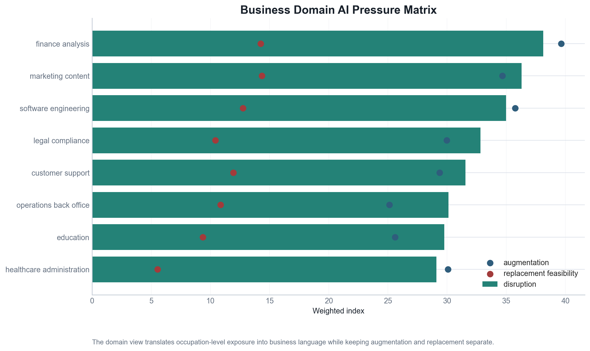

## 2, 5 And 10 Year Forecasts

Base scenario subset:

|   target_year | metric                                          |   value | unit                                                   | method                                                                                                    |
|--------------:|:------------------------------------------------|--------:|:-------------------------------------------------------|:----------------------------------------------------------------------------------------------------------|
|          2028 | frontier_context_window_multiplier              |  6.23   | x current API catalog trend                            | capped scenario from OpenRouter upper-tail slope; raw=6.23x capped=False                                  |
|          2028 | frontier_output_price_factor                    |  0.4365 | fraction of current low-price frontier API output cost | Explicit price-decline scenario; current-catalog release-cohort diagnostic=0.036, scenario_assumed=-0.180 |
|          2028 | open_weight_lmarena_gap_remaining               | 53.6    | arena rating points                                    | current open vs closed LMArena gap with scenario-specific closure speed                                   |
|          2028 | share_of_us_occupation_tasks_materially_touched |  0.104  | share of task-weighted occupation activity             | Anthropic observed exposure plus O*NET task bottleneck pressure, scaled by horizon                        |
|          2031 | frontier_context_window_multiplier              | 64      | x current API catalog trend                            | capped scenario from OpenRouter upper-tail slope; raw=96.70x capped=True                                  |
|          2031 | frontier_output_price_factor                    |  0.1259 | fraction of current low-price frontier API output cost | Explicit price-decline scenario; current-catalog release-cohort diagnostic=0.036, scenario_assumed=-0.180 |
|          2031 | open_weight_lmarena_gap_remaining               | 28.2    | arena rating points                                    | current open vs closed LMArena gap with scenario-specific closure speed                                   |
|          2031 | share_of_us_occupation_tasks_materially_touched |  0.183  | share of task-weighted occupation activity             | Anthropic observed exposure plus O*NET task bottleneck pressure, scaled by horizon                        |
|          2036 | frontier_context_window_multiplier              | 64      | x current API catalog trend                            | capped scenario from OpenRouter upper-tail slope; raw=9351.33x capped=True                                |
|          2036 | frontier_output_price_factor                    |  0.05   | fraction of current low-price frontier API output cost | Explicit price-decline scenario; current-catalog release-cohort diagnostic=0.036, scenario_assumed=-0.180 |
|          2036 | open_weight_lmarena_gap_remaining               |  5.6    | arena rating points                                    | current open vs closed LMArena gap with scenario-specific closure speed                                   |
|          2036 | share_of_us_occupation_tasks_materially_touched |  0.281  | share of task-weighted occupation activity             | Anthropic observed exposure plus O*NET task bottleneck pressure, scaled by horizon                        |

The dashboard puts four scenario families on one page: context scale, output price, open-weight benchmark gap and task-share contact. The useful reading is not the exact number in 2036; it is which assumptions move together and which do not.

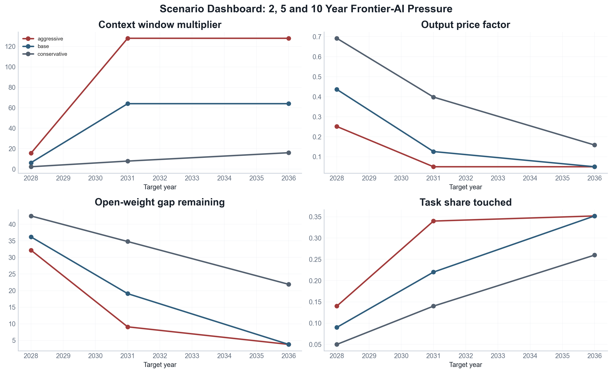

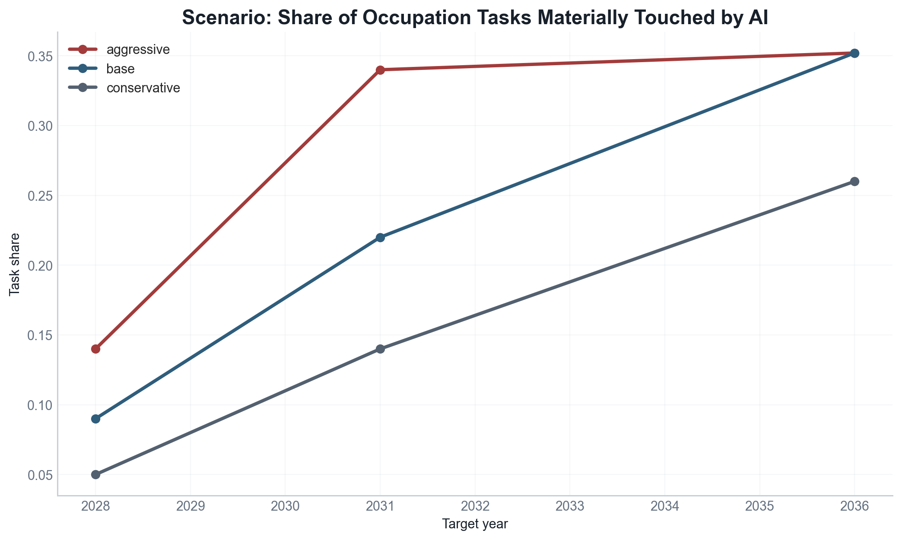

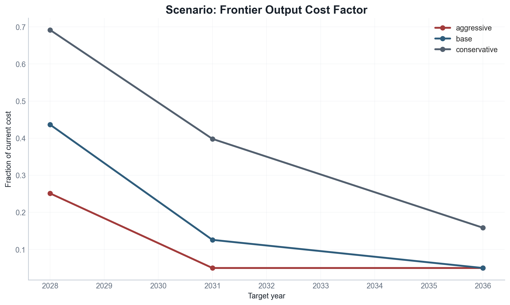

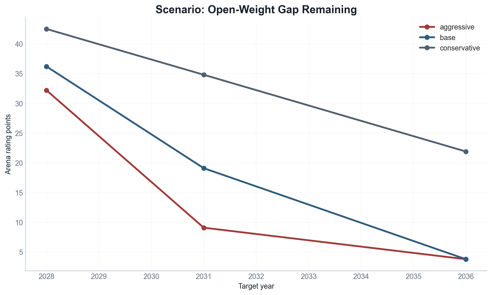

## Uncertainty And Rank Stability

The uncertainty view stress-tests component weights and evidence depth. These intervals are not calibrated confidence intervals; they are a visibility layer for how much the rank can move when public-source signals are perturbed.

| model_family   |   current_rank |   score_p10 |   score_p50 |   score_p90 |   best_rank |   median_rank |   worst_rank | rank_stability_label   |
|:---------------|---------------:|------------:|------------:|------------:|------------:|--------------:|-------------:|:-----------------------|
| GPT            |              1 |       73.83 |       77.77 |       81.71 |           1 |             1 |            2 | stable                 |
| Qwen           |              2 |       74.08 |       77.84 |       81.57 |           1 |             2 |            2 | stable                 |
| Mistral        |              3 |       54.32 |       59.1  |       63.98 |           3 |             4 |            8 | moderate               |
| Gemini         |              4 |       54.83 |       59.64 |       64.52 |           3 |             4 |            9 | moderate               |
| Claude         |              6 |       53.63 |       57.97 |       62.46 |           3 |             5 |            8 | moderate               |
| DeepSeek       |              5 |       54    |       58.27 |       62.73 |           3 |             5 |            8 | moderate               |
| Llama          |              7 |       48.7  |       53.64 |       58.48 |           3 |             7 |            9 | moderate               |
| Gemma          |              8 |       44.54 |       49.37 |       54.86 |           3 |             8 |           10 | stable                 |
| Command        |              9 |       36.51 |       45.33 |       53.9  |           3 |             9 |           11 | moderate               |
| Grok           |             11 |       34.4  |       39.06 |       44.38 |           7 |            10 |           11 | stable                 |
| Phi            |             10 |       34.25 |       39.14 |       44.56 |           8 |            10 |           11 | stable                 |

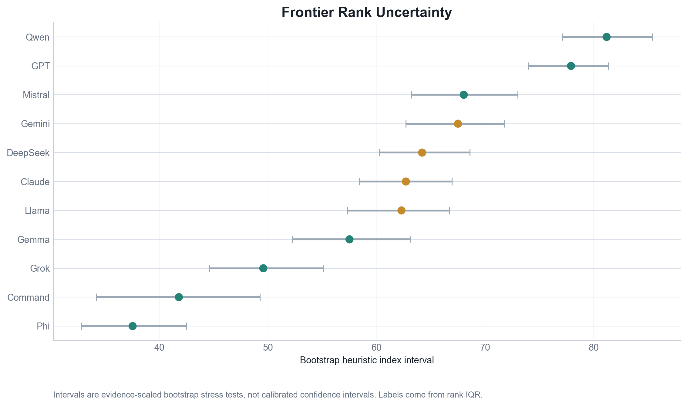

The forecast band chart is a scenario envelope across conservative, base and aggressive cases. It should not be read as a statistical confidence band.

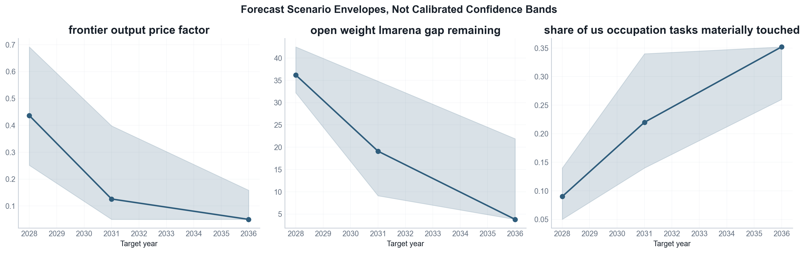

## Release Velocity And Product Cadence

Release cadence separates visible public execution speed from benchmark quality. The cadence tables combine OpenRouter API catalog entries and Epoch metadata, deduplicated by family, vendor, product line and date.

Family cadence:

| model_family   | vendor    |   total_releases |   recent_releases_365d |   median_days_between_releases |   days_since_latest_release | cadence_label   |
|:---------------|:----------|-----------------:|-----------------------:|-------------------------------:|----------------------------:|:----------------|
| GPT            | OpenAI    |              162 |                     66 |                           16   |                          10 | fast            |
| Qwen           | Alibaba   |              131 |                     64 |                            8   |                          18 | fast            |
| Gemini         | Google    |               69 |                     31 |                           14   |                           8 | fast            |
| Mistral        | Mistral   |               67 |                     30 |                           17   |                          15 | fast            |
| Claude         | Anthropic |               37 |                     24 |                           37.5 |                           3 | fast            |
| DeepSeek       | DeepSeek  |               52 |                     19 |                           26.5 |                          21 | fast            |
| Grok           | xAI       |               22 |                     13 |                           40   |                          15 | fast            |
| Gemma          | Google    |               31 |                      9 |                           18   |                          42 | fast            |
| Llama          | Meta      |               92 |                      3 |                           13   |                         212 | fast            |
| Phi            | Microsoft |               17 |                      1 |                           71   |                         210 | fast            |

Vendor cadence:

| vendor    | portfolio_families   |   total_releases |   recent_releases_365d |   median_days_between_releases | cadence_label   |
|:----------|:---------------------|-----------------:|-----------------------:|-------------------------------:|:----------------|
| OpenAI    | GPT                  |              162 |                     66 |                           16   | fast            |
| Alibaba   | Qwen                 |              131 |                     64 |                            8   | fast            |
| Google    | Gemini,Gemma         |              100 |                     40 |                           12   | fast            |
| Mistral   | Mistral              |               67 |                     30 |                           17   | fast            |
| Anthropic | Claude               |               37 |                     24 |                           37.5 | fast            |
| DeepSeek  | DeepSeek             |               52 |                     19 |                           26.5 | fast            |
| xAI       | Grok                 |               22 |                     13 |                           40   | fast            |
| Meta      | Llama                |               92 |                      3 |                           13   | fast            |
| Microsoft | Phi                  |               17 |                      1 |                           71   | fast            |

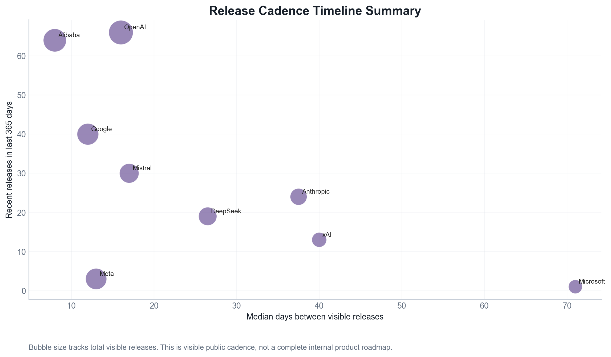

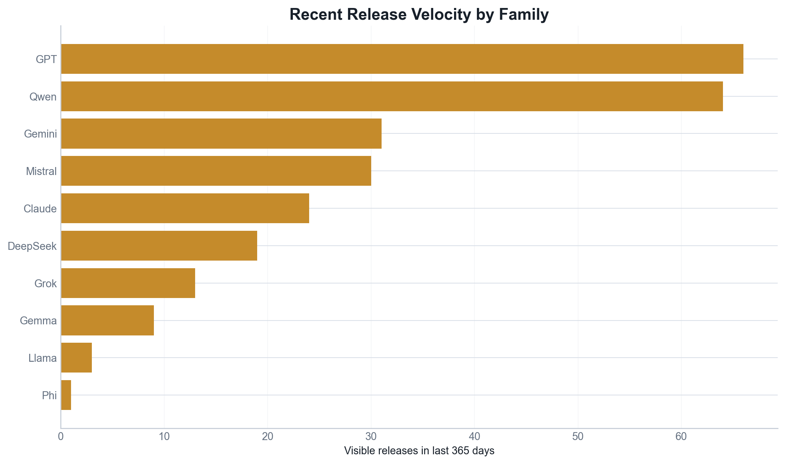

## Historical Analogy

AI looks less like a single prior wave and more like an uncomfortable hybrid: spreadsheet-style task rebundling, internet-style diffusion, cloud-style API economics, and electricity-style long-run production redesign.

| wave                | period    |   ai_similarity_score | interpretation                                                                                       |
|:--------------------|:----------|----------------------:|:-----------------------------------------------------------------------------------------------------|
| cloud_saas          | 2006-2022 |                 99.17 | Best analogy for enterprise adoption lags and API-first business-model shift.                        |
| internet            | 1993-2010 |                 98.86 | Best analogy for general-purpose diffusion, platform creation and strange second-order labor demand. |
| smartphones         | 2007-2020 |                 97.44 | Best analogy for consumer pull, app ecosystems and fast behavioral rewiring.                         |
| containerization    | 1956-1990 |                 97.23 | Best analogy for cost shock in a hidden infrastructure layer.                                        |
| search_ads          | 1998-2015 |                 96.53 | Best analogy for advertising-funded discovery and winner-take-most information layers.               |
| electricity         | 1882-1930 |                 96.22 | Best analogy for long-run production reorganization, not near-term speed.                            |
| spreadsheets        | 1979-1995 |                 95.85 | Best analogy for occupational task rebundling and sudden knowledge-worker productivity jumps.        |
| industrial_robotics | 1961-2020 |                 89.11 | Useful negative analogy: physical deployment is slower and more capital-locked than software AI.     |

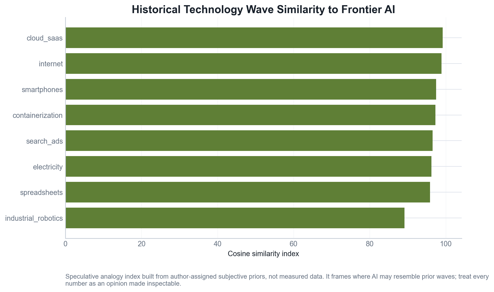

## Forecast Claims

| claim_id                                | claim                                                                                                                                                                       | evidence                                                                                                                  | confidence   | analysis_captured_at      |
|:----------------------------------------|:----------------------------------------------------------------------------------------------------------------------------------------------------------------------------|:--------------------------------------------------------------------------------------------------------------------------|:-------------|:--------------------------|
| company-next-best-model                 | GPT has the strongest composite signal for near-term frontier leadership, but the top open-weight ecosystem score is not necessarily the same family.                       | Composite of LMArena, SWE-bench, OpenRouter, Epoch, Hugging Face, GitHub and OpenAlex indicators.                         | medium       | 2026-07-12T19:42:51+00:00 |
| jobs-augmentation-not-total-replacement | The labor signal is broad task contact, not full-job deletion: high-exposure occupations still retain bottlenecks from trust, regulation, physical work and accountability. | Anthropic Economic Index occupation exposure joined to O*NET task text, task collaboration modes and wage/job metadata.   | medium-high  | 2026-07-12T19:42:51+00:00 |
| open-source-catchup                     | Open-weight systems look structurally advantaged on ecosystem and cost but still need repeated frontier jumps to erase closed/API benchmark gaps.                           | OpenRouter price fields, Hugging Face downloads/files, LMArena access-class split and Epoch open-weight release metadata. | medium       | 2026-07-12T19:42:51+00:00 |
| ten-year-forecast                       | The 10-year question is less whether AI touches most cognitive workflows and more whether institutions redesign jobs around verification, liability and human preference.   | Scenario table combines capability trend, price decline, observed task exposure and bottleneck scoring.                   | speculative  | 2026-07-12T19:42:51+00:00 |

## Counterintuitive Findings

| finding                                                                               | evidence                                                                                                                                                        | why_it_is_interesting                                                                                                                    | artifact                                | analysis_captured_at      |
|:--------------------------------------------------------------------------------------|:----------------------------------------------------------------------------------------------------------------------------------------------------------------|:-----------------------------------------------------------------------------------------------------------------------------------------|:----------------------------------------|:--------------------------|
| Raw frontier leadership and open-distribution upside are different questions.         | In the 10-year frontier-quality scenario, GPT leads (58.6% of simulation draws); in the open-ecosystem-upside scenario, Qwen leads (70.2% of simulation draws). | The previous single 10-year number was misleading because it mixed best-model simulation share with adoption economics.                  | company_next_frontier_probabilities.csv | 2026-07-12T19:42:51+00:00 |
| The open-vs-closed gap is not one gap.                                                | The largest measured LMArena category gap is text_to_image at 361.6 rating points.                                                                              | Open-source catchup can be true in one domain and false in another; a single headline benchmark hides where closed labs still have moat. | open_closed_gap_by_category.csv         | 2026-07-12T19:42:51+00:00 |
| Cheap models can sit on the efficient frontier without being the raw best model.      | Efficient frontier examples include OpenAI: gpt-oss-20b; inclusionAI: Ling-2.6-flash.                                                                           | Enterprise adoption often follows sufficient capability per dollar, not absolute leaderboard rank.                                       | price_performance_frontier.csv          | 2026-07-12T19:42:51+00:00 |
| The top whole-job automation candidates are narrower than the top task-exposure jobs. | The highest replacement-feasibility occupation is Market Research Analysts and Marketing Specialists with feasibility index 39.0.                               | A job can be heavily touched by AI but still mostly redesigned around human review rather than deleted.                                  | job_replacement_feasibility.csv         | 2026-07-12T19:42:51+00:00 |
| Augmentation can be a larger labor-weighted mode than replacement.                    | Available labor-weight proxy: augmentation-first=4,213,430, replacement-candidate=22,338.                                                                       | This pushes the labor forecast toward workflow redesign, wage compression and productivity dispersion before mass full automation.       | labor_market_exposure_summary.csv       | 2026-07-12T19:42:51+00:00 |

## Where This Analysis Is Weak

The skeptical section names assumptions that could break the analysis. It is meant to make the work easier to challenge, not to protect it with broad caveats.

| claim_id                 | assumption                                                                              | failure_mode                                                                                                  | mitigation                                                                                | severity   |
|:-------------------------|:----------------------------------------------------------------------------------------|:--------------------------------------------------------------------------------------------------------------|:------------------------------------------------------------------------------------------|:-----------|
| family-frontier-ranking  | Benchmark, release, ecosystem, cost and openness signals are directionally informative. | A private model or undisclosed benchmark result changes the frontier without appearing in public data.        | Keep heuristic label, show sensitivity, and refresh source snapshots before external use. | high       |
| direct-model-evidence    | Normalized names and curated aliases correctly identify equivalent model rows.          | Vendor naming drift or hidden routing makes same-looking model IDs non-equivalent.                            | Expose match confidence and keep unmatched/family-only rows in the audit table.           | high       |
| vendor-portfolio-ranking | Flagship plus evidence-weighted portfolio mean is a reasonable vendor aggregation.      | A vendor has one dominant model family and several weak rows that should not affect portfolio interpretation. | Report flagship family, family count and components beside the vendor score.              | medium     |
| labor-domain-pressure    | Keyword domain mapping is sufficient for a portfolio-level translation layer.           | Occupation titles hide domain-specific workflows or regulated subdomains.                                     | Keep occupation examples and human gates visible for each domain.                         | medium     |
| forecast-envelope        | Conservative/base/aggressive scenarios bound the intended stress test.                  | A structural market break makes historical slopes irrelevant.                                                 | Label forecast bands as non-calibrated scenario envelopes.                                | high       |

Under-observed family audit:

| model_family   | vendor    |   direct_benchmark_match_count |   coverage_score | underobserved   | underobserved_reasons                                                    |
|:---------------|:----------|-------------------------------:|-----------------:|:----------------|:-------------------------------------------------------------------------|
| Command        | Command   |                              0 |             0    | True            | few_direct_model_matches,low_source_coverage,below_median_evidence_depth |
| GPT            | OpenAI    |                            120 |            99.5  | True            | below_median_evidence_depth                                              |
| Gemini         | Google    |                             24 |           100    | True            | below_median_evidence_depth                                              |
| Claude         | Anthropic |                             48 |           100    | True            | below_median_evidence_depth                                              |
| Grok           | xAI       |                              3 |           100    | True            | below_median_evidence_depth                                              |
| Gemma          | Google    |                             15 |            96.3  | False           | none                                                                     |
| Llama          | Meta      |                             81 |            98.08 | False           | none                                                                     |
| DeepSeek       | DeepSeek  |                             25 |            98.89 | False           | none                                                                     |
| Qwen           | Alibaba   |                             83 |            99.3  | False           | none                                                                     |
| Mistral        | Mistral   |                             56 |            99.33 | False           | none                                                                     |
| Phi            | Microsoft |                              6 |           100    | False           | none                                                                     |

## Method Notes

- Model-family scoring uses `data/dataset/`: LMArena full leaderboard rows, SWE-bench submissions, Open LLM Leaderboard metrics, OpenRouter prices/context, Epoch model metadata, Hugging Face rollups, GitHub model mentions and OpenAlex paper mentions.
- Domain scoring adds downloaded public benchmark sources under `data/raw/domain_benchmarks/`: LiveCodeBench, Open Medical-LLM, Terminal-Bench, FinanceBench, QFBench and Lexometrica. These are normalized into `domain_benchmark_results.csv`.
- Direct model evidence uses conservative name matching across exact, normalized exact, alias, family-only and unmatched classes. Family-only rows are audit evidence, not direct model proof.
- Vendor scoring maps model families to legal vendors and combines flagship-family signal with evidence-weighted portfolio breadth.
- Rank stability and forecast bands are stress tests and scenario envelopes. They are not calibrated confidence intervals.
- Labor scoring uses Anthropic Economic Index files from Hugging Face, including occupation exposure, task penetration, task automation/augmentation labels, O*NET task mappings/statements, and BLS wage/employment companion data.
- Scenario forecasts are not forecasts from a proprietary model. They are transparent transforms of observed slopes and pressure scores. Every scenario row includes a method field and the input diagnostics include caps/fallback policy.
- Domain forecasts use bounded gap closure from dated public benchmark frontier trends. When a domain lacks enough longitudinal evidence, the forecast uses a cross-domain fallback and marks confidence as low.
- Cost-per-message analysis is a workload-mix model over listed API price cohorts, not observed billing data. It separates low-cost chat, knowledge work, long-context analysis and agentic workflow runs.
- Fixed-task cost curves hold task token budgets and quality thresholds stable, then ask which current or future adequate family proxy is cheapest. They should be read as deployability screens, not direct model guarantees.
- Leadership simulation shares are stochastic sensitivity analyses over explicit score components, not calibrated market probabilities.
- Labor-weighted summaries use the best available public companion weights; where only major-group BLS employment is available, the analysis allocates it across detailed occupations inside that group to avoid treating each detailed occupation as the whole major group.
- BLS web xlsx endpoints returned anti-bot 403 responses in this environment. The analysis therefore uses public BLS-derived companion files already included in Anthropic's release rather than scraping around that restriction.

## Generated Artifacts

- `data/analysis/company_frontier_scores.csv`
- `data/analysis/dashboard_key_findings.csv`
- `data/analysis/domain_benchmark_catalog.csv`
- `data/analysis/domain_benchmark_results.csv`
- `data/analysis/domain_capability_frontier.csv`
- `data/analysis/domain_improvement_velocity.csv`
- `data/analysis/domain_capability_forecasts.csv`
- `data/analysis/domain_forecast_thresholds.csv`
- `data/analysis/company_score_methodology.csv`
- `data/analysis/company_score_sensitivity.csv`
- `data/analysis/model_benchmark_match_audit.csv`
- `data/analysis/direct_model_price_performance.csv`
- `data/analysis/llm_message_cost_trends.csv`
- `data/analysis/llm_message_cost_profile_components.csv`
- `data/analysis/fixed_task_cost_candidates.csv`
- `data/analysis/fixed_task_cost_curves.csv`
- `data/analysis/cost_divergence_scenarios.csv`
- `data/analysis/cost_external_evidence.csv`
- `data/analysis/vendor_frontier_scores.csv`
- `data/analysis/vendor_score_components.csv`
- `data/analysis/source_coverage_diagnostics.csv`
- `data/analysis/family_coverage_matrix.csv`
- `data/analysis/frontier_score_bootstrap.csv`
- `data/analysis/rank_stability_intervals.csv`
- `data/analysis/claim_failure_modes.csv`
- `data/analysis/underobserved_family_audit.csv`
- `data/analysis/business_domain_ai_pressure.csv`
- `data/analysis/domain_workflow_examples.csv`
- `data/analysis/release_cadence_by_family.csv`
- `data/analysis/release_cadence_by_vendor.csv`
- `data/analysis/job_exposure_scores.csv`
- `data/analysis/capability_forecasts.csv`
- `data/analysis/forecast_input_diagnostics.csv`
- `data/analysis/company_next_frontier_probabilities.csv`
- `data/analysis/open_closed_gap_by_category.csv`
- `data/analysis/lmarena_category_leaders.csv`
- `data/analysis/price_performance_frontier.csv`
- `data/analysis/labor_cluster_profiles.csv`
- `data/analysis/labor_market_exposure_summary.csv`
- `data/analysis/job_replacement_feasibility.csv`
- `data/analysis/counterintuitive_findings.csv`
- `data/analysis/historical_analogy_index.csv`
- `data/analysis/forecast_claims.csv`
- `figures/deep_analysis/company_score_component_stack.png`
- `figures/deep_analysis/company_score_evidence_scatter.png`
- `figures/deep_analysis/domain_benchmark_coverage.png`
- `figures/deep_analysis/domain_source_matrix.png`
- `figures/deep_analysis/domain_frontier_trends.png`
- `figures/deep_analysis/domain_current_velocity.png`
- `figures/deep_analysis/domain_forecast_base.png`
- `figures/deep_analysis/domain_forecast_scenarios.png`
- `figures/deep_analysis/domain_threshold_timeline.png`
- `figures/deep_analysis/leadership_scenario_matrix.png`
- `figures/deep_analysis/open_closed_category_levels.png`
- `figures/deep_analysis/price_context_rating_map.png`
- `figures/deep_analysis/labor_outcome_mix.png`
- `figures/deep_analysis/forecast_scenario_dashboard.png`
- `figures/deep_analysis/direct_vs_proxy_price_performance.png`
- `figures/deep_analysis/llm_message_cost_trends.png`
- `figures/deep_analysis/fixed_task_cost_curves.png`
- `figures/deep_analysis/cost_task_message_divergence.png`
- `figures/deep_analysis/fixed_task_quality_cost_ladder.png`
- `figures/deep_analysis/vendor_frontier_scores.png`
- `figures/deep_analysis/family_vs_vendor_rank_shift.png`
- `figures/deep_analysis/source_coverage_dashboard.png`
- `figures/deep_analysis/family_signal_coverage_heatmap.png`
- `figures/deep_analysis/frontier_rank_uncertainty.png`
- `figures/deep_analysis/forecast_uncertainty_bands.png`
- `figures/deep_analysis/business_domain_pressure_matrix.png`
- `figures/deep_analysis/release_cadence_timeline.png`
- `figures/deep_analysis/recent_release_velocity.png`
- `figures/deep_analysis/*.png`
