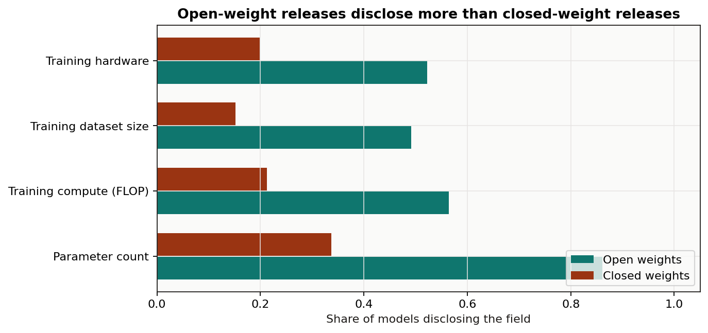
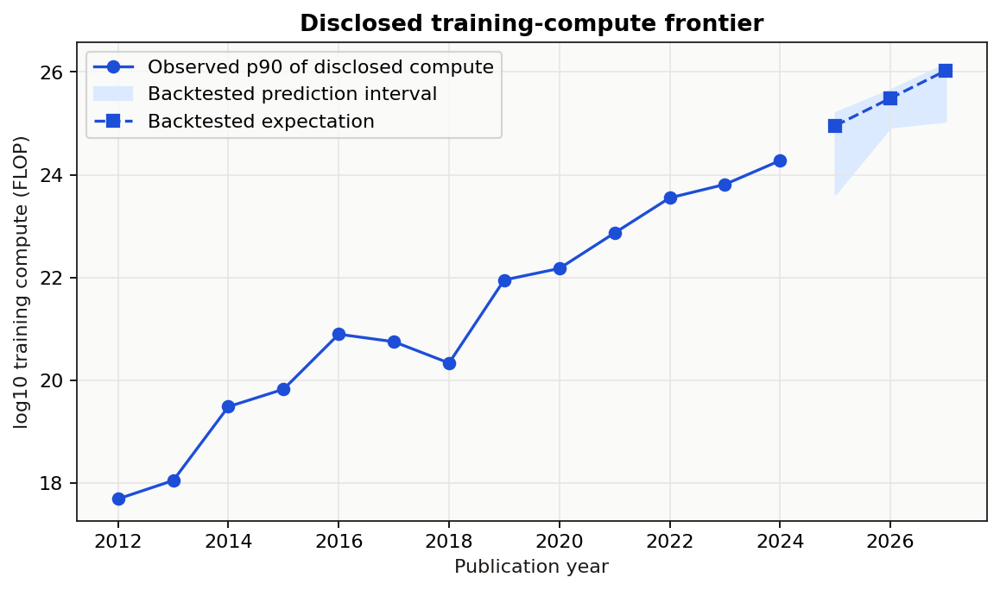
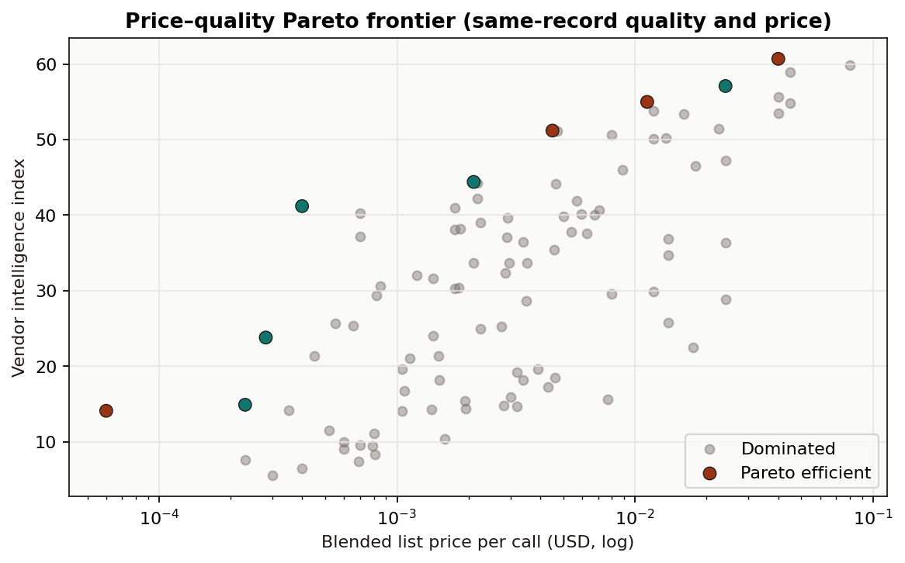
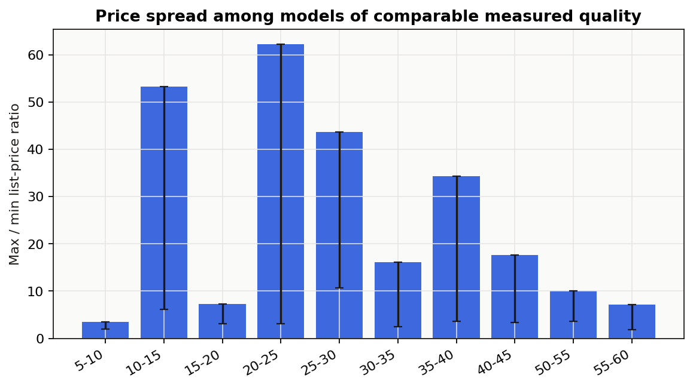
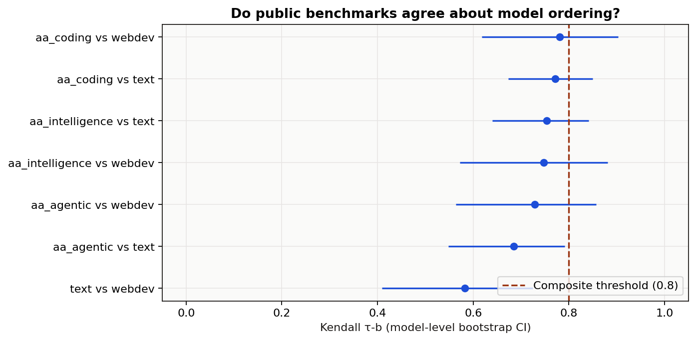
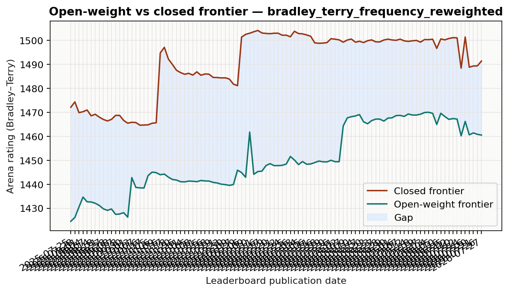
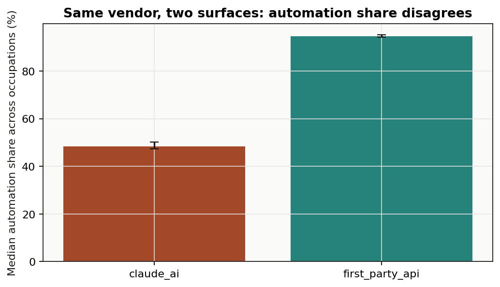
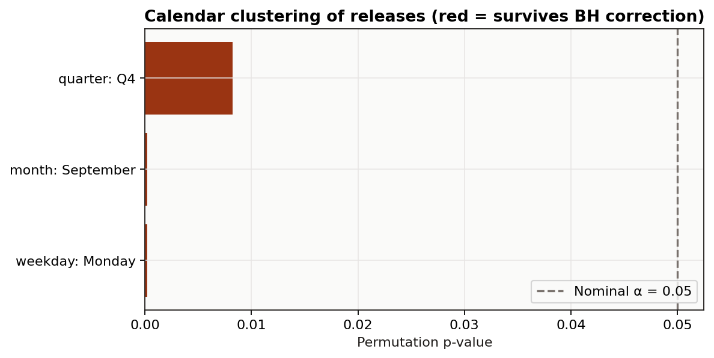

# AI Capability Signals

**Reference date:** 2026-07-27 (freshest source horizon; lagging sources are listed below).
**Generated:** 2026-07-28T08:29:58+00:00.
**Version:** 2.0.

This report answers a small number of questions that public data can actually support, each with a
stated estimator and an uncertainty interval. Claims the data cannot support are listed as
refusals rather than estimated.

## Source freshness

Each source's latest observation. Analyses that depend on a source more than 90 days behind the
reference date refuse present-tense claims for that source.

| source_id                | latest_observation   | date_semantics                                                           |    rows |   days_behind_reference | is_freshest   |
|:-------------------------|:---------------------|:-------------------------------------------------------------------------|--------:|------------------------:|:--------------|
| swebench_verified        | 2025-12-15           | submission directory date                                                |     134 |                     224 | False         |
| anthropic_economic_index | 2026-06-01           | usage period end date                                                    |    2844 |                      56 | False         |
| epoch_models             | 2026-07-24           | model publication date (curated; recent years right-censored)            |    3572 |                       3 | False         |
| openrouter_models        | 2026-07-27           | catalogue listing created timestamp (cross-section, not a price history) |     341 |                       0 | True          |
| lmarena_leaderboard      | 2026-07-27           | leaderboard publication date                                             | 1894027 |                       0 | True          |


## Findings that survive the audit

- Open-weight releases disclose more than closed-weight releases. The largest corrected difference is for **Parameter count**: 52% points (95% CI 47% to 58%; BH q=0.000).
- The disclosed training-compute frontier grows at **0.54 log10 FLOP per year** (HC3 95% CI 0.47–0.60), a doubling time of about **6.7 months**. This is a lower bound: compute disclosure is incomplete and voluntary.
- A single composite capability score is not defensible on this evidence. Benchmarks are reported separately, and no weighted average of them is published.
- Inside the current arena rating regime (bradley_terry_frequency_reweighted), the open–closed gap changes by **-6.6 rating points per year** (HC3 CI -12.4 to -0.8). A crossing date is not published.
- Kaplan–Meier median lag for open weights to reach a historical closed-frontier level: **152 days** (89 of 229 levels still unmatched and right-censored).
- On the same occupations, the consumer product and the first-party API disagree about automation share by **-40.2 percentage points** (95% CI -41.3 to -39.1). No single 'share of work automated' number is published.
- The pipeline records **8 refused claims** — quantities the available public data cannot support. They are listed below rather than estimated.

## Data quality and refusals

Before any estimate, the pipeline reports the properties of the data that constrain what can be
claimed. Blocking findings are paired with an entry in the refusals ledger.

### Blocking findings

| source_id                | check                    |   value | interpretation                                                                                                                                                                                                                           |
|:-------------------------|:-------------------------|--------:|:-----------------------------------------------------------------------------------------------------------------------------------------------------------------------------------------------------------------------------------------|
| anthropic_economic_index | panel_length             |       2 | The release covers 2 monthly period(s) (2026-04-01 to 2026-05-01). Cross-sectional comparisons are supported; trends in usage composition are not.                                                                                       |
| epoch_models             | curation_right_censoring |    2025 | Model counts fall monotonically from 2025 to 2026, which is consistent with curation lag and also with a genuine slowdown. The two cannot be distinguished from this dataset, so release-count trends are not published for these years. |
| swebench_verified        | leaderboard_staleness    |     224 | The most recent public submission is dated 2025-12-15, 224 days before the reference date. The leaderboard supports historical statements only; it cannot describe current agent capability.                                             |

### Refused claims

| analysis            | claim                                                                               | reason                                                                                                                                                                                                                                                                                                                 | unblocked_by                                                                                                                                                   |
|:--------------------|:------------------------------------------------------------------------------------|:-----------------------------------------------------------------------------------------------------------------------------------------------------------------------------------------------------------------------------------------------------------------------------------------------------------------------|:---------------------------------------------------------------------------------------------------------------------------------------------------------------|
| benchmark_agreement | A single composite score ranking models by overall capability.                      | Public benchmarks do not agree strongly enough on model ordering to be treated as noisy measurements of one construct. The weakest measured pair (lmarena_text_rating versus lmarena_webdev_rating) has Kendall tau 0.58 on 40 shared models, so a weighted average of them would mostly encode the choice of weights. | Evidence that the benchmarks load on a common factor, for example a factor analysis on a much wider model-by-benchmark matrix with published per-model scores. |
| data_quality        | A single number for how far behind open-weight models are, across all capabilities. | The gap is measured per arena and per category and varies widely between them. One pooled number would hide that variation and depend on which categories were included.                                                                                                                                               | Nothing in this data. The quantity is category-specific by construction.                                                                                       |
| data_quality        | Current state-of-the-art coding-agent capability on SWE-bench Verified.             | The public submission directory has received no entry for 224 days, so its top score is a lower bound from an earlier period, not a current measurement.                                                                                                                                                               | New submissions to the public SWE-bench Verified experiments directory.                                                                                        |
| data_quality        | How listed prices for a given capability level changed over time.                   | The catalogue is a cross-section of currently listed models. Withdrawn models are absent and no historical price field is published, so any 'price over time' series built from it would be a survivorship-biased cohort comparison.                                                                                   | Repeated snapshots of this catalogue captured over time, or a source that publishes dated historical prices.                                                   |
| data_quality        | Number of notable AI models released per year, including the most recent years.     | Epoch AI model counts decline monotonically from 2025 onward. Curation lag and a real slowdown produce identical shapes in this dataset.                                                                                                                                                                               | A dataset revision that marks completeness per year, or waiting until the affected years stop growing between snapshots.                                       |
| open_weights_lag    | The date on which open-weight models will match the closed frontier.                | Extrapolating the measured gap trend to zero assumes the trend is linear, that the rating scale is stable, and that no methodology change intervenes. The trend is estimated on serially correlated weekly publications inside a single regime, which supports a direction but not a crossing date.                    | A model of the gap process validated out of sample against past regime changes.                                                                                |
| swebench_progress   | Extrapolated future SWE-bench Verified resolve rates.                               | The public leaderboard has received no entry for 224 days. A trend fitted to a frozen series projects silence, not progress.                                                                                                                                                                                           | New public submissions.                                                                                                                                        |
| usage_composition   | Trend in the automation share of observed AI usage.                                 | The release covers 2 monthly period(s). A trend needs a longer panel; with this little history any slope is indistinguishable from noise.                                                                                                                                                                              | A longer run of monthly releases from the same surface.                                                                                                        |


## Disclosure completeness

Disclosure is a property of the record: either a field is populated or it is not. The comparison
below is a difference of proportions with a two-sample bootstrap interval, corrected across fields
by Benjamini–Hochberg. The accessibility field is excluded from the test because the weights class
is derived from it, which would make the comparison circular.

| field_label             |   open_disclosure_rate |   closed_disclosure_rate |   difference |   ci_low |   ci_high |   q_value_bh | significant_after_bh   |
|:------------------------|-----------------------:|-------------------------:|-------------:|---------:|----------:|-------------:|:-----------------------|
| Parameter count         |               0.860772 |                 0.3367   |     0.524072 | 0.465437 |  0.581373 |       0.0001 | True                   |
| Training compute (FLOP) |               0.564024 |                 0.212121 |     0.351903 | 0.294599 |  0.407869 |       0.0001 | True                   |
| Training dataset size   |               0.49187  |                 0.151515 |     0.340355 | 0.287119 |  0.390411 |       0.0001 | True                   |
| Training hardware       |               0.522358 |                 0.198653 |     0.323705 | 0.267993 |  0.37726  |       0.0001 | True                   |



**Confound, stated rather than adjusted:** open-weight releases skew academic and closed releases
skew commercial. Part of the difference is publication culture. The data contain no instrument that
separates the two.


## Disclosed training-compute growth

Training compute is a physical, unbounded quantity. Its logarithm can be extrapolated without
hitting a ceiling — unlike a benchmark percentage capped at 100, which is why the previous version's
domain forecasts were withdrawn.

### Trend estimates

| specification                 | estimator   |    n |   log10_flop_per_year |   ci_low |   ci_high |   doubling_time_months |
|:------------------------------|:------------|-----:|----------------------:|---------:|----------:|-----------------------:|
| frontier_p90_by_year          | ols_hc3     |   13 |              0.535666 | 0.474299 |  0.597033 |                6.74368 |
| frontier_p90_by_year          | theil_sen   |   13 |              0.517738 | 0.464067 |  0.602392 |                6.9772  |
| frontier_max_by_year          | ols_hc3     |   13 |              0.635875 | 0.528083 |  0.743667 |                5.68093 |
| frontier_max_by_year          | theil_sen   |   13 |              0.63964  | 0.511744 |  0.728187 |                5.64748 |
| all_disclosed_models          | ols_hc3     | 1124 |              0.554794 | 0.51554  |  0.594049 |                6.51117 |
| all_disclosed_models          | theil_sen   | 1124 |              0.574119 | 0.530559 |  0.617581 |                6.29201 |
| epoch_frontier_flagged_models | ols_hc3     |   74 |              0.65278  | 0.621707 |  0.683853 |                5.53381 |
| epoch_frontier_flagged_models | theil_sen   |   74 |              0.661969 | 0.629017 |  0.693926 |                5.45699 |

### Backtest against a last-value baseline

A forecast is published only when it beats carrying the last observed frontier forward. The
prediction interval is built from measured out-of-sample errors, not from the regression's
in-sample standard error.

|   horizon_years |   folds |   mae_log10 |   rmse_log10 |   baseline_mae_log10 |   skill_ratio_vs_last_value | beats_baseline   |   error_quantile_low |   error_quantile_high | baseline                                     | note                                                                                                                           |
|----------------:|--------:|------------:|-------------:|---------------------:|----------------------------:|:-----------------|---------------------:|----------------------:|:---------------------------------------------|:-------------------------------------------------------------------------------------------------------------------------------|
|               1 |       7 |    0.365346 |     0.603382 |             0.622291 |                    0.587098 | True             |            -0.255446 |              1.33189  | last observed frontier value carried forward | Errors are in log10 FLOP. A skill ratio below 1 means the fitted trend forecasts better out of sample than assuming no change. |
|               2 |       6 |    0.202818 |     0.283188 |             1.16729  |                    0.173752 | True             |            -0.166287 |              0.561697 | last observed frontier value carried forward | Errors are in log10 FLOP. A skill ratio below 1 means the fitted trend forecasts better out of sample than assuming no change. |
|               3 |       5 |    0.315061 |     0.49396  |             1.72041  |                    0.183131 | True             |            -0.128298 |              0.983956 | last observed frontier value carried forward | Errors are in log10 FLOP. A skill ratio below 1 means the fitted trend forecasts better out of sample than assuming no change. |

### Selection sensitivity

Compute disclosure is incomplete and voluntary. The slope under several restrictions:

| restriction                    |    n |   log10_flop_per_year |   doubling_time_months |   relative_change_vs_baseline | status    |
|:-------------------------------|-----:|----------------------:|-----------------------:|------------------------------:|:----------|
| all_disclosed                  | 1124 |              0.554794 |                6.51117 |                      0        | estimated |
| top_decile_within_year         |  117 |              0.540879 |                6.67868 |                     -0.025081 | estimated |
| vendors_with_5plus_disclosures |  873 |              0.520713 |                6.93734 |                     -0.061431 | estimated |
| language_domain_only           |  707 |              0.753905 |                4.79153 |                      0.358891 | estimated |
| excluding_open_weights         |   65 |              0.45521  |                7.93559 |                     -0.179497 | estimated |
| open_weights_only              |  564 |              0.56829  |                6.35654 |                      0.024326 | estimated |

### Expectations for provisional and future years

|   target_year |   horizon_years | target_kind                  |   log10_compute_p90_forecast |   pi_low |   pi_high |   flop_forecast | interval_source                                   |   backtest_folds |   skill_ratio_vs_last_value | interpretation                                                                                                                                                      |
|--------------:|----------------:|:-----------------------------|-----------------------------:|---------:|----------:|----------------:|:--------------------------------------------------|-----------------:|----------------------------:|:--------------------------------------------------------------------------------------------------------------------------------------------------------------------|
|          2025 |               1 | backfill_of_provisional_year |                      24.9539 |  23.622  |   25.2094 |     8.99352e+24 | empirical rolling-origin backtest error quantiles |                7 |                    0.587098 | Expectation for the 90th percentile of *disclosed* training compute. Because disclosure is incomplete and voluntary, read it as a lower bound on the true frontier. |
|          2026 |               2 | backfill_of_provisional_year |                      25.4896 |  24.9279 |   25.6559 |     3.08742e+25 | empirical rolling-origin backtest error quantiles |                6 |                    0.173752 | Expectation for the 90th percentile of *disclosed* training compute. Because disclosure is incomplete and voluntary, read it as a lower bound on the true frontier. |
|          2027 |               3 | future                       |                      26.0253 |  25.0413 |   26.1536 |     1.05989e+26 | empirical rolling-origin backtest error quantiles |                5 |                    0.183131 | Expectation for the 90th percentile of *disclosed* training compute. Because disclosure is incomplete and voluntary, read it as a lower bound on the true frontier. |




## Price structure in the current catalogue

Quality and price come from the **same catalogue record**, so there is no cross-source name join.
The catalogue is a cross-section of currently listed models: it cannot support a price history, and
that claim is refused.

### Cheapest listed model at each quality threshold

|   quality_threshold |   eligible_models | cheapest_model_id    | cheapest_model_vendor   | cheapest_model_weights   |   cheapest_model_quality |   cheapest_blended_usd_per_call |   premium_vs_cheapest | highest_quality_model_id   | status    |
|--------------------:|------------------:|:---------------------|:------------------------|:-------------------------|-------------------------:|--------------------------------:|----------------------:|:---------------------------|:----------|
|                  20 |                69 | openai/gpt-oss-120b  | OpenAI                  | open_weights             |                     23.8 |                        0.000281 |             142.349   | anthropic/claude-opus-5    | estimated |
|                  30 |                53 | tencent/hy3-preview  | Tencent                 | open_weights             |                     41.2 |                        0.000399 |             100.251   | anthropic/claude-opus-5    | estimated |
|                  40 |                30 | tencent/hy3-preview  | Tencent                 | open_weights             |                     41.2 |                        0.000399 |             100.251   | anthropic/claude-opus-5    | estimated |
|                  50 |                16 | openai/gpt-5.6-luna  | OpenAI                  | closed_weights           |                     51.2 |                        0.0045   |               8.88889 | anthropic/claude-opus-5    | estimated |
|                  55 |                 6 | openai/gpt-5.6-terra | OpenAI                  | closed_weights           |                     55   |                        0.01125  |               3.55556 | anthropic/claude-opus-5    | estimated |

### Price spread among models of comparable quality

If quality determined price, the max/min ratio inside a narrow quality band would be near 1. It is
not.

| quality_band   |   models |   cheapest_usd_per_call |   dearest_usd_per_call |   max_min_price_ratio |   ratio_ci_low |   ratio_ci_high |
|:---------------|---------:|------------------------:|-----------------------:|----------------------:|---------------:|----------------:|
| 5-10           |        8 |                0.00023  |               0.000806 |               3.50435 |        1.975   |         3.50435 |
| 10-15          |       12 |                6e-05    |               0.0032   |              53.3333  |        6.15385 |        53.3333  |
| 15-20          |       11 |                0.00105  |               0.0077   |               7.33333 |        3.04636 |         7.33333 |
| 20-25          |        6 |                0.000281 |               0.0175   |              62.2776  |        3.15556 |        62.2776  |
| 25-30          |       10 |                0.00055  |               0.024    |              43.6364  |       10.6667  |        43.6364  |
| 30-35          |       10 |                0.00085  |               0.01375  |              16.1765  |        2.44408 |        16.1765  |
| 35-40          |       13 |                0.0007   |               0.024    |              34.2857  |        3.57143 |        34.2857  |
| 40-45          |       11 |                0.000399 |               0.00705  |              17.6692  |        3.35714 |        17.6692  |
| 50-55          |       10 |                0.0045   |               0.045    |              10       |        3.55556 |        10       |
| 55-60          |        5 |                0.01125  |               0.08     |               7.11111 |        1.77778 |         7.11111 |

### Weight availability and price, at equal measured quality

| term              |   price_factor |    ci_low |   ci_high |   n | causal_status                                                                                                                                                                      |
|:------------------|---------------:|----------:|----------:|----:|:-----------------------------------------------------------------------------------------------------------------------------------------------------------------------------------|
| quality_index     |        1.0572  |  0.018097 |  0.030218 | 100 | association in a catalogue. Published-weight models are served by competing hosts while closed models are served by their developer, so this mixes openness with host competition. |
| weights_published |        0.41515 | -0.569258 | -0.187613 | 100 | association in a catalogue. Published-weight models are served by competing hosts while closed models are served by their developer, so this mixes openness with host competition. |

### Prompt-length price tiers

|   models_listed |   models_with_tiers |   share_with_tiers |   evaluation_prompt_tokens |   models_with_tier_binding_at_evaluation_length |   median_input_price_multiplier_when_binding |   ci_low |   ci_high |   max_input_price_multiplier | estimator                      | interpretation                                                                                                                                                                                                 |
|----------------:|--------------------:|-------------------:|---------------------------:|------------------------------------------------:|---------------------------------------------:|---------:|----------:|-----------------------------:|:-------------------------------|:---------------------------------------------------------------------------------------------------------------------------------------------------------------------------------------------------------------|
|             321 |                  44 |           0.137072 |                      64000 |                                               5 |                                            2 |  1.66667 |   3.33333 |                      3.33333 | percentile_bootstrap_of_median | Among listings whose price tier actually applies at 64,000 prompt tokens, the input price relative to the base rate. Reading only the base rate understates long-context cost by this factor for those models. |






## Do public benchmarks agree?

Every composite "AI capability score" rests on an untested premise: that the signals being combined
measure one underlying thing. This section tests that premise. A composite is treated as defensible
only if every measured pair of independent benchmarks has a Kendall τ lower bound above 0.8.

|   pairs_tested |   pairs_between_independent_benchmarks |   minimum_tau_ci_low |   median_tau | weakest_pair                                 |   weakest_pair_tau |   threshold_for_composite | composite_score_defensible   | verdict                                                                                                                                                   | threshold_rationale                                                                                                                                                                                       |
|---------------:|---------------------------------------:|---------------------:|-------------:|:---------------------------------------------|-------------------:|--------------------------:|:-----------------------------|:----------------------------------------------------------------------------------------------------------------------------------------------------------|:----------------------------------------------------------------------------------------------------------------------------------------------------------------------------------------------------------|
|             10 |                                      7 |             0.409745 |     0.747126 | lmarena_text_rating vs lmarena_webdev_rating |           0.582051 |                       0.8 | False                        | A single composite capability score is not defensible on this evidence. Benchmarks are reported separately, and no weighted average of them is published. | Declared before estimation. tau > 0.8 corresponds to at least 90% of model pairs ordered identically, which is the minimum for a single number to be usable without knowing which benchmark generated it. |

| benchmark_a           | benchmark_b           |   common_models |   kendall_tau_b |   tau_ci_low |   tau_ci_high |   top_10_overlap | both_vendor_composites   |
|:----------------------|:----------------------|----------------:|----------------:|-------------:|--------------:|-----------------:|:-------------------------|
| lmarena_text_rating   | lmarena_webdev_rating |              40 |        0.582051 |     0.409745 |      0.724047 |              0.7 | False                    |
| aa_agentic_index      | lmarena_text_rating   |              47 |        0.684895 |     0.548204 |      0.79132  |              0.8 | False                    |
| aa_agentic_index      | lmarena_webdev_rating |              30 |        0.728736 |     0.563549 |      0.856802 |              0.8 | False                    |
| aa_intelligence_index | lmarena_webdev_rating |              30 |        0.747126 |     0.572115 |      0.881517 |              0.8 | False                    |
| aa_intelligence_index | lmarena_text_rating   |              47 |        0.753355 |     0.639958 |      0.841709 |              0.9 | False                    |
| aa_coding_index       | lmarena_text_rating   |              51 |        0.77098  |     0.673594 |      0.849238 |              1   | False                    |
| aa_coding_index       | lmarena_webdev_rating |              31 |        0.780645 |     0.617778 |      0.903089 |              0.8 | False                    |
| aa_coding_index       | aa_agentic_index      |             108 |        0.839226 |     0.790501 |      0.880571 |              0.9 | True                     |
| aa_intelligence_index | aa_agentic_index      |             107 |        0.888319 |     0.856275 |      0.916936 |              0.9 | True                     |
| aa_intelligence_index | aa_coding_index       |             107 |        0.902519 |     0.867372 |      0.93229  |              1   | True                     |



Because the threshold is not met, **no composite capability score is published**. Benchmarks are
reported separately.


## Open-weight lag on the arena frontier

Trends are estimated inside a single rating-methodology regime. A slope that spans a methodology
break would partly measure the break.

### Gap trend by regime

| methodology_regime                  |   leaderboards | window_start   | window_end   |   mean_gap_rating |   gap_change_per_year_ols |   ci_low |    ci_high |   gap_change_per_year_theil_sen |   theil_sen_ci_low |   theil_sen_ci_high |   r_squared | estimator                                    | serial_correlation_note                                                                                                                                                                               |
|:------------------------------------|---------------:|:---------------|:-------------|------------------:|--------------------------:|---------:|-----------:|--------------------------------:|-------------------:|--------------------:|------------:|:---------------------------------------------|:------------------------------------------------------------------------------------------------------------------------------------------------------------------------------------------------------|
| bradley_terry                       |            102 | 2024-01-09     | 2025-05-11   |           55.187  |                 -57.654   | -72.4254 | -42.8826   |                        -50.4896 |           -66.0529 |           -41.3194  |    0.433054 | ols_hc3_and_theil_sen_on_within_regime_dates | Consecutive leaderboards share most of their vote history, so observations are strongly serially correlated and these intervals are too narrow. Read the sign and rough magnitude, not the endpoints. |
| bradley_terry_frequency_reweighted  |            102 | 2025-07-25     | 2026-07-27   |           40.1906 |                  -6.57898 | -12.3748 |  -0.783139 |                        -11.9994 |           -20.1212 |            -6.54908 |    0.033431 | ols_hc3_and_theil_sen_on_within_regime_dates | Consecutive leaderboards share most of their vote history, so observations are strongly serially correlated and these intervals are too narrow. Read the sign and rough magnitude, not the endpoints. |
| bradley_terry_style_control_default |             14 | 2025-05-19     | 2025-07-17   |           40.3924 |                  53.5378  | -25.4885 | 132.564    |                         59.2254 |           -29.1643 |            92.6544  |    0.037159 | ols_hc3_and_theil_sen_on_within_regime_dates | Consecutive leaderboards share most of their vote history, so observations are strongly serially correlated and these intervals are too narrow. Read the sign and rough magnitude, not the endpoints. |

### Catch-up lag (Kaplan–Meier, right-censored)

|   levels_tracked |   levels_reached |   levels_still_unmatched |   share_right_censored |   kaplan_meier_median_lag_days |   follow_up_days |   naive_median_of_completed_lags_days |   naive_understates_by_days | estimator                                | interpretation                                                                                                                                                                                                                                                                                                 |
|-----------------:|-----------------:|-------------------------:|-----------------------:|-------------------------------:|-----------------:|--------------------------------------:|----------------------------:|:-----------------------------------------|:---------------------------------------------------------------------------------------------------------------------------------------------------------------------------------------------------------------------------------------------------------------------------------------------------------------|
|              229 |              140 |                       89 |               0.388646 |                            152 |              398 |                                  98.5 |                        53.5 | kaplan_meier_median_with_right_censoring | Kaplan-Meier median days for the open-weight frontier to reach a historical closed-frontier level. Censored levels contribute as 'not yet reached'. A NaN median means more than half the levels tracked are still unmatched within the follow-up window, so the honest answer is 'longer than the follow-up'. |

### Gap by category in the latest publication

A single pooled gap number is refused; the gap is category-specific.

| arena   | category                                      | open_best_model   | closed_best_model        |   gap_rating |   gap_ci_low | gap_distinguishable_from_zero   |
|:--------|:----------------------------------------------|:------------------|:-------------------------|-------------:|-------------:|:--------------------------------|
| text    | industry_mathematical                         | mimo-v2.5-pro     | claude-opus-5-high       |     102.931  |    63.8895   | True                            |
| text    | polish                                        | mimo-v2.5-pro     | gemini-3.5-flash-high    |      77.8629 |    35.6569   | True                            |
| text    | math                                          | inkling           | claude-opus-5-high       |      65.9092 |    16.1994   | True                            |
| text    | creative_writing                              | glm-5.1           | claude-opus-5-max        |      62.3683 |    29.8349   | True                            |
| text    | korean                                        | mimo-v2.5-pro     | claude-fable-5           |      60.7786 |    17.3192   | True                            |
| text    | japanese                                      | glm-5.2-max       | claude-fable-5           |      49.7919 |    -8.23794  | False                           |
| text    | industry_legal_and_government                 | mimo-v2.5-pro     | claude-opus-5-high       |      48.6344 |    19.4439   | True                            |
| text    | non_english                                   | glm-5.1           | claude-opus-5-max        |      43.5031 |     5.60445  | True                            |
| text    | industry_entertainment_and_sports_and_media   | glm-5.1           | claude-opus-4-6-thinking |      41.6977 |    14.4703   | True                            |
| text    | russian                                       | glm-5.1           | claude-opus-5-high       |      39.8644 |    13.4427   | True                            |
| text    | exclude_ties                                  | mimo-v2.5-pro     | claude-opus-5-max        |      37.7747 |    -0.367644 | False                           |
| text    | industry_life_and_physical_and_social_science | hy3               | claude-opus-5-max        |      36.9466 |    -0.723988 | False                           |




## Observed usage composition (not employment impact)

These tables describe the composition of one vendor's observed conversations. They are not a sample
of the workforce and carry no information about employment outcomes. No replacement or disruption
index is constructed.

### Surface medians

| surface         | period_start   |   occupations | metric                 |   median |   ci_low |   ci_high | estimator                      | scope                                                                                                                                                                           |
|:----------------|:---------------|--------------:|:-----------------------|---------:|---------:|----------:|:-------------------------------|:--------------------------------------------------------------------------------------------------------------------------------------------------------------------------------|
| claude_ai       | 2026-05-01     |           718 | automation_share_pct   |    48.4  |    47.3  |     50.12 | percentile_bootstrap_of_median | Median across occupations with published values. Occupations are not employment-weighted: this describes the composition of the published occupation set, not of the workforce. |
| claude_ai       | 2026-05-01     |           718 | augmentation_share_pct |    51.6  |    49.88 |     52.7  | percentile_bootstrap_of_median | Median across occupations with published values. Occupations are not employment-weighted: this describes the composition of the published occupation set, not of the workforce. |
| claude_ai       | 2026-05-01     |           718 | ai_autonomy_mean       |     2.74 |     2.72 |      2.75 | percentile_bootstrap_of_median | Median across occupations with published values. Occupations are not employment-weighted: this describes the composition of the published occupation set, not of the workforce. |
| first_party_api | 2026-05-01     |           690 | automation_share_pct   |    94.63 |    94.12 |     95.21 | percentile_bootstrap_of_median | Median across occupations with published values. Occupations are not employment-weighted: this describes the composition of the published occupation set, not of the workforce. |
| first_party_api | 2026-05-01     |           690 | augmentation_share_pct |     5.37 |     4.79 |      5.88 | percentile_bootstrap_of_median | Median across occupations with published values. Occupations are not employment-weighted: this describes the composition of the published occupation set, not of the workforce. |
| first_party_api | 2026-05-01     |           690 | ai_autonomy_mean       |     2.19 |     2.18 |      2.22 | percentile_bootstrap_of_median | Median across occupations with published values. Occupations are not employment-weighted: this describes the composition of the published occupation set, not of the workforce. |

### Surface contrast on the same occupations

| surface_a   | surface_b       |   occupations_in_common |   mean_automation_share_a |   mean_automation_share_b |   mean_difference_a_minus_b |   ci_low |   ci_high |   spearman_rho_of_automation_shares | estimator                                            | interpretation                                                                                                                                                                                                                                                             |
|:------------|:----------------|------------------------:|--------------------------:|--------------------------:|----------------------------:|---------:|----------:|------------------------------------:|:-----------------------------------------------------|:---------------------------------------------------------------------------------------------------------------------------------------------------------------------------------------------------------------------------------------------------------------------------|
| claude_ai   | first_party_api |                     659 |                   51.2186 |                   91.4137 |                    -40.1951 | -41.2635 |  -39.1171 |                            0.637133 | paired_bootstrap_of_mean_difference_over_occupations | Mean difference in automation share for the same occupations across the two surfaces. A difference whose interval excludes zero means the surfaces disagree about how automated usage is, even for the same jobs. Averaging them into one number would invent a consensus. |




## SWE-bench Verified: historical record

The public submission directory is stale relative to the reference date, so only the historical series is shown. Present-tense claims are refused.

### Top public submissions

| submission                                        | submission_date   | system_label                             | model_tag             | vendor    | family   |   resolve_rate_pct |   uses_open_weights_model | source_url                                                                                                               |
|:--------------------------------------------------|:------------------|:-----------------------------------------|:----------------------|:----------|:---------|-------------------:|--------------------------:|:-------------------------------------------------------------------------------------------------------------------------|
| 20251215_livesweagent_claude-opus-4-5             | 2025-12-15        | livesweagent_claude-opus-4-5             | claude-opus-4-5       | Anthropic | Claude   |               79.2 |                         0 | https://github.com/SWE-bench/experiments/tree/main/evaluation/verified/20251215_livesweagent_claude-opus-4-5             |
| 20251205_sonar-foundation-agent_claude-opus-4-5   | 2025-12-05        | sonar-foundation-agent_claude-opus-4-5   | claude-opus-4-5       | Anthropic | Claude   |               79.2 |                         0 | https://github.com/SWE-bench/experiments/tree/main/evaluation/verified/20251205_sonar-foundation-agent_claude-opus-4-5   |
| 20250928_trae_doubao_seed_code                    | 2025-09-28        | trae_doubao_seed_code                    | trae_doubao_seed_code | ByteDance | Doubao   |               78.8 |                       nan | https://github.com/SWE-bench/experiments/tree/main/evaluation/verified/20250928_trae_doubao_seed_code                    |
| 20251127_openhands_claude-opus-4-5                | 2025-11-27        | openhands_claude-opus-4-5                | claude-opus-4-5       | Anthropic | Claude   |               77.6 |                         0 | https://github.com/SWE-bench/experiments/tree/main/evaluation/verified/20251127_openhands_claude-opus-4-5                |
| 20251120_livesweagent_gemini-3-pro-preview        | 2025-11-20        | livesweagent_gemini-3-pro-preview        | gemini-3-pro-preview  | Google    | Gemini   |               77.4 |                         0 | https://github.com/SWE-bench/experiments/tree/main/evaluation/verified/20251120_livesweagent_gemini-3-pro-preview        |
| 20250804_epam-ai-run-claude-4-sonnet              | 2025-08-04        | epam-ai-run-claude-4-sonnet              | claude-4-sonnet       | Anthropic | Claude   |               76.8 |                         0 | https://github.com/SWE-bench/experiments/tree/main/evaluation/verified/20250804_epam-ai-run-claude-4-sonnet              |
| 20250902_atlassian-rovo-dev                       | 2025-09-02        | atlassian-rovo-dev                       | atlassian-rovo-dev    | Unknown   | Other    |               76.8 |                       nan | https://github.com/SWE-bench/experiments/tree/main/evaluation/verified/20250902_atlassian-rovo-dev                       |
| 20250819_ACoder                                   | 2025-08-19        | ACoder                                   | ACoder                | Unknown   | Other    |               76.4 |                       nan | https://github.com/SWE-bench/experiments/tree/main/evaluation/verified/20250819_ACoder                                   |
| 20250901_warp                                     | 2025-09-01        | warp                                     | warp                  | Unknown   | Other    |               75.6 |                       nan | https://github.com/SWE-bench/experiments/tree/main/evaluation/verified/20250901_warp                                     |
| 20250612_trae                                     | 2025-06-12        | trae                                     | trae                  | Unknown   | Other    |               75.2 |                       nan | https://github.com/SWE-bench/experiments/tree/main/evaluation/verified/20250612_trae                                     |
| 20251103_sonar-foundation-agent_claude-sonnet-4-5 | 2025-11-03        | sonar-foundation-agent_claude-sonnet-4-5 | claude-sonnet-4-5     | Anthropic | Claude   |               74.8 |                         0 | https://github.com/SWE-bench/experiments/tree/main/evaluation/verified/20251103_sonar-foundation-agent_claude-sonnet-4-5 |
| 20250731_harness_ai                               | 2025-07-31        | harness_ai                               | harness_ai            | Unknown   | Other    |               74.8 |                       nan | https://github.com/SWE-bench/experiments/tree/main/evaluation/verified/20250731_harness_ai                               |

### Within-model scaffold spread

A large spread across submissions that name the same model is direct evidence that the score is not
a model property.

| model_tag         |   submissions |   distinct_system_labels |   min_resolve_rate_pct |   max_resolve_rate_pct |   spread_pp |   median_resolve_rate_pct | interpretation                                                                                                                                           |
|:------------------|--------------:|-------------------------:|-----------------------:|-----------------------:|------------:|--------------------------:|:---------------------------------------------------------------------------------------------------------------------------------------------------------|
| claude-3-5-sonnet |             3 |                        1 |                   39.6 |                   62.8 |        23.2 |                      55.4 | Spread in resolve rate across submissions that name the same model. A large spread means the score is dominated by the agent scaffold, not by the model. |
| claude-opus-4-5   |             3 |                        3 |                   77.6 |                   79.2 |         1.6 |                      79.2 | Spread in resolve rate across submissions that name the same model. A large spread means the score is dominated by the agent scaffold, not by the model. |


## Calendar negative control

A small, pre-registered family of calendar features (weekday, month, quarter) is tested against a
year-preserving random-date null, then corrected by Benjamini–Hochberg.

**Results surviving BH correction:** 3 of 3. Clusters survive correction. That is consistent with real vendor scheduling (weekdays, conference seasons), not astrology, and not a finding beyond calendars.

| feature   | top_bucket   |   top_count |    share |   permutation_p_value |   q_value_bh | significant_after_bh   |
|:----------|:-------------|------------:|---------:|----------------------:|-------------:|:-----------------------|
| weekday   | Monday       |         467 | 0.20234  |              0.0002   |     0.0003   | True                   |
| month     | September    |         268 | 0.116118 |              0.0002   |     0.0003   | True                   |
| quarter   | Q4           |         641 | 0.27773  |              0.008198 |     0.008198 | True                   |




## Methods in brief

- **Reference date** `2026-07-27` is the freshest source horizon. Sources that lag
  behind are shown in the freshness table; when a source is too stale for present-tense claims the
  analyses that depend on it refuse rather than quietly using old data.
- **Intervals** are Wilson score intervals for proportions, HC3 robust intervals for OLS slopes,
  Theil–Sen for robust slope checks, and percentile bootstraps that resample the unit of analysis
  (a model, an occupation, a benchmark pair) — never a row of a table that may contain repeated
  snapshots.
- **Multiple comparisons** inside a pre-registered family are corrected by Benjamini–Hochberg.
- **Forecasts** are published only when a rolling-origin backtest beats a last-value baseline; the
  published interval is built from measured out-of-sample errors.
- **Refusals** replace capped extrapolations. If a claim cannot be supported, the pipeline says so
  and writes a row to `data/analysis/refusals.csv`.
- The detailed audit of the previous version, and the specific defects this rebuild exists to
  prevent, is in [`docs/audit_of_previous_version.md`](../docs/audit_of_previous_version.md).

## Reproduce

```bash
uv sync
uv run aicap                # full refresh
uv run aicap --from-interim # re-analyse cached frames
uv run python -m unittest discover -s tests
```
